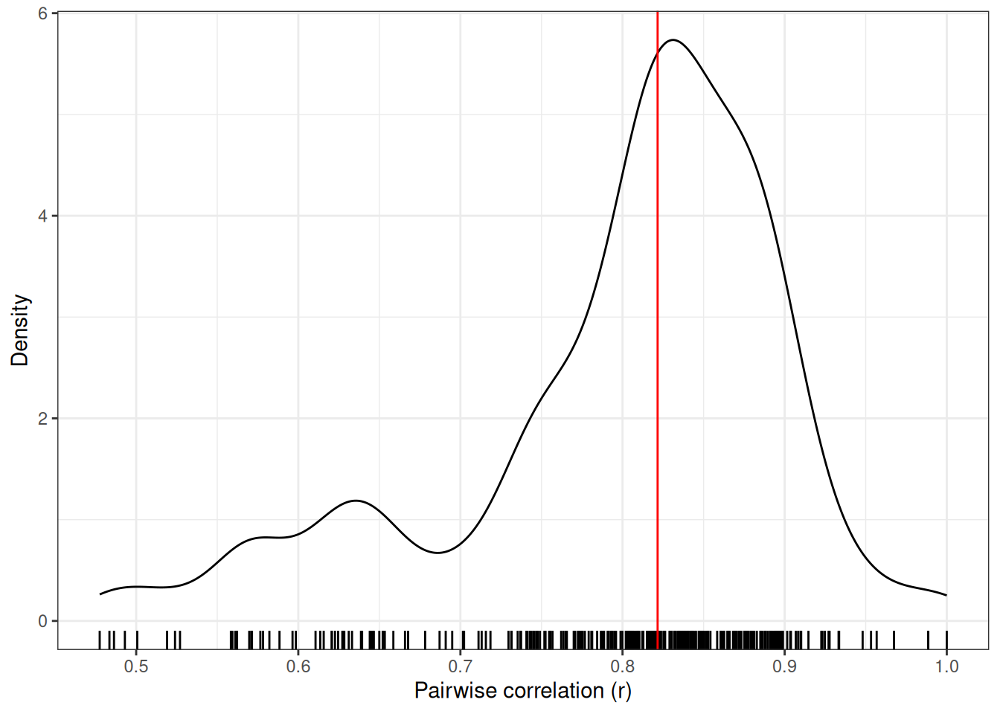
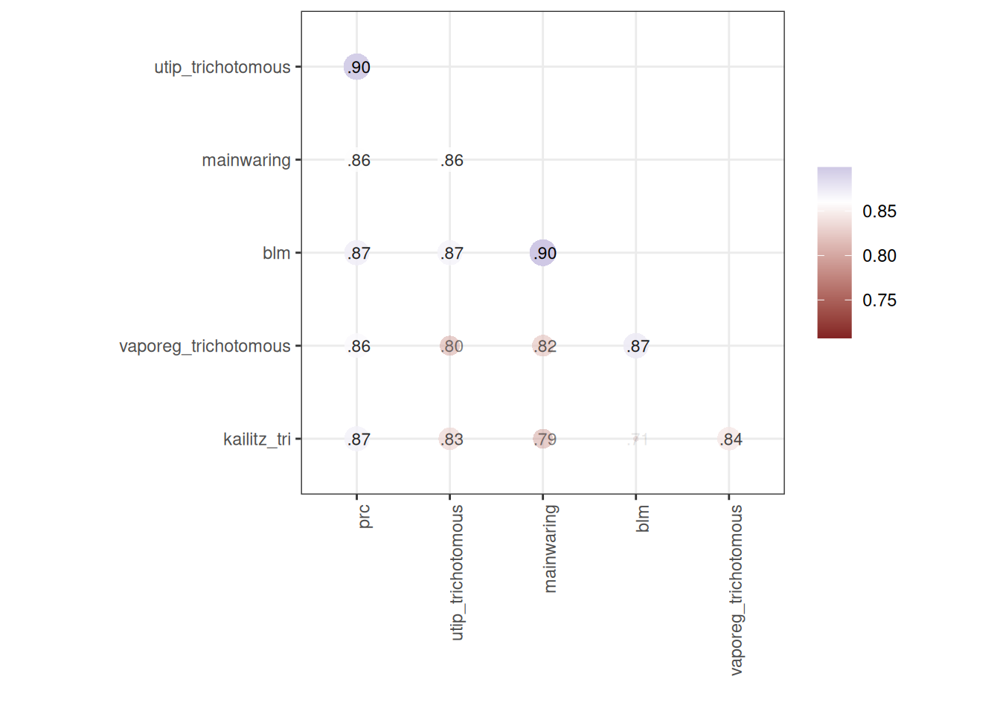
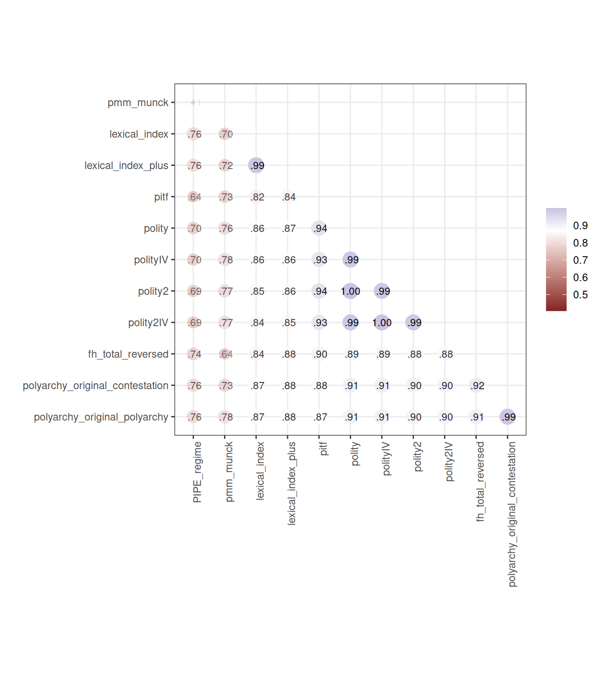
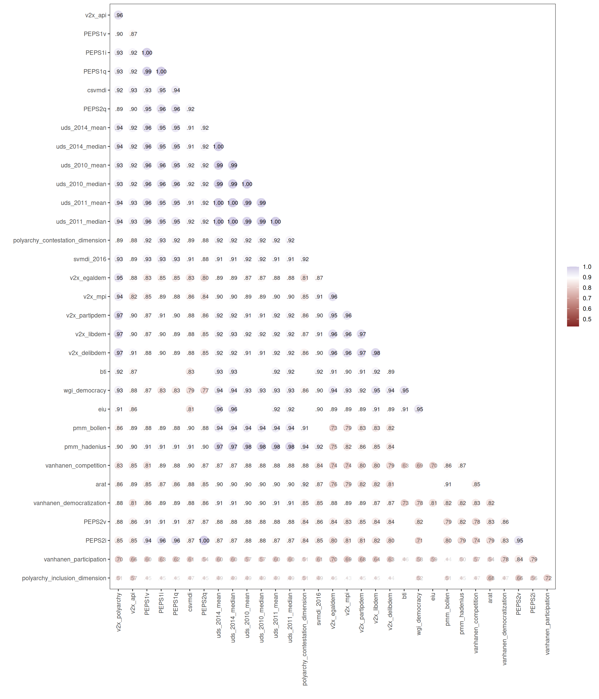
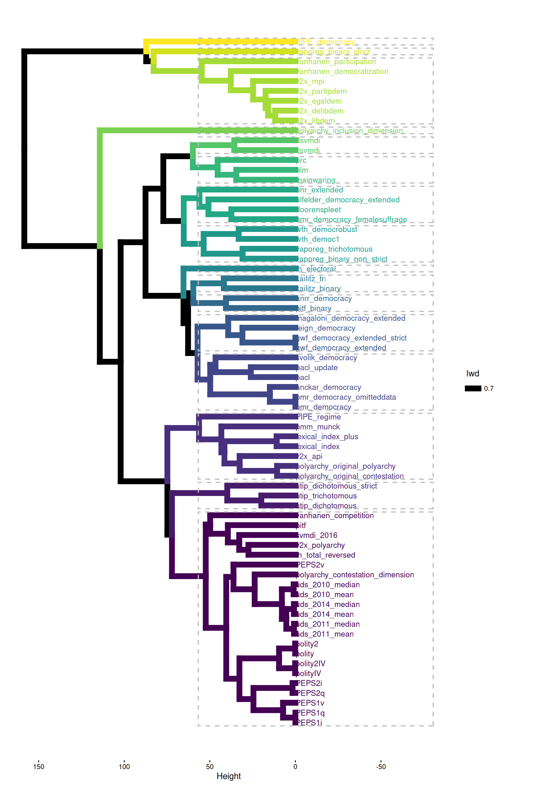
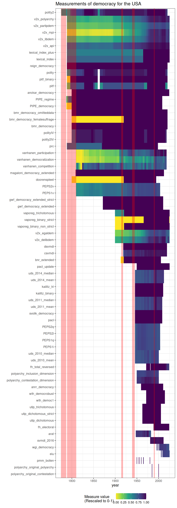
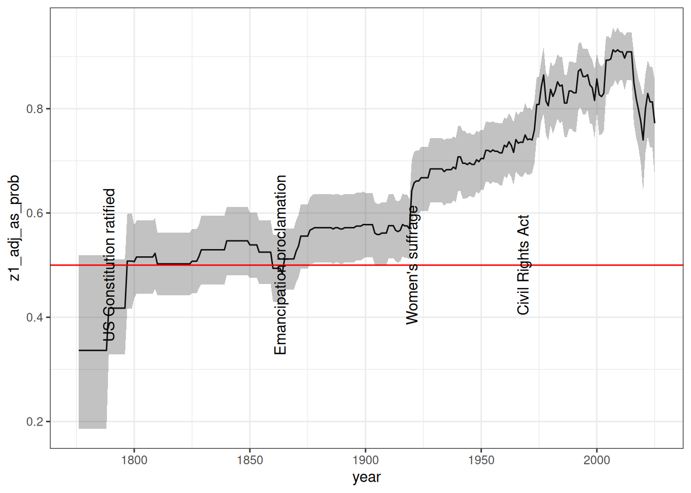
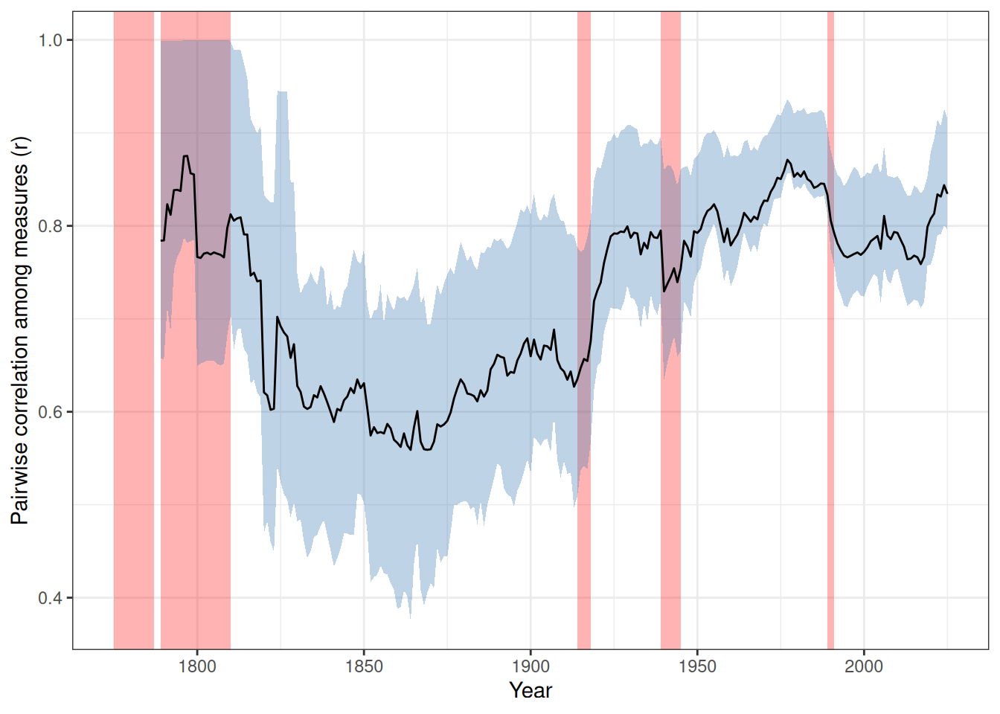
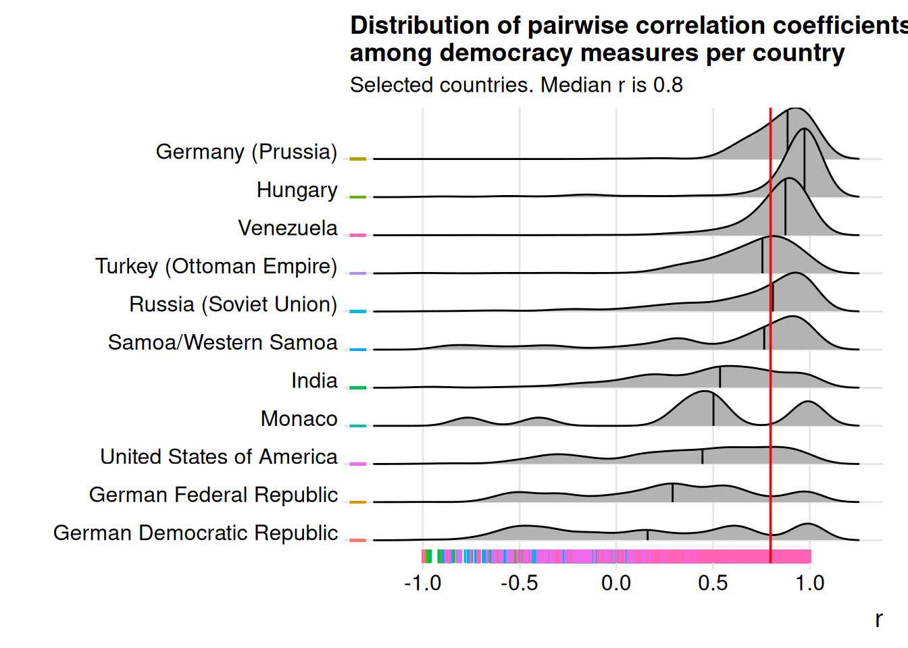
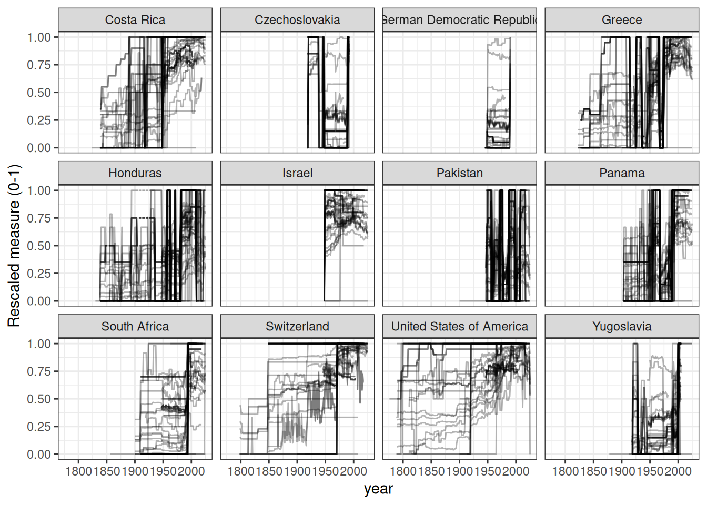

# Relationships between democracy measures

Most measures of democracy are highly correlated. But these correlations
can nevertheless vary quite a bit across measures, years, and countries.

## Dichotomous Measures of Democracy

Consider first dichotomous measures of democracy, which classify
countries into two categories: democracies and non-democracies. These
are very highly correlated (median pairwise correlation coefficient =
0.82).

Figure 1: Pairwise correlations among all dichotomous measures of
democracy, reordered by hierarchical clustering.

Figure 2: Distribution of pairwise correlation coefficients among
dichotomous measures of democracy. The red vertical line marks the
median.

Nevertheless, a few of these measures are poorly correlated with the
rest, in particular, the
[PIPE](https://xmarquez.github.io/reference/PIPE.md) ([Przeworski
2013](#ref-PIPE2013)) and
[bnr](https://xmarquez.github.io/reference/bnr.md) ([Bernhard,
Nordstrom, and Reenock 2001](#ref-bnr2001)) measures. The
[PIPE](https://xmarquez.github.io/reference/PIPE.md) measure of
democracy is likely not properly constructed; there are no clear
instructions for replicating it in the original documentation, and I
can’t be sure I succeeded in replicating it. The 0.7.0 release
recalculated the package-derived PIPE variables (`cum_salterel`,
`cum_term`, `democracy`, `democracy2`, `democracy_age`, `regime`,
`regime_period`) to better match the PIPE codebook: only `salterel == 1`
and `term == 1` now advance democratic spells, and
`regime`/`regime_period` are now missing before independence, so
PIPE-derived correlations here may differ from previously rendered
versions of this article.

The [bnr](https://xmarquez.github.io/reference/bnr.md) measure is
different from most other dichotomous measures of democracy because it
was constructed with survival analysis in mind, and hence only includes
democracies; when extended to non-democracies (in
[bnr_extended](https://xmarquez.github.io/reference/bnr.md)) it is
well-correlated with the rest.
[utip](https://xmarquez.github.io/reference/utip.md) ([Hsu
2008](#ref-utip2008)) and
[doorenspleet](https://xmarquez.github.io/reference/doorenspleet.md)
([Doorenspleet 2000](#ref-doorenspleet2000)) also have below average
correlations with the other measures; these are somewhat idiosyncratic
measures that are not widely used, and doorenspleet in particular is
based on an earlier version of
[Polity](https://xmarquez.github.io/reference/polityIV.md) (Polity III)
and also adds an “inclusion” criterion, whereas most of the other
dichotomous measures are based on
[pacl](https://xmarquez.github.io/reference/pacl.md) ([Cheibub, Gandhi,
and Vreeland 2009](#ref-pacl2010)).

## Trichotomous Measures of Democracy

There are a number of measures of democracy that distinguish between
democracy, non-democracy, and some hybrid or intermediate category.
These trichotomous measures are also highly correlated (median pairwise
correlation coefficient = 0.86).

Figure 3: Pairwise correlations among all trichotomous measures of
democracy.

Most of these are specialist measures that are no longer maintained, but
remain of historical interest. The lowest correlation levels are with
the [Kailitz](https://xmarquez.github.io/reference/kailitz.md)
trichotomous index calculated by taking “electoral autocracy” as the
middle category (updated in the
[VaPoReg](https://xmarquez.github.io/reference/vaporeg.md) measure).

## Ordinal/Graded Measures of Democracy

There are also measures that distinguish among different “grades” of
democracy, though the intervals between grades may not have a consistent
meaning. For example, [Freedom
House](https://xmarquez.github.io/reference/download_fh.md) ([Freedom
House 2025](#ref-fh2025)) distinguishes 14 different “grades” between
the most unfree and the most free category, but it is not clear that the
difference between one grade and another means the same across all
grades. Note that the Freedom House objects bundled with this package
(`fh`, `fh_full`, `fh_electoral`) are frozen at the 2025 release (data
through 2024), since Freedom House moved to email-request distribution
in 2026. In any case, these measures are highly correlated among
themselves (median pairwise correlation coefficient = 0.87).

Figure 4: Pairwise correlations among all ordinal/graded measures of
democracy.

## Continous Measures of Democracy

Finally, there are a number of continuous measures of democracy (usually
in the 0-1 range), which like other measures, are very highly correlated
(median pairwise correlation coefficient = 0.89).

Figure 5: Pairwise correlations among all continuous measures of
democracy.

## All Correlations

The median correlation coefficient between any two measures (of any
type) is 0.83.

Figure 6: Distribution of pairwise correlation coefficients among all
democracy measures (rescaled to 0-1).

A simple hierarchical cluster analysis can help us to better visualize
the relationships among these measures.

At the top of the figure below, we find the main outlier, the measure of
democracy from [PIPE](https://xmarquez.github.io/reference/PIPE.md)
([Przeworski 2013](#ref-PIPE2013)). The next cluster includes a set of
continuous, “thick” measures of democracy, mostly from V-Dem ([Coppedge
et al. 2026](#ref-vdem16codebook)) (`v2x_libdem`, `v2x_egaldem`,
`v2x_delibdem`, `v2x_partipdem`, `v2x_mpi`), but also the
[vanhanen](https://xmarquez.github.io/reference/vanhanen.md) measure
([Vanhanen 2019](#ref-vanhanen2019)) that includes information about
participation. The middle of the dendrogram contains the
[pacl](https://xmarquez.github.io/reference/pacl.md)-derived family of
dichotomous measures ([Cheibub, Gandhi, and Vreeland
2009](#ref-pacl2010)) –
[bmr](https://xmarquez.github.io/reference/bmr.md) ([Boix, Miller, and
Rosato 2012](#ref-bmr2012)),
[gwf](https://xmarquez.github.io/reference/gwf_all.md) ([Geddes, Wright,
and Frantz 2014](#ref-gwf2014)), the
[pacl_update](https://xmarquez.github.io/reference/pacl_update.md)
([Bjørnskov and Rode 2020](#ref-pacl_update_2020)),
[svolik](https://xmarquez.github.io/reference/svolik_regime.md), and
[anckar](https://xmarquez.github.io/reference/anckar.md) – alongside the
autocratic-regime classifications
([kailitz](https://xmarquez.github.io/reference/kailitz.md),
[vaporeg](https://xmarquez.github.io/reference/vaporeg.md),
[magaloni](https://xmarquez.github.io/reference/magaloni.md),
[reign](https://xmarquez.github.io/reference/REIGN.md)). The bottom
clusters are dominated by
[polity](https://xmarquez.github.io/reference/polityIV.md)-based indexes
([Marshall, Gurr, and Jaggers 2019](#ref-polity2019)) – the various
Polity vintages, the participation-enhanced Polity scores ([Moon et al.
2006](#ref-peps2006)), the
[pitf](https://xmarquez.github.io/reference/pitf.md) measure ([Taylor
and Ulfelder 2015](#ref-pitf2015)), and the latent-variable
[uds](https://xmarquez.github.io/reference/uds_2014.md) family
([Pemstein, Meserve, and Melton 2013](#ref-pmm2013uds2010)) – which are
all heavily influenced by the inclusion of Polity in their construction.
Notably, V-Dem’s `v2x_polyarchy` – the project’s “thin”,
electoral-democracy index – groups with this Polity/UDS cluster rather
than with V-Dem’s thicker indexes.

Figure 7: Hierarchical cluster analysis of most democracy measures,
using Euclidean distance on the rescaled value series.

## Variation in per-country and per-year correlations

As noted in the [article on the temporal and geographic coverage of
democracy
measures](https://xmarquez.github.io/democracyData/articles/Understanding_the_geographic_and_temporal_coverage_of_existing_democracy_indexes.md),
such measures, though highly correlated in general, can disagree
substantially in particular cases. Consider the USA. Despite general
agreement in these datasets that the USA is basically democratic,
different measurements do not agree on when the country first became
democratic, or how democratic it actually was at any given point in
time.

Figure 8: Measurements of democracy for the USA across all indexes,
rescaled to 0-1. Shaded red bands are the American and French
revolutions, the two World Wars, and the end of the Cold War.

A latent variable analysis of most of these measures (using the
[extended_uds](https://xmarquez.github.io/reference/extended_uds.md)
measure – see the [vignette on replicating and extending the UD
scores](https://xmarquez.github.io/democracyData/articles/Replicating_and_extending_the_UD_scores.md)
in this package) makes the evolution of democracy in the USA look like
this:

Figure 9: Extended UD scores for the United States, with annotated
political milestones.

The average correlation between democracy measures varies substantially
year by year, due in part to the particular states that are measured on
any given year, the availability of historical information, and the
prevalence of hybrid or ambiguous regime forms. It is thus high in the
late 18th and early 19th century, as most countries were clearly
non-democratic and relatively easy to classify (and there were fewer
independent states); it becomes lower in the 19th century, with more
countries in difficult-to-classify hybrid forms, and more difficulties
for researchers in finding appropriate historical information; and it
increases in the mid-twentieth century, where most of the classificatory
effort has been focused. The series also dips after the Cold War, as
more countries take on difficult-to-classify hybrid forms; this dip is
sustained roughly from the mid-1990s through about 2020 and coincides
with the recent wave of democratic backsliding – as established
democracies acquire authoritarian features and authoritarian regimes
adopt democratic facades, raters disagree more – before partially
recovering in the last few years.

Figure 10: Mean pairwise correlation among democracy measures by year
(line). The shaded band shows the interquartile range of the pairwise
correlations in each year – a wider band means raters disagree more on
which measures track each other.

Correlations among measures can also vary substantially within a given
country.

Figure 11: Distribution of pairwise correlation coefficients among
democracy measures, for selected countries.

Here we see that for a country like the USA, the pairwise correlation
coefficient between any two measures of democracy ranges from nearly 1
to nearly -1, with a median below 0.5. Small semi-monarchical countries
like Monaco are especially susceptible to scholarly disagreements on
their level of democracy, though some countries have very decent levels
of agreement (e.g., Hungary, Venezuela).

We can find the “hardest” countries to classify by looking at the
standard deviation of the rescaled measures per year. Here are the top
12 most difficult to classify countries by this measure:

Figure 12: The twelve countries with the greatest within-year
disagreement among democracy measures, measured by the average standard
deviation of rescaled scores weighted by coverage.

There is clearly a great deal of uncertainty in these measures for many
country-years, though the overall patterns are usually clear. Two ways
of aggregating these measures to deal with uncertainty are explored in
other articles in this website: [Latent Variable
Indexes](https://xmarquez.github.io/democracyData/articles/Replicating_and_extending_the_UD_scores.md)
– see vignette(“Replicating_and_extending_the_UD_scores”) – and
Machine-Learning predictions (article still to come).

## References

Bernhard, Michael, Timothy Nordstrom, and Christopher Reenock. 2001.
“Economic Performance, Institutional Intermediation, and Democratic
Survival.” *Journal of Politics* 63(3): 775–803.
doi:[10.1111/0022-3816.00087](https://doi.org/10.1111/0022-3816.00087).

Bjørnskov, Christian, and Martin Rode. 2020. “Regime Types and Regime
Change: A New Dataset on Democracy, Coups, and Political Institutions.”
*The Review of International Organizations* 15(2): 531–51.
doi:[10.1007/s11558-019-09345-1](https://doi.org/10.1007/s11558-019-09345-1).

Boix, Carles, Michael Miller, and Sebastian Rosato. 2012. “A Complete
Data Set of Political Regimes, 1800–2007.” *Comparative Political
Studies* 46(12): 1523–54.
doi:[10.1177/0010414012463905](https://doi.org/10.1177/0010414012463905).

Cheibub, José Antonio, Jennifer Gandhi, and James Raymond Vreeland.
2009. “Democracy and Dictatorship Revisited.” *Public Choice* 143(1–2):
67–101.
doi:[10.1007/s11127-009-9491-2](https://doi.org/10.1007/s11127-009-9491-2).

Coppedge, Michael, John Gerring, Carl Henrik Knutsen, Staffan I.
Lindberg, Jan Teorell, David Altman, Fabio Angiolillo, et al. 2026.
*V-Dem Codebook V16*. Varieties of Democracy (V-Dem) Project. Report.
<https://www.v-dem.net/documents/70/codebook_v16.pdf>.

Doorenspleet, Renske. 2000. “Reassessing the Three Waves of
Democratization.” *World Politics* 52(03): 384–406.
doi:[10.1017/S0043887100016580](https://doi.org/10.1017/S0043887100016580).

Freedom House. 2025. *Freedom in the World 2025: The Uphill Battle to
Safeguard Rights*. Freedom House.

Geddes, Barbara, Joseph Wright, and Erica Frantz. 2014. “Autocratic
Breakdown and Regime Transitions: A New Data Set.” *Perspectives on
Politics* 12(1): 313–31.
doi:[10.1017/S1537592714000851](https://doi.org/10.1017/S1537592714000851).

Hsu, Sara. 2008. “The Effect of Political Regimes on Inequality,
1963-2002.” *UTIP Working Paper* (53).

Marshall, Monty G., Ted Robert Gurr, and Keith Jaggers. 2019. *Polity IV
Project: Political Regime Characteristics and Transitions, 1800-2018.
Dataset Users’ Manual.* Center for Systemic Peace. manual.

Moon, Bruce E., Jennifer Harvey Birdsall, Sylvia Ciesluk, Lauren M.
Garlett, Joshua J. Hermias, Elizabeth Mendenhall, Patrick D. Schmid, and
Wai Hong Wong. 2006. “Voting Counts: Participation in the Measurement of
Democracy.” *Studies in Comparative International Development* 41(2):
3–32. doi:[10.1007/BF02686309](https://doi.org/10.1007/BF02686309).

Pemstein, Daniel, Stephen A. Meserve, and James Melton. 2013.
“Replication Data for: Democratic Compromise: A Latent Variable Analysis
of Ten Measures of Regime Type.”
doi:[10.7910/DVN/WWYOHU](https://doi.org/10.7910/DVN/WWYOHU).

Przeworski, Adam. 2013. “Political Institutions and Political Events
(PIPE) Data Set.”
<https://sites.google.com/a/nyu.edu/adam-przeworski/home/data>.

Taylor, Sean J., and Jay Ulfelder. 2015. “A Measurement Error Model of
Dichotomous Democracy Status.” *Available at SSRN*.
doi:[10.2139/ssrn.2726962](https://doi.org/10.2139/ssrn.2726962).

Vanhanen, Tatu. 2019. “Measures of Democracy 1810-2018 (Dataset).
Version 8.0 (2019-06-17).” <https://urn.fi/urn:nbn:fi:fsd:T-FSD1289>.
