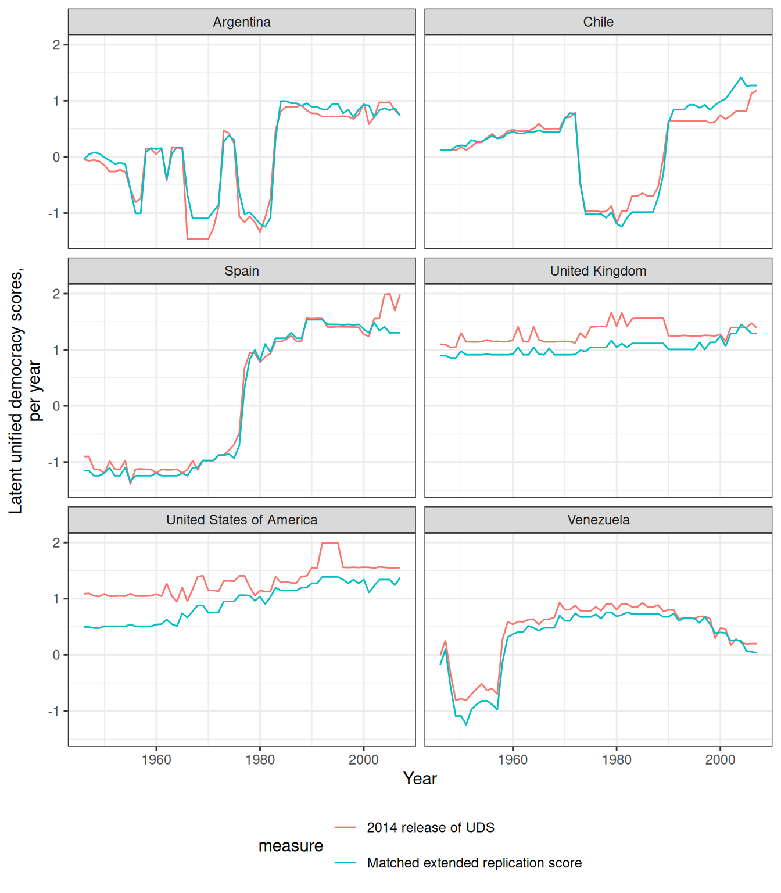
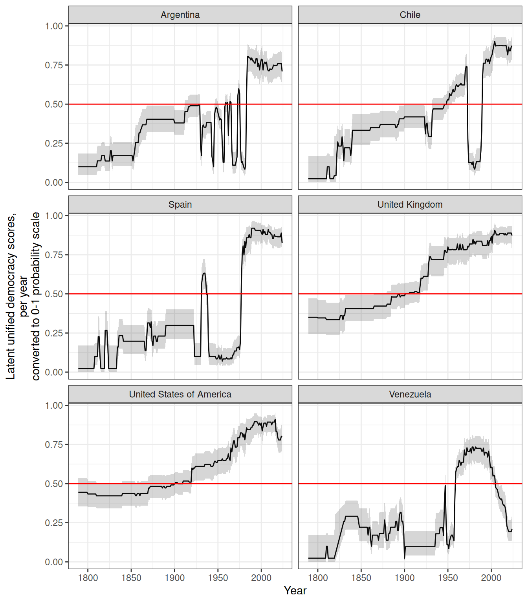
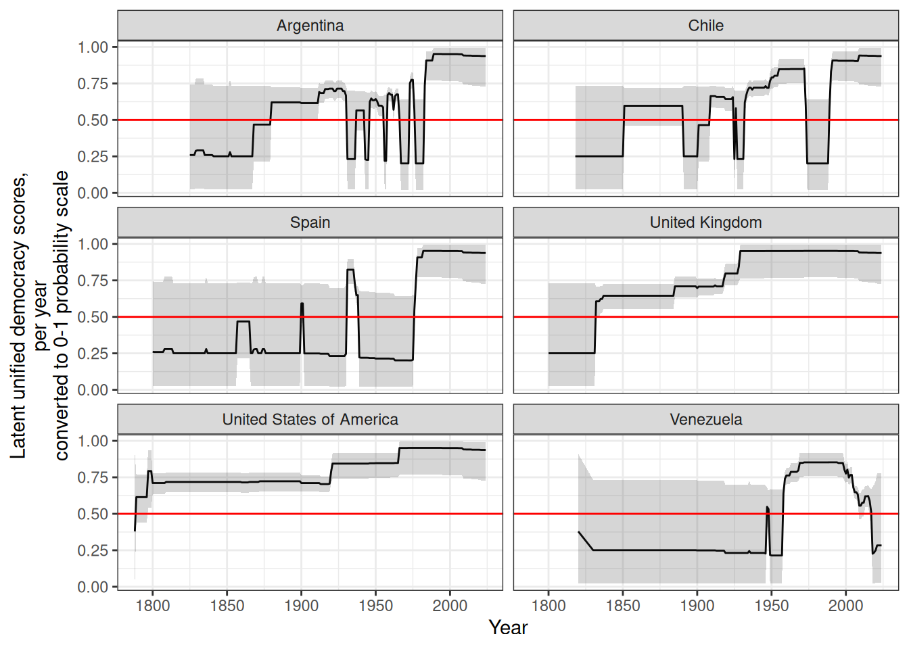
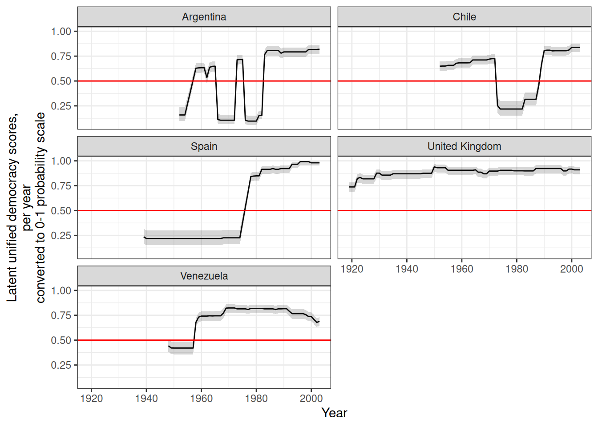
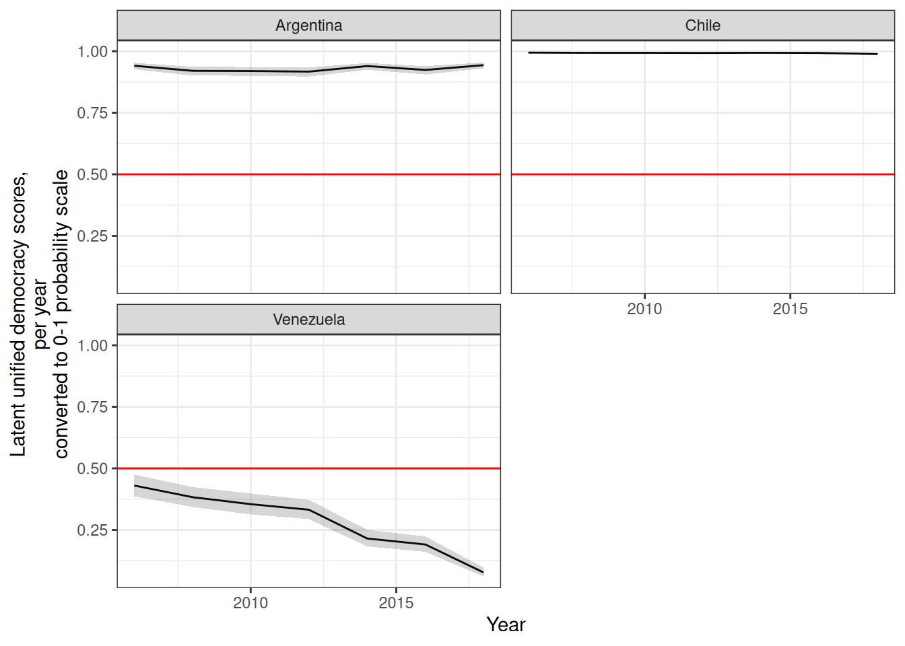
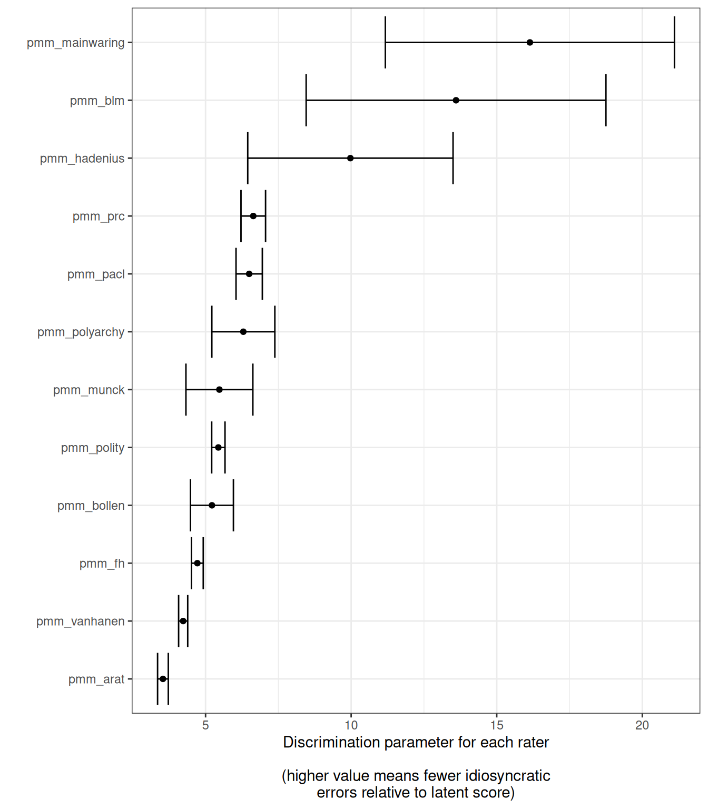

# Replicating and Extending the UD scores of Pemstein, Meserve, and Melton

We can use this package to replicate and extend the [Unified Democracy
Scores](http://www.unified-democracy-scores.org/) of Pemstein, Meserve,
and Melton ([2010](#ref-pmm2010)) (which are no longer being updated or
maintained), and in general to calculate latent variable indexes of
democracy.[¹](#fn1) This article is a modified version of the vignette
for my package [QuickUDS](https://xmarquez.github.io/QuickUDS), which I
am no longer actively maintaining; I am slowly migrating the functions
in that package to this package to avoid having to update two different
data sets of democracy measures.

You will need the package
[`mirt`](https://cran.r-project.org/web/packages/mirt/index.html)
([**Chalmers2012?**](#ref-Chalmers2012)), which can quickly compute
full-information factor analyses.

The basic procedure for replicating or extending the UD scores is very
simple.

1.  Generate a dataset of democracy scores with a call to
    [`generate_democracy_scores_dataset()`](https://xmarquez.github.io/democracyData/reference/generate_democracy_scores_dataset.md);
2.  Prepare the democracy data using the convenience function
    [`prepare_democracy_data()`](https://xmarquez.github.io/democracyData/reference/prepare_democracy_data.md);
3.  Fit a simple
    [`mirt`](https://cran.r-project.org/web/packages/mirt/index.html)
    model;
4.  Extract the calculated scores with a call to
    [`democracy_scores()`](https://xmarquez.github.io/democracyData/reference/democracy_scores.md)
    or to
    [`mirt::fscores()`](https://philchalmers.github.io/mirt/reference/fscores.html).

### Preparing your democracy measures

The first step is to prepare the democracy measures for use with
[`mirt`](https://cran.r-project.org/web/packages/mirt/index.html). I
focus first on replicating the 2011 release of the UDS, and then explain
how to extend and augment these scores.

In order to replicate the original UD scores, we need to use PMM’s
replication dataset ([Pemstein, Meserve, and Melton
2013](#ref-pmm2013uds2010)). This dataset is included this package: we
just need to generate a data frame of democracy scores from all the
datasets with names ending in `_pmm`. We can then use the function
[`prepare_democracy_data()`](https://xmarquez.github.io/democracyData/reference/prepare_democracy_data.md)
to put the data in the right format for use with
[`mirt`](https://cran.r-project.org/web/packages/mirt/index.html).

``` r
library(mirt)
```

    Loading required package: stats4

    Loading required package: lattice

``` r
library(tidyverse)
```

    ── Attaching core tidyverse packages ──────────────────────── tidyverse 2.0.0 ──
    ✔ dplyr     1.2.1     ✔ readr     2.2.0
    ✔ forcats   1.0.1     ✔ stringr   1.6.0
    ✔ ggplot2   4.0.2     ✔ tibble    3.3.1
    ✔ lubridate 1.9.5     ✔ tidyr     1.3.2
    ✔ purrr     1.2.2     

    ── Conflicts ────────────────────────────────────────── tidyverse_conflicts() ──
    ✖ dplyr::filter() masks stats::filter()
    ✖ dplyr::lag()    masks stats::lag()
    ℹ Use the conflicted package (<http://conflicted.r-lib.org/>) to force all conflicts to become errors

``` r
library(democracyData)

identifiers <- c("extended_country_name", "GWn", "cown", "in_GW_system", "year")

democracy_data <- generate_democracy_scores_dataset(
  selection = "_pmm",
  exclude_pmm_duplicates = FALSE, 
  output_format = "wide") 
```

    Adding arat_pmm data
    Adding blm_pmm data
    Adding bollen_pmm data
    Adding fh_pmm data
    Adding hadenius_pmm data
    Adding mainwaring_pmm data
    Adding Munck data
    Adding pacl_pmm data
    Adding polity_pmm data
    Adding polyarchy_pmm data
    Adding prc_pmm data
    Adding vanhanen_pmm data

Before transformation by
[`prepare_democracy_data()`](https://xmarquez.github.io/democracyData/reference/prepare_democracy_data.md),
the data looks like this:

``` r
skimr::skim(democracy_data |> select(matches("pmm")))
```

|                                                  |                            |
|:-------------------------------------------------|:---------------------------|
| Name                                             | select(democracy_data, ma… |
| Number of rows                                   | 9137                       |
| Number of columns                                | 12                         |
| \_\_\_\_\_\_\_\_\_\_\_\_\_\_\_\_\_\_\_\_\_\_\_   |                            |
| Column type frequency:                           |                            |
| numeric                                          | 12                         |
| \_\_\_\_\_\_\_\_\_\_\_\_\_\_\_\_\_\_\_\_\_\_\_\_ |                            |
| Group variables                                  | None                       |

Data summary

**Variable type: numeric**

| skim_variable  | n_missing | complete_rate |  mean |    sd |  p0 |   p25 |   p50 |   p75 | p100 | hist  |
|:---------------|----------:|--------------:|------:|------:|----:|------:|------:|------:|-----:|:------|
| pmm_arat       |      5264 |          0.42 | 73.20 | 18.91 |  29 | 58.00 | 69.00 | 92.00 |  109 | ▂▇▇▅▆ |
| pmm_blm        |      8862 |          0.03 |  0.36 |  0.41 |   0 |  0.00 |  0.00 |  0.50 |    1 | ▇▁▃▁▃ |
| pmm_bollen     |      8627 |          0.06 | 55.46 | 33.70 |   0 | 22.84 | 53.59 | 90.95 |  100 | ▅▅▃▂▇ |
| pmm_fh         |      2699 |          0.70 |  4.15 |  2.07 |   1 |  2.50 |  4.00 |  6.00 |    7 | ▆▅▃▃▇ |
| pmm_hadenius   |      9008 |          0.01 |  4.51 |  3.56 |   0 |  1.50 |  3.10 |  8.30 |   10 | ▇▅▁▂▆ |
| pmm_mainwaring |      8302 |          0.09 |  0.12 |  0.85 |  -1 | -1.00 |  0.00 |  1.00 |    1 | ▆▁▅▁▇ |
| pmm_munck      |      8795 |          0.04 |  0.84 |  0.26 |   0 |  0.75 |  1.00 |  1.00 |    1 | ▁▁▂▂▇ |
| pmm_pacl       |        70 |          0.99 |  0.44 |  0.50 |   0 |  0.00 |  0.00 |  1.00 |    1 | ▇▁▁▁▆ |
| pmm_polity     |      1087 |          0.88 |  0.13 |  7.50 | -10 | -7.00 | -1.00 |  8.00 |   10 | ▇▂▂▂▆ |
| pmm_polyarchy  |      8784 |          0.04 |  6.33 |  3.51 |   0 |  3.00 |  7.00 | 10.00 |   10 | ▅▂▃▃▇ |
| pmm_prc        |      3135 |          0.66 |  2.15 |  1.37 |   1 |  1.00 |  1.00 |  4.00 |    4 | ▇▁▁▂▅ |
| pmm_vanhanen   |       172 |          0.98 | 11.31 | 12.67 |   0 |  0.00 |  5.90 | 20.70 |   49 | ▇▂▂▂▁ |

After transformation, it looks like this:

``` r
democracy_data_transformed <- prepare_democracy_data(democracy_data)

skimr::skim(democracy_data_transformed |> select(matches("pmm")))
```

|                                                  |                            |
|:-------------------------------------------------|:---------------------------|
| Name                                             | select(democracy_data_tra… |
| Number of rows                                   | 9137                       |
| Number of columns                                | 12                         |
| \_\_\_\_\_\_\_\_\_\_\_\_\_\_\_\_\_\_\_\_\_\_\_   |                            |
| Column type frequency:                           |                            |
| numeric                                          | 12                         |
| \_\_\_\_\_\_\_\_\_\_\_\_\_\_\_\_\_\_\_\_\_\_\_\_ |                            |
| Group variables                                  | None                       |

Data summary

**Variable type: numeric**

| skim_variable  | n_missing | complete_rate |  mean |   sd |  p0 | p25 |  p50 |  p75 | p100 | hist  |
|:---------------|----------:|--------------:|------:|-----:|----:|----:|-----:|-----:|-----:|:------|
| pmm_arat       |      5264 |          0.42 |  3.88 | 1.91 |   1 | 2.0 |  3.0 |  6.0 |    7 | ▇▆▃▃▇ |
| pmm_blm        |      8862 |          0.03 |  1.72 | 0.82 |   1 | 1.0 |  1.0 |  2.0 |    3 | ▇▁▃▁▃ |
| pmm_bollen     |      8627 |          0.06 |  6.01 | 3.23 |   1 | 3.0 |  6.0 | 10.0 |   10 | ▅▅▃▂▇ |
| pmm_fh         |      2699 |          0.70 |  7.30 | 4.13 |   1 | 4.0 |  7.0 | 11.0 |   13 | ▆▅▃▃▇ |
| pmm_hadenius   |      9008 |          0.01 |  4.51 | 3.56 |   0 | 1.5 |  3.1 |  8.3 |   10 | ▇▅▁▂▆ |
| pmm_mainwaring |      8302 |          0.09 |  2.12 | 0.85 |   1 | 1.0 |  2.0 |  3.0 |    3 | ▆▁▅▁▇ |
| pmm_munck      |      8795 |          0.04 |  3.33 | 0.96 |   1 | 3.0 |  4.0 |  4.0 |    4 | ▁▂▁▂▇ |
| pmm_pacl       |        70 |          0.99 |  1.44 | 0.50 |   1 | 1.0 |  1.0 |  2.0 |    2 | ▇▁▁▁▆ |
| pmm_polity     |      1087 |          0.88 | 11.13 | 7.50 |   1 | 4.0 | 10.0 | 19.0 |   21 | ▇▂▂▂▆ |
| pmm_polyarchy  |      8784 |          0.04 |  7.33 | 3.51 |   1 | 4.0 |  8.0 | 11.0 |   11 | ▅▂▃▃▇ |
| pmm_prc        |      3135 |          0.66 |  2.15 | 1.37 |   1 | 1.0 |  1.0 |  4.0 |    4 | ▇▁▁▂▅ |
| pmm_vanhanen   |       172 |          0.98 |  2.94 | 2.34 |   1 | 1.0 |  2.0 |  5.0 |    8 | ▇▁▂▁▂ |

The function
[`prepare_democracy_data()`](https://xmarquez.github.io/democracyData/reference/prepare_democracy_data.md)
gets rid of “empty rows” (country-years that have no measurements of
democracy for the chosen indexes; such patterns will make
[`mirt`](https://cran.r-project.org/web/packages/mirt/index.html) fail)
and transforms selected democracy indexes into ordinal variables
suitable for use with
[`mirt`](https://cran.r-project.org/web/packages/mirt/index.html),
mostly following the advice in Pemstein, Meserve, and Melton’s original
article (2010).

In particular,
[`prepare_democracy_data()`](https://xmarquez.github.io/democracyData/reference/prepare_democracy_data.md)
will try to do the following on your dataset:

- If a selected index contains the string `arat`, the function assumes
  the index is Arat’s ([Arat 1991](#ref-Arat1991)) 0-109 democracy
  score, and cuts it into 7 intervals with the following cutoffs: 50,
  60, 70, 80, 90, and 100. The resulting score is ordinal from 1 to 8
  (following Pemstein, Meserve, and Melton’s advice).

- If a selected index contains the string `bollen`, the function assumes
  the index is Bollen’s ([**Bollen2001?**](#ref-Bollen2001)) 0-100
  democracy score, and cuts it into 10 intervals with the following
  cutoffs: 10,20,30,40,50,60,70,80, and 90. The resulting score is
  ordinal from 1 to 10 (following Pemstein, Meserve, and Melton’s
  advice).

- If a selected index contains the string `wgi`, the function assumes
  the index is the World Governance Indicator’s “Voice and
  Accountability” index ([Kaufmann and Kraay 2020](#ref-wgi2017)), and
  it will cut it into 20 categories. The resulting score is ordinal from
  1 to 20.

- If a selected index contains the string `eiu`, the function assumes
  the index is the Economist Intelligence Unit’s democracy index
  ([**eiu2021?**](#ref-eiu2021)), and it will cut it into 20 categories.
  The resulting score is ordinal from 1 to 20.

- If a selected index contains the string `hadenius_pmm`, the function
  assumes the index is Hadenius’s 0-10 democracy score
  ([**hadenius1992?**](#ref-hadenius1992)), and it will cut it into 8
  intervals with the following cutoffs: 1, 2,3,4, 7, 8, and 9. The
  resulting score is ordinal from 1 to 8 (following Pemstein, Meserve,
  and Melton’s advice).

- If the selected index contains the string `munck`, the function
  assumes the index is Munck’s 0-1 democracy score ([Munck
  2009](#ref-munck2009)), and it will cut it into 4 intervals with the
  following cutoffs: 0.5,0.5,0.75, and 0.99. The resulting score is
  ordinal from 1 to 4 (following Pemstein, Meserve, and Melton’s
  advice).

- If the selected index contains the string `peps`, the function assumes
  the index is one of the variants of the Participation-Enhanced Polity
  Score ([Moon et al. 2006](#ref-peps2006)), and it will round its value
  (eliminating the decimal) and then transform it into an ordinal
  measure from 1 to 21.

- If the selected index contains the string `polity`, the function
  assumes this is the Polity IV or Polity 5 score ([Marshall and Gurr
  2020](#ref-polity2020); [Marshall, Gurr, and Jaggers
  2019](#ref-polity2019)), and it will thus set any values below -10 to
  NA and then transform the variable into an ordinal measure from 1 to
  21.

- If the selected index contains the string
  `polyarchy_inclusion_dimension` or `polyarchy_contestation_dimension`,
  the function assumes this is one of the two dimensions of polyarchy
  estimated by Coppedge, Alvarez, and Maldonado
  ([2008](#ref-polyarchy_dimensions2008)), and it will cut it into 20
  categories. The resulting score is ordinal from 1 to 20.

- If the selected index contains the string `v2x`, the function assumes
  this is one of the v2x\_ continuous indexes of democracy from the
  V-Dem dataset ([**vdem11dataset?**](#ref-vdem11dataset)), and it will
  cut it into 20 categories. The resulting score is ordinal from 1 to
  20.

- If the selected index contains the string `csvdmi` or `svdmi_2016`,
  the function assumes this is one of the continuous indexes of
  democracy from the SVMDI dataset ([Gründler and Krieger
  2016](#ref-svmdi2016), [2018](#ref-svmdi2018)), and it will cut it
  into 20 categories. The resulting score is ordinal from 1 to 20.

- If the selected index contains the string `bti`, the function assumes
  this is the Bertelsman Transformation Index
  ([**bti2020?**](#ref-bti2020)), and it will cut it into 20 categories.
  The resulting score is ordinal from 1 to 20.

- If the selected index contains the string `vanhanen_democratization`
  or `vanhanen_pmm`, the function assumes this is Vanhanen’s index of
  democratization ([**vanhanen2014?**](#ref-vanhanen2014)), and it will
  cut it into 8 intervals with the following cutoffs: 5,10,15,20,25,30,
  and 35 (following Pemstein, Meserve, and Melton’s advice). The
  resulting score is ordinal from 1 to 8.

[`prepare_democracy_data()`](https://xmarquez.github.io/democracyData/reference/prepare_democracy_data.md)
will also work on column names that contain the following strings:

- `anckar` (assumes it’s the democracy indicator from
  [**AnckarFredriksson2018?**](#ref-AnckarFredriksson2018))
- `anrr` (assumes it’s the democracy indicator from [Acemoglu et al.
  2019](#ref-anrr2019))
- `blm` (assumes it’s from [Bowman, Lehoucq, and Mahoney
  2005](#ref-blm2005))
- `bmr` (assumes it’s from [**bmr2007?**](#ref-bmr2007))
- `doorenspleet` (assumes it’s from [Doorenspleet
  2000](#ref-doorenspleet2000))
- `dsvmdi` (assumes it’s the discrete machine-learning index [Gründler
  and Krieger 2018](#ref-svmdi2018))
- `e_v2x` (assumes it’s one of the “ordinal” indexes from the V-dem
  project, [Coppedge et al. 2025](#ref-vdem15codebook))
- `fh` or `freedomhouse` (assumes it’s from [**fh2020?**](#ref-fh2020))
- `gwf` (assumes it’s from [Geddes, Wright, and Frantz
  2014](#ref-gwf2014) - the dichotomous democracy indicator only)
- `kailitz` (assumes it’s from from
  [**Kailitz2013?**](#ref-Kailitz2013) - democracy/electoral
  autocracy/non-democracy indicator only)
- `lied` or `lexical_index` (assumes it’s from [Skaaning, Gerring, and
  Bartusevičius 2015](#ref-LIED2015))
- `mainwaring` (assumes it’s from [Mainwaring, Pérez-Liñán, and Brinks
  2014](#ref-mainwaring2014))
- `magaloni` (assumes it’s from [Magaloni, Chu, and Min
  2013](#ref-MagaloniChuMin2013))
- `pacl` or `cgv` (assumes it’s from [Cheibub, Gandhi, and Vreeland
  2009](#ref-pacl2010) or its later updates)
- `pitf` (assumes it’s the measure of democracy used in [Goldstone et
  al. 2010](#ref-pitf2010); [Taylor and Ulfelder 2015](#ref-pitf2015))
- `polyarchy` (assumes it’s from [Coppedge and Reinicke
  1990](#ref-polyarchy1990))
- `prc` (assumes it’s from
  [**prc_gasiorowski1996?**](#ref-prc_gasiorowski1996) or its later
  update)
- `przeworski` (assumes it’s the “regime” variable from [Przeworski
  2013](#ref-PIPE2013))
- `reign` (assumes it’s the democracy/dictatorship indicator from [Bell
  2016](#ref-reign2016))
- `svolik` (assumes it’s the democracy/dictatorship indicator from
  [**svolik2012?**](#ref-svolik2012))
- `ulfelder` (assumes it’s from [Ulfelder 2012](#ref-ulfelder2012))
- `utip` (assumes it’s from [Hsu 2008](#ref-utip2008))
- `wahman_teorell_hadenius` or `wth` (assumes it’s a
  democracy/non-democracy indicator from [Wahman, Teorell, and Hadenius
  2013](#ref-wahman_teorell_hadenius2013)).

In each of these cases the function
[`prepare_democracy_data()`](https://xmarquez.github.io/democracyData/reference/prepare_democracy_data.md)
transforms the values of the scores by running
`as.numeric(unclass(factor(x)))`, which transforms each index into
ordinal variables from 1 to the number of categories.

If you are using democracy indexes not included in the `democracy`
dataset, or want to use your own custom measures of democracy, or
transform them in a very particular way, you simply need to ensure that
there are no “blank” country-years in your data (i.e., country-years
without any democracy measurements; the package provides the convenience
function
[`remove_empty_rows()`](https://xmarquez.github.io/democracyData/reference/remove_empty_rows.md)
for this purpose) and that the indexes you are using are ordinal
measures from 1 to N with every category present in the data.
[`mirt`](https://cran.r-project.org/web/packages/mirt/index.html) is
pretty flexible and forgiving: it will accept ordinal variables in any
range and will attempt to transform your indexes so that every category
is within a distance of 1 of its neighboring categories. But it’s useful
to have a good sense of what the algorithm is doing to your data before
you begin!

### Fitting a democracy model

After you’ve prepared the data, you can then fit a model as follows:

``` r
replication_2011_model <- mirt(
  democracy_data_transformed |> 
    select(
      matches("pmm")
      ), 
      model = 1,
      itemtype = "graded", SE = TRUE,
      verbose = FALSE
      )
```

This just tells
[`mirt`](https://cran.r-project.org/web/packages/mirt/index.html) to fit
a one-factor, full information graded response model like that in
([**pmm2010uds2010?**](#ref-pmm2010uds2010)), and to calculate the
standard errors for the coefficients. (See
[`?mirt`](https://philchalmers.github.io/mirt/reference/mirt.html) for
details of the many options you can use to tweak your model, and see [my
paper](https://papers.ssrn.com/sol3/papers.cfm?abstract_id=2753830) for
a fuller description of why this model is useful here).

Fitting this model is reasonably fast:

``` r
replication_2011_model@time
```

    TOTAL:   Data  Estep  Mstep     SE   Post
     5.053  0.099  0.599  3.424  0.906  0.000 

We can easily check that this model converges and that it accounts for
most of the variance in the democracy indexes:

``` r
replication_2011_model
```

    Call:
    mirt(data = select(democracy_data_transformed, matches("pmm")),
        model = 1, itemtype = "graded", SE = TRUE, verbose = FALSE)

    Full-information item factor analysis with 1 factor(s).
    Converged within 1e-04 tolerance after 146 EM iterations.
    mirt version: 1.46.1
    M-step optimizer: BFGS
    EM acceleration: Ramsay
    Number of rectangular quadrature: 61
    Latent density type: Gaussian

    Information matrix estimated with method: Oakes
    Second-order test: model is a possible local maximum
    Condition number of information matrix =  89112.81

    Log-likelihood = -55716.18
    Estimated parameters: 97
    AIC = 111626.4
    BIC = 112317; SABIC = 112008.8

``` r
summary(replication_2011_model)
```

                      F1    h2
    pmm_arat       0.901 0.812
    pmm_blm        0.992 0.985
    pmm_bollen     0.951 0.904
    pmm_fh         0.941 0.885
    pmm_hadenius   0.986 0.972
    pmm_mainwaring 0.994 0.989
    pmm_munck      0.955 0.912
    pmm_pacl       0.967 0.936
    pmm_polity     0.954 0.911
    pmm_polyarchy  0.965 0.932
    pmm_prc        0.969 0.938
    pmm_vanhanen   0.928 0.861

                    SE.F1
    pmm_arat       0.0045
    pmm_blm        0.0030
    pmm_bollen     0.0066
    pmm_fh         0.0024
    pmm_hadenius   0.0050
    pmm_mainwaring 0.0017
    pmm_munck      0.0090
    pmm_pacl       0.0022
    pmm_polity     0.0018
    pmm_polyarchy  0.0058
    pmm_prc        0.0019
    pmm_vanhanen   0.0024

    SS loadings:  11.035
    Proportion Var:  0.92

    Factor correlations:

       F1
    F1  1

And we can then extract the latent democracy scores, either via
`mirt::fscore()`, or via this package’s convenient wrapper
`democracy_scores` (which returns a tidy dataset with the latent scores
and automatically calculates 95% confidence intervals):

``` r
replication_2011_scores <-  fscores(replication_2011_model, 
                                    full.scores = TRUE, 
                                    full.scores.SE = TRUE)
# Not a data frame, no country-years:
str(replication_2011_scores)
```

     'matrix' num [1:9137, 1:2] -1.89 -1.89 -1.57 -1.57 -1.45 ...
     - attr(*, "dimnames")=List of 2
      ..$ : NULL
      ..$ : chr [1:2] "F1" "SE_F1"

``` r
replication_2011_scores <- democracy_scores(model = replication_2011_model)

replication_2011_scores <- bind_cols(democracy_data, replication_2011_scores)

# A data frame with confidence intervals and country-years:

replication_2011_scores
```

    # A tibble: 9,137 × 30
       extended_country_name   GWn  cown in_GW_system  year pmm_arat pmm_blm
       <chr>                 <dbl> <dbl> <lgl>        <dbl>    <dbl>   <dbl>
     1 Afghanistan             700   700 TRUE          1946       NA      NA
     2 Afghanistan             700   700 TRUE          1947       NA      NA
     3 Afghanistan             700   700 TRUE          1948       54      NA
     4 Afghanistan             700   700 TRUE          1949       55      NA
     5 Afghanistan             700   700 TRUE          1950       54      NA
     6 Afghanistan             700   700 TRUE          1951       55      NA
     7 Afghanistan             700   700 TRUE          1952       56      NA
     8 Afghanistan             700   700 TRUE          1953       55      NA
     9 Afghanistan             700   700 TRUE          1954       56      NA
    10 Afghanistan             700   700 TRUE          1955       54      NA
    # ℹ 9,127 more rows
    # ℹ 23 more variables: pmm_bollen <dbl>, pmm_fh <dbl>, pmm_hadenius <dbl>,
    #   pmm_mainwaring <dbl>, pmm_munck <dbl>, pmm_pacl <dbl>, pmm_polity <dbl>,
    #   pmm_polyarchy <dbl>, pmm_prc <dbl>, pmm_vanhanen <dbl>, z1 <matrix>,
    #   se_z1 <matrix>, z1_pct975 <matrix>, z1_pct025 <matrix>, z1_adj <matrix>,
    #   z1_pct975_adj <matrix>, z1_pct025_adj <matrix>, z1_as_prob <matrix>,
    #   z1_pct975_as_prob <matrix>, z1_pct025_as_prob <matrix>, …

We can check that these scores are, in fact, almost perfectly correlated
with Pemstein, Meserve, and Melton’s 2011 UDS release:

``` r
uds <- generate_democracy_scores_dataset(
  selection = "uds", 
  output_format = "wide"
  )
```

    Adding UDS data (2010 release)

    Adding UDS data (2011 release)

    Adding UDS data (2014 release)

``` r
replication_2011_scores <- replication_2011_scores |> 
  left_join(uds)
```

    Joining with `by = join_by(extended_country_name, GWn, cown, in_GW_system,
    year)`

``` r
cor(replication_2011_scores |> 
  select(matches("uds_2011"), z1), use = "pairwise")
```

                    uds_2011_mean uds_2011_median        z1
    uds_2011_mean       1.0000000       0.9999485 0.9996735
    uds_2011_median     0.9999485       1.0000000 0.9995924
    z1                  0.9996735       0.9995924 1.0000000

(For more details on the relationship between the original UD scores and
the replicated scores produced using this method, see my [working
paper](http://ssrn.com/abstract=2753830)).

### Extending the model

Now suppose you want to create a new latent score derived but want to
include other measures, or updated measures, or want to restrict your
sources to dichotomous indicators of democracy or a particular set of
measures that seem especially reliable.

For example, suppose we want to use:

- The dichotomous indicator of democracy, adjusted for female suffrage,
  in version 3.0 of the Boix, Miller and Rosato dataset of political
  regimes ([**bmr2007?**](#ref-bmr2007))
- The full extent of the Political Regime Change dataset ([Reich
  2002](#ref-prc_gasiorowski2002);
  [**prc_gasiorowski1996?**](#ref-prc_gasiorowski1996)), Vanhanen’s
  index of democratization ([**vanhanen2014?**](#ref-vanhanen2014)),
  Bowman, Lehoucq, and Mahoney’s data on Central America ([Bowman,
  Lehoucq, and Mahoney 2005](#ref-blm2005)) and Mainwaring, Brinks and
  Perez-Linan’s data on Latin America ([Mainwaring, Pérez-Liñán, and
  Brinks 2014](#ref-mainwaring2014)), all of which go back to the
  beginning of the 20th century or before but are not used to their
  fullest extent in the official UD releases.
- One of the new V-Dem indexes of democracy, ordinal or continuous
  ([Coppedge et al. 2025](#ref-vdem15codebook))
- Renske Doorenspleet’s dichotomous indicator of democracy including
  suffrage info ([Doorenspleet 2000](#ref-doorenspleet2000))
- The World Governance Indicator’s latest Voice and Accountability index
- The most current release of Freedom House’s data, to 2020, and the
  most current Polity data, to 2018
- The indicators of democracy in various autocratic regime datasets
  ([Geddes, Wright, and Frantz 2014](#ref-gwf2014); [Wahman, Teorell,
  and Hadenius 2013](#ref-wahman_teorell_hadenius2013);
  [**svolik2012?**](#ref-svolik2012);
  [**Kailitz2013?**](#ref-Kailitz2013))
- The 7-level Lexical Index of Democracy and Autocracy ([Skaaning,
  Gerring, and Bartusevičius 2015](#ref-LIED2015))
- Jay Ulfelder’s dichotomous indicator of democracy ([Ulfelder
  2012](#ref-ulfelder2012))

This package makes the process extremely simple:

``` r
all_dem <- generate_democracy_scores_dataset(
  output_format = "wide",
  verbose = FALSE
  )


other_dem <- all_dem |>
  select(any_of(identifiers), arat, blm, bmr_democracy_femalesuffrage,
         pmm_bollen, doorenspleet, wgi_democracy, fh_total_reversed, 
         gwf_democracy_extended_strict, pmm_hadenius, kailitz_tri, svolik_democracy, 
         lexical_index, ulfelder_democracy_extended, prc, mainwaring, 
         vanhanen_democratization, v2x_polyarchy)

other_dem <- prepare_democracy_data(other_dem)

extended_model <- mirt(other_dem |> select(-any_of(identifiers)), 
                       model = 1, itemtype = "graded", SE = TRUE, verbose = FALSE)

summary(extended_model)
```

                                     F1    h2
    arat                          0.962 0.925
    blm                           0.990 0.981
    bmr_democracy_femalesuffrage  0.989 0.977
    pmm_bollen                    0.966 0.933
    doorenspleet                  0.979 0.959
    wgi_democracy                 0.978 0.957
    fh_total_reversed             0.962 0.926
    gwf_democracy_extended_strict 0.970 0.940
    pmm_hadenius                  0.982 0.965
    kailitz_tri                   0.964 0.930
    svolik_democracy              0.975 0.951
    lexical_index                 0.968 0.937
    ulfelder_democracy_extended   0.980 0.960
    prc                           0.986 0.972
    mainwaring                    0.986 0.971
    vanhanen_democratization      0.943 0.890
    v2x_polyarchy                 0.980 0.960

                                    SE.F1
    arat                          0.00172
    blm                           0.00215
    bmr_democracy_femalesuffrage  0.00073
    pmm_bollen                    0.00398
    doorenspleet                  0.00134
    wgi_democracy                 0.00092
    fh_total_reversed             0.00107
    gwf_democracy_extended_strict 0.00164
    pmm_hadenius                  0.00441
    kailitz_tri                   0.00132
    svolik_democracy              0.00147
    lexical_index                 0.00075
    ulfelder_democracy_extended   0.00118
    prc                           0.00072
    mainwaring                    0.00136
    vanhanen_democratization      0.00131
    v2x_polyarchy                 0.00048

    SS loadings:  16.133
    Proportion Var:  0.949

    Factor correlations:

       F1
    F1  1

``` r
extended_scores <- democracy_scores(model = extended_model)

extended_scores <- bind_cols(
  other_dem |>
    select(any_of(identifiers)),
  extended_scores
  )

extended_scores <- extended_scores |>
  left_join(
    uds |> 
      select(any_of(identifiers), 
      matches("_mean")))
```

    Joining with `by = join_by(extended_country_name, GWn, cown, in_GW_system,
    year)`

[`mirt`](https://cran.r-project.org/web/packages/mirt/index.html) will
stop by default after 500 EM cycles, but some models will take longer to
converge. If your model has not converged after 500 iterations of the
algorithm, you can try increasing the number of cycles with the
`technical` option. Use
[`?mirt`](https://philchalmers.github.io/mirt/reference/mirt.html) for
more details.

One important point to note about latent variable democracy scores is
that they are normalized with mean zero and standard deviation one, so a
score of 1 just means that the country-year is 1 standard deviation more
democratic than the average country-year in the sample. But this means
that adding extra country-years to our model will typically result in
scores that have a higher mean (though usually smaller standard errors)
than the original UD model, given that the world has become
substantially more democratic over the last two centuries:

``` r
countries <- c("United States of America", 
               "United Kingdom","Argentina",
               "Chile","Venezuela","Spain")

data <- extended_scores |> 
  filter(extended_country_name %in% countries) |>
  tidyr::gather(measure, zscore, uds_2014_mean, z1) |>
  filter(!is.na(zscore), year >=1946, year < 2008) |>
  mutate(measure = case_when(
    measure == "uds_2010_mean" ~ "2010 release of UDS",
    measure == "uds_2011_mean" ~ "2011 release of UDS",
    measure == "uds_2014_mean" ~ "2014 release of UDS",
    measure == "z1_matched" ~ "Extended replication score",
    TRUE ~ measure
    )
)
```

    Warning: attributes are not identical across measure variables; they will be
    dropped

``` r
ggplot(data = data, 
       aes(x = year, y = zscore, color = measure)) + 
  geom_path() + 
  theme_bw() + 
  labs(x = "Year", y = "Latent unified democracy scores,\nper year")  + 
  theme(legend.position="bottom") + 
  guides(color = guide_legend(ncol = 1),fill = guide_legend(nrow = 1)) + 
  facet_wrap(~extended_country_name, ncol = 2)  
```


If necessary, one can therefore “match” the extended scores to the
official UD release by substracting the mean of the extended scores for
the period of the UD release one wants to match from the extended scores
(that is, making the mean of the extended scores equal to zero for the
period of adjustment):

``` r
matched_data <- extended_scores |> 
  filter(!is.na(uds_2014_mean)) |>
  mutate(z1_matched = z1 - mean(z1, na.rm = TRUE), 
         z1_pct975_matched = z1_pct975 - mean(z1, na.rm = TRUE), 
         z1_pct025_matched = z1_pct025 - mean(z1, na.rm = TRUE))

matched_data <- matched_data |> 
  filter(extended_country_name %in% countries) |>
  tidyr::gather(measure, zscore, uds_2014_mean, z1_matched) |>
  filter(!is.na(zscore), year >=1946, year < 2008) |>
  mutate(measure = case_when(
    measure == "uds_2010_mean" ~ "2010 release of UDS",
    measure == "uds_2011_mean" ~ "2011 release of UDS",
    measure == "uds_2014_mean" ~ "2014 release of UDS",
    measure == "z1_matched" ~ "Matched extended replication score",
    TRUE ~ measure
    ))
```

    Warning: attributes are not identical across measure variables; they will be
    dropped

``` r
ggplot(data = matched_data, 
       aes(x = year, y = zscore, color = measure)) + 
  geom_path() + 
  theme_bw() + 
  labs(x = "Year", y = "Latent unified democracy scores,\nper year")  + 
  theme(legend.position="bottom") + 
  guides(color = guide_legend(ncol=1),fill = guide_legend(nrow=1)) + 
  facet_wrap(~extended_country_name,ncol=2)  
```



In the graph above, we can see that the 2014 release of the UDS seems to
overestimate the degree of democracy in the USA in the early decades of
1950 relative to the “extended” scores.

These scores have a more natural interpretation when transformed to a
0-1 index using the cumulative distribution function as the “probability
that a country-year is democratic” (so the 0 is now a natural minimum,
and 1 a natural maximum). These indexes are automatically produced by
the function `democracy_scores`; they are in the column `z1_as_prob` of
the output, and are produced by applying the `pnorm` function to `z1`,
as follows:

``` r
extended_scores <- extended_scores |> 
  mutate(index = pnorm(z1), 
         index_pct025 = pnorm(z1_pct025), 
         index_pct975 = pnorm(z1_pct975))

# These are equal to z1_as_prob, which is automatically calculated:

extended_scores |> filter(index != z1_as_prob)
```

    # A tibble: 0 × 24
    # ℹ 24 variables: extended_country_name <chr>, GWn <dbl>, cown <dbl>,
    #   in_GW_system <lgl>, year <dbl>, z1 <matrix>, se_z1 <matrix>,
    #   z1_pct975 <matrix>, z1_pct025 <matrix>, z1_adj <matrix>,
    #   z1_pct975_adj <matrix>, z1_pct025_adj <matrix>, z1_as_prob <matrix>,
    #   z1_pct975_as_prob <matrix>, z1_pct025_as_prob <matrix>,
    #   z1_adj_as_prob <matrix>, z1_pct975_adj_as_prob <matrix>,
    #   z1_pct025_adj_as_prob <matrix>, uds_2010_mean <dbl>, uds_2011_mean <dbl>, …

It is also possible to to set the cutpoint for this index at, for
example, the average cutpoint in the latent variable of the dichotomous
indexes of democracy (so that 0.5 correponds more naturally to the point
at which a regime could be either democratic or non-democratic according
to the dichotomous measures of democracy included in your model). These
scores are also automatically calculated (they are in the column
`z1_adj`) but they can also be manually added as follows:

``` r
cutpoints_extended <- cutpoints(extended_model)

cutpoints_extended
```

    # A tibble: 101 × 6
       variable                     estimate pct025 pct975      se num_obs
       <chr>                           <dbl>  <dbl>  <dbl>   <dbl>   <int>
     1 arat                           -0.511 -0.515 -0.506 0.00254    3873
     2 arat                           -0.183 -0.195 -0.169 0.00704    3873
     3 arat                            0.249  0.215  0.286 0.0189     3873
     4 arat                            0.537  0.482  0.597 0.0307     3873
     5 arat                            0.922  0.835  1.02  0.0486     3873
     6 arat                            1.70   1.55   1.87  0.0843     3873
     7 blm                             0.491  0.310  0.775 0.145       505
     8 blm                             1.08   0.691  1.70  0.314       505
     9 bmr_democracy_femalesuffrage    0.856  0.754  0.972 0.0590    19126
    10 pmm_bollen                     -0.645 -0.655 -0.633 0.00638     510
    # ℹ 91 more rows

``` r
dichotomous_cutpoints <- cutpoints_extended |> 
  group_by(variable) |>
  filter(n() == 1) 

dichotomous_cutpoints
```

    # A tibble: 5 × 6
    # Groups:   variable [5]
      variable                      estimate pct025 pct975     se num_obs
      <chr>                            <dbl>  <dbl>  <dbl>  <dbl>   <int>
    1 bmr_democracy_femalesuffrage     0.856  0.754  0.972 0.0590   19126
    2 doorenspleet                     0.939  0.828  1.07  0.0645   13009
    3 gwf_democracy_extended_strict    0.676  0.602  0.758 0.0422    9243
    4 svolik_democracy                 0.735  0.648  0.832 0.0497    8554
    5 ulfelder_democracy_extended      0.725  0.643  0.817 0.0470   11545

``` r
avg_dichotomous <- mean(dichotomous_cutpoints$estimate)

avg_dichotomous
```

    [1] 0.7860133

``` r
extended_scores <- extended_scores |> mutate(adj_z1 = z1 - avg_dichotomous, 
                                        adj_pct025 = z1_pct025 - avg_dichotomous, 
                                        adj_pct975 =z1_pct975 - avg_dichotomous,
                                        index = pnorm(adj_z1),
                                        index_pct025 = pnorm(adj_pct025),
                                        index_pct975 = pnorm(adj_pct975))

ggplot(data = extended_scores |> filter(extended_country_name %in% countries), 
       aes(x= year, y = index, 
           ymin = index_pct025, ymax = index_pct975)) + 
  geom_line() + 
  geom_ribbon(alpha=0.2) + 
  theme_bw() + 
  labs(x = "Year", y = "Latent unified democracy scores,\nper year\nconverted to 0-1 probability scale")  + 
  theme(legend.position="bottom") + 
  guides(color = guide_legend(ncol=1),fill = guide_legend(nrow=1)) + 
  geom_hline(yintercept=0.5,color="red") +
  facet_wrap(~extended_country_name,ncol=2)  
```

    Don't know how to automatically pick scale for object of type
    <matrix/array/mirt_matrix>. Defaulting to continuous.
    Don't know how to automatically pick scale for object of type
    <matrix/array/mirt_matrix>. Defaulting to continuous.
    Don't know how to automatically pick scale for object of type
    <matrix/array/mirt_matrix>. Defaulting to continuous.



A pre-computed and documented version of the extended UDS scores, with
data from all the indexes mentioned above, plus the
participation-enhanced Polity Scores of Moon et al.
([2006](#ref-peps2006)), a trichotomous democracy indicator calculated
from Magaloni, Min, and Chu’s “Autocracies of the World” datset
([Magaloni, Chu, and Min 2013](#ref-MagaloniChuMin2013)), a dichotomous
democracy indicator calculated from Hsu ([2008](#ref-utip2008)), the
REIGN dataset of Bell ([2016](#ref-reign2016)), which extends Geddes,
Wright, and Frantz ([2014](#ref-gwf2014)), a dichotomous democracy
indicator from Acemoglu et al. ([2019](#ref-anrr2019)), the Bertelsmann
Transformation index ([**bti2020?**](#ref-bti2020)), the new Varieties
of Political Regimes dataset ([Kailitz 2024](#ref-kailitz2024dataset)),
and an indicator of democracy used by the Political Instability Task
Force ([Goldstone et al. 2010](#ref-pitf2010); [Taylor and Ulfelder
2015](#ref-pitf2015)), is included with the package; it can be loaded by
simply typing `extended_uds`. Use
[`?extended_uds`](https://xmarquez.github.io/democracyData/reference/extended_uds.md)
to examine the documentation for all its variables, and see my working
paper ([Marquez 2016](http://ssrn.com/abstract=2753830)) for more detail
on the data and its uses.

The function
[`generate_extended_uds()`](https://xmarquez.github.io/democracyData/reference/generate_extended_uds.md)
recreates these scores in one line of code, at the cost of some
flexibility.

### Other Extensions

We can also use this method to create indexes from specific types of
scores, such as dichotomous measures of democracy. Here we compute a
2-parameter logistic model from all dichotomous indexes of democracy
(excluding near-duplicates):

``` r
dichotomous_dem <- all_dem |>
  select(any_of(identifiers), where(~n_distinct(.) <= 3))  |>
  select(-pacl, 
         -bmr_democracy_omitteddata, -bmr_democracy, 
         -wth_democ1, 
         -gwf_democracy_extended, -utip_dichotomous)

dichotomous_dem <- prepare_democracy_data(dichotomous_dem)

dichotomous_model <- mirt(dichotomous_dem |> select(-any_of(identifiers)),
                          model = 1, itemtype = "2PL", SE = TRUE, verbose = FALSE)

summary(dichotomous_model)
```

                                     F1    h2
    anckar_democracy              0.995 0.989
    anrr_democracy                0.987 0.975
    bmr_democracy_femalesuffrage  0.991 0.983
    bnr_extended                  0.975 0.951
    doorenspleet                  0.976 0.952
    fh_electoral                  0.985 0.971
    gwf_democracy_extended_strict 0.981 0.963
    kailitz_binary                0.984 0.967
    magaloni_democracy_extended   0.987 0.975
    pacl_update                   0.974 0.948
    PIPE_democracy                0.817 0.667
    pitf_binary                   0.977 0.954
    reign_democracy               0.975 0.951
    dsvmdi                        0.962 0.926
    svolik_democracy              0.982 0.965
    ulfelder_democracy_extended   0.978 0.957
    utip_dichotomous_strict       0.936 0.877
    vaporeg_binary_strict         0.977 0.955
    vaporeg_binary_non_strict     0.983 0.966
    wth_democrobust               0.978 0.956

                                    SE.F1
    anckar_democracy              0.00045
    anrr_democracy                0.00103
    bmr_democracy_femalesuffrage  0.00058
    bnr_extended                  0.00152
    doorenspleet                  0.00153
    fh_electoral                  0.00123
    gwf_democracy_extended_strict 0.00130
    kailitz_binary                0.00114
    magaloni_democracy_extended   0.00102
    pacl_update                   0.00152
    PIPE_democracy                0.00558
    pitf_binary                   0.00122
    reign_democracy               0.00141
    dsvmdi                        0.00181
    svolik_democracy              0.00129
    ulfelder_democracy_extended   0.00127
    utip_dichotomous_strict       0.00375
    vaporeg_binary_strict         0.00180
    vaporeg_binary_non_strict     0.00094
    wth_democrobust               0.00165

    SS loadings:  18.848
    Proportion Var:  0.942

    Factor correlations:

       F1
    F1  1

``` r
dichotomous_scores <- democracy_scores(dichotomous_model)

dichotomous_scores <- bind_cols(dichotomous_dem |> select(any_of(identifiers)),
                                dichotomous_scores)


ggplot(data = dichotomous_scores |> filter(extended_country_name %in% countries), 
       aes(x= year, y = z1_as_prob, 
           ymin = z1_pct025_as_prob, ymax = z1_pct975_as_prob)) + 
  geom_line() + 
  geom_ribbon(alpha=0.2) + 
  theme_bw() + 
  labs(x = "Year", y = "Latent unified democracy scores,\nper year\nconverted to 0-1 probability scale")  + 
  theme(legend.position="bottom") + 
  guides(color = guide_legend(ncol=1),fill = guide_legend(nrow=1)) + 
  geom_hline(yintercept=0.5,color="red") +
  facet_wrap(~extended_country_name,ncol=2)
```

    Don't know how to automatically pick scale for object of type
    <matrix/array/mirt_matrix>. Defaulting to continuous.
    Don't know how to automatically pick scale for object of type
    <matrix/array/mirt_matrix>. Defaulting to continuous.
    Don't know how to automatically pick scale for object of type
    <matrix/array/mirt_matrix>. Defaulting to continuous.



As ([**svmdi2021?**](#ref-svmdi2021)) note, latent variable indexes
suffer from arbitrary changes in level related to variables entering
into or out of the source data. One way to get around this is to use a
panel, with every measure present for every country-year in the panel.
For example, suppose we’re interested only in measures with long
coverage. Here we select a set of indexes with coverage down to the 19th
century and then select the set of rows for which all measures exist,
producing a panel with 159 countries and scores from 1919 to 2003.

``` r
full_panel <- all_dem |>
  select(any_of(identifiers), reign_democracy, polity2, 
         bmr_democracy_femalesuffrage, v2x_polyarchy,
         ulfelder_democracy_extended, bnr_extended, 
         magaloni_democracy_extended, csvmdi, pitf,
         anckar_democracy, PEPS1v, vanhanen_democratization) |>
  rowwise() |>
  mutate(num_nas = sum(is.na(c_across(-any_of(identifiers))))) |>
  filter(num_nas == 0) |>
  ungroup() |>
  select(-num_nas)

full_panel <- prepare_democracy_data(full_panel)

panel_model <- mirt(full_panel |> select(-any_of(identifiers)),
                    model = 1, itemtype = "graded", SE = TRUE, 
                    verbose = FALSE, technical = list(NCYCLES = 1000))

panel_model@time
```

    TOTAL:   Data  Estep  Mstep     SE   Post
     7.996  0.053  1.060  5.804  1.054  0.001 

``` r
summary(panel_model)
```

                                    F1    h2
    reign_democracy              0.979 0.958
    polity2                      0.990 0.980
    bmr_democracy_femalesuffrage 0.984 0.968
    v2x_polyarchy                0.924 0.853
    ulfelder_democracy_extended  0.978 0.956
    bnr_extended                 0.975 0.952
    magaloni_democracy_extended  0.989 0.979
    csvmdi                       0.958 0.917
    pitf                         0.981 0.963
    anckar_democracy             0.986 0.972
    PEPS1v                       0.991 0.982
    vanhanen_democratization     0.949 0.900

                                   SE.F1
    reign_democracy              0.00158
    polity2                      0.00040
    bmr_democracy_femalesuffrage 0.00134
    v2x_polyarchy                0.00204
    ulfelder_democracy_extended  0.00159
    bnr_extended                 0.00178
    magaloni_democracy_extended  0.00111
    csvmdi                       0.00134
    pitf                         0.00082
    anckar_democracy             0.00121
    PEPS1v                       0.00036
    vanhanen_democratization     0.00170

    SS loadings:  11.38
    Proportion Var:  0.948

    Factor correlations:

       F1
    F1  1

``` r
panel_scores <- democracy_scores(panel_model)

panel_scores <- bind_cols(full_panel |> select(any_of(identifiers)),
                                panel_scores)

skimr::skim(panel_scores)
```

    Warning: Couldn't find skimmers for class: matrix, array, mirt_matrix; No
    user-defined `sfl` provided. Falling back to `character`.
    Warning: Couldn't find skimmers for class: matrix, array, mirt_matrix; No
    user-defined `sfl` provided. Falling back to `character`.
    Warning: Couldn't find skimmers for class: matrix, array, mirt_matrix; No
    user-defined `sfl` provided. Falling back to `character`.
    Warning: Couldn't find skimmers for class: matrix, array, mirt_matrix; No
    user-defined `sfl` provided. Falling back to `character`.
    Warning: Couldn't find skimmers for class: matrix, array, mirt_matrix; No
    user-defined `sfl` provided. Falling back to `character`.
    Warning: Couldn't find skimmers for class: matrix, array, mirt_matrix; No
    user-defined `sfl` provided. Falling back to `character`.
    Warning: Couldn't find skimmers for class: matrix, array, mirt_matrix; No
    user-defined `sfl` provided. Falling back to `character`.
    Warning: Couldn't find skimmers for class: matrix, array, mirt_matrix; No
    user-defined `sfl` provided. Falling back to `character`.
    Warning: Couldn't find skimmers for class: matrix, array, mirt_matrix; No
    user-defined `sfl` provided. Falling back to `character`.
    Warning: Couldn't find skimmers for class: matrix, array, mirt_matrix; No
    user-defined `sfl` provided. Falling back to `character`.
    Warning: Couldn't find skimmers for class: matrix, array, mirt_matrix; No
    user-defined `sfl` provided. Falling back to `character`.
    Warning: Couldn't find skimmers for class: matrix, array, mirt_matrix; No
    user-defined `sfl` provided. Falling back to `character`.
    Warning: Couldn't find skimmers for class: matrix, array, mirt_matrix; No
    user-defined `sfl` provided. Falling back to `character`.

|                                                  |              |
|:-------------------------------------------------|:-------------|
| Name                                             | panel_scores |
| Number of rows                                   | 7058         |
| Number of columns                                | 18           |
| \_\_\_\_\_\_\_\_\_\_\_\_\_\_\_\_\_\_\_\_\_\_\_   |              |
| Column type frequency:                           |              |
| character                                        | 14           |
| logical                                          | 1            |
| numeric                                          | 3            |
| \_\_\_\_\_\_\_\_\_\_\_\_\_\_\_\_\_\_\_\_\_\_\_\_ |              |
| Group variables                                  | None         |

Data summary

**Variable type: character**

| skim_variable         | n_missing | complete_rate | min | max | empty | n_unique | whitespace |
|:----------------------|----------:|--------------:|----:|----:|------:|---------:|-----------:|
| extended_country_name |         0 |             1 |   4 |  39 |     0 |      158 |          0 |
| z1                    |         0 |             1 |  14 |  20 |     0 |     1638 |          0 |
| se_z1                 |         0 |             1 |  14 |  18 |     0 |     1638 |          0 |
| z1_pct975             |         0 |             1 |  14 |  20 |     0 |     1638 |          0 |
| z1_pct025             |         0 |             1 |  14 |  21 |     0 |     1638 |          0 |
| z1_adj                |         0 |             1 |  14 |  20 |     0 |     1638 |          0 |
| z1_pct975_adj         |         0 |             1 |  12 |  21 |     0 |     1638 |          0 |
| z1_pct025_adj         |         0 |             1 |  15 |  20 |     0 |     1638 |          0 |
| z1_as_prob            |         0 |             1 |  14 |  18 |     0 |     1638 |          0 |
| z1_pct975_as_prob     |         0 |             1 |  15 |  18 |     0 |     1638 |          0 |
| z1_pct025_as_prob     |         0 |             1 |  14 |  19 |     0 |     1638 |          0 |
| z1_adj_as_prob        |         0 |             1 |  14 |  19 |     0 |     1638 |          0 |
| z1_pct975_adj_as_prob |         0 |             1 |  15 |  18 |     0 |     1638 |          0 |
| z1_pct025_adj_as_prob |         0 |             1 |  15 |  19 |     0 |     1638 |          0 |

**Variable type: logical**

| skim_variable | n_missing | complete_rate | mean | count     |
|:--------------|----------:|--------------:|-----:|:----------|
| in_GW_system  |         0 |             1 |    1 | TRU: 7058 |

**Variable type: numeric**

| skim_variable | n_missing | complete_rate |    mean |     sd |   p0 |  p25 |  p50 |  p75 | p100 | hist  |
|:--------------|----------:|--------------:|--------:|-------:|-----:|-----:|-----:|-----:|-----:|:------|
| GWn           |         0 |             1 |  455.34 | 246.18 |   20 |  230 |  451 |  663 |  950 | ▇▇▇▇▅ |
| cown          |         0 |             1 |  455.33 | 246.19 |   20 |  230 |  451 |  663 |  950 | ▇▇▇▇▅ |
| year          |         0 |             1 | 1976.28 |  18.27 | 1919 | 1964 | 1978 | 1992 | 2003 | ▁▂▅▇▇ |

``` r
ggplot(data = panel_scores |> filter(extended_country_name %in% countries), 
       aes(x= year, y = z1_as_prob, 
           ymin = z1_pct025_as_prob, ymax = z1_pct975_as_prob)) + 
  geom_line() + 
  geom_ribbon(alpha=0.2) + 
  theme_bw() + 
  labs(x = "Year", y = "Latent unified democracy scores,\nper year\nconverted to 0-1 probability scale")  + 
  theme(legend.position="bottom") + 
  guides(color = guide_legend(ncol=1),fill = guide_legend(nrow=1)) + 
  geom_hline(yintercept=0.5,color="red") +
  facet_wrap(~extended_country_name,ncol=2)
```

    Don't know how to automatically pick scale for object of type
    <matrix/array/mirt_matrix>. Defaulting to continuous.
    Don't know how to automatically pick scale for object of type
    <matrix/array/mirt_matrix>. Defaulting to continuous.
    Don't know how to automatically pick scale for object of type
    <matrix/array/mirt_matrix>. Defaulting to continuous.



Or suppose we’re interested in a particular coverage period, including
only measures that have data to 2018:

``` r
full_panel <- all_dem |>
  pivot_longer(-any_of(identifiers), values_drop_na = TRUE) |>
  filter(name %in% name[year == 2018]) |>
  filter(year <= 2018) |>
  pivot_wider(id_cols = any_of(identifiers), names_from = "name", values_from = "value") |>
  unnest(fh_total_reversed:eiu) |>
  select(-pitf_binary, -dsvmdi, -polityIV, -polity2IV, 
         -polity,  -vanhanen_competition, 
         -vanhanen_participation) |>
  rowwise() |>
  mutate(num_nas = sum(is.na(c_across(-any_of(identifiers))))) |>
  filter(num_nas == 0) |>
  ungroup() |>
  select(-num_nas)

full_panel <- prepare_democracy_data(full_panel)

panel_model <- mirt(full_panel |> select(-any_of(identifiers)),
                    model = 1, itemtype = "graded", SE = TRUE, 
                    verbose = FALSE, technical = list(NCYCLES = 1000))

panel_model@time
```

    TOTAL:   Data  Estep  Mstep     SE   Post
    15.693  0.035  0.791 10.579  4.223  0.000 

``` r
summary(panel_model)
```

                                    F1    h2
    fh_total_reversed            0.927 0.859
    fh_electoral                 0.945 0.894
    lexical_index                0.932 0.868
    lexical_index_plus           0.931 0.867
    v2x_polyarchy                0.997 0.995
    v2x_libdem                   0.971 0.942
    v2x_partipdem                0.963 0.927
    v2x_api                      0.996 0.992
    v2x_mpi                      0.996 0.992
    anckar_democracy             0.946 0.895
    bmr_democracy                0.921 0.848
    bmr_democracy_femalesuffrage 0.921 0.848
    bmr_democracy_omitteddata    0.921 0.848
    pitf                         0.864 0.746
    polity2                      0.873 0.762
    vaporeg_binary_strict        0.919 0.845
    vaporeg_binary_non_strict    0.946 0.895
    vaporeg_trichotomous         0.936 0.876
    v2x_delibdem                 0.950 0.903
    v2x_egaldem                  0.916 0.839
    csvmdi                       0.893 0.797
    vanhanen_democratization     0.628 0.394
    reign_democracy              0.847 0.717
    pacl_update                  0.830 0.689
    wgi_democracy                0.933 0.870
    bti                          0.902 0.813
    eiu                          0.850 0.723

                                   SE.F1
    fh_total_reversed            0.00466
    fh_electoral                 0.00869
    lexical_index                0.00683
    lexical_index_plus           0.00586
    v2x_polyarchy                0.00039
    v2x_libdem                   0.00199
    v2x_partipdem                0.00247
    v2x_api                      0.00053
    v2x_mpi                      0.00055
    anckar_democracy             0.00878
    bmr_democracy                0.01134
    bmr_democracy_femalesuffrage 0.01134
    bmr_democracy_omitteddata    0.01134
    pitf                         0.01002
    polity2                      0.00761
    vaporeg_binary_strict        0.01510
    vaporeg_binary_non_strict    0.00905
    vaporeg_trichotomous         0.00802
    v2x_delibdem                 0.00314
    v2x_egaldem                  0.00509
    csvmdi                       0.00709
    vanhanen_democratization     0.01804
    reign_democracy              0.01659
    pacl_update                  0.01776
    wgi_democracy                0.00421
    bti                          0.00587
    eiu                          0.00846

    SS loadings:  22.647
    Proportion Var:  0.839

    Factor correlations:

       F1
    F1  1

``` r
panel_scores <- democracy_scores(panel_model)

panel_scores <- bind_cols(full_panel |> select(any_of(identifiers)),
                                panel_scores)

skimr::skim(panel_scores)
```

    Warning: Couldn't find skimmers for class: matrix, array, mirt_matrix; No
    user-defined `sfl` provided. Falling back to `character`.
    Warning: Couldn't find skimmers for class: matrix, array, mirt_matrix; No
    user-defined `sfl` provided. Falling back to `character`.
    Warning: Couldn't find skimmers for class: matrix, array, mirt_matrix; No
    user-defined `sfl` provided. Falling back to `character`.
    Warning: Couldn't find skimmers for class: matrix, array, mirt_matrix; No
    user-defined `sfl` provided. Falling back to `character`.
    Warning: Couldn't find skimmers for class: matrix, array, mirt_matrix; No
    user-defined `sfl` provided. Falling back to `character`.
    Warning: Couldn't find skimmers for class: matrix, array, mirt_matrix; No
    user-defined `sfl` provided. Falling back to `character`.
    Warning: Couldn't find skimmers for class: matrix, array, mirt_matrix; No
    user-defined `sfl` provided. Falling back to `character`.
    Warning: Couldn't find skimmers for class: matrix, array, mirt_matrix; No
    user-defined `sfl` provided. Falling back to `character`.
    Warning: Couldn't find skimmers for class: matrix, array, mirt_matrix; No
    user-defined `sfl` provided. Falling back to `character`.
    Warning: Couldn't find skimmers for class: matrix, array, mirt_matrix; No
    user-defined `sfl` provided. Falling back to `character`.
    Warning: Couldn't find skimmers for class: matrix, array, mirt_matrix; No
    user-defined `sfl` provided. Falling back to `character`.
    Warning: Couldn't find skimmers for class: matrix, array, mirt_matrix; No
    user-defined `sfl` provided. Falling back to `character`.
    Warning: Couldn't find skimmers for class: matrix, array, mirt_matrix; No
    user-defined `sfl` provided. Falling back to `character`.

|                                                  |              |
|:-------------------------------------------------|:-------------|
| Name                                             | panel_scores |
| Number of rows                                   | 832          |
| Number of columns                                | 18           |
| \_\_\_\_\_\_\_\_\_\_\_\_\_\_\_\_\_\_\_\_\_\_\_   |              |
| Column type frequency:                           |              |
| character                                        | 14           |
| logical                                          | 1            |
| numeric                                          | 3            |
| \_\_\_\_\_\_\_\_\_\_\_\_\_\_\_\_\_\_\_\_\_\_\_\_ |              |
| Group variables                                  | None         |

Data summary

**Variable type: character**

| skim_variable         | n_missing | complete_rate | min | max | empty | n_unique | whitespace |
|:----------------------|----------:|--------------:|----:|----:|------:|---------:|-----------:|
| extended_country_name |         0 |             1 |   4 |  39 |     0 |      129 |          0 |
| z1                    |         0 |             1 |  13 |  21 |     0 |      787 |          0 |
| se_z1                 |         0 |             1 |  15 |  18 |     0 |      787 |          0 |
| z1_pct975             |         0 |             1 |  14 |  20 |     0 |      787 |          0 |
| z1_pct025             |         0 |             1 |  13 |  20 |     0 |      787 |          0 |
| z1_adj                |         0 |             1 |  14 |  20 |     0 |      787 |          0 |
| z1_pct975_adj         |         0 |             1 |  15 |  20 |     0 |      787 |          0 |
| z1_pct025_adj         |         0 |             1 |  13 |  20 |     0 |      787 |          0 |
| z1_as_prob            |         0 |             1 |  13 |  19 |     0 |      787 |          0 |
| z1_pct975_as_prob     |         0 |             1 |  15 |  18 |     0 |      787 |          0 |
| z1_pct025_as_prob     |         0 |             1 |  15 |  19 |     0 |      787 |          0 |
| z1_adj_as_prob        |         0 |             1 |  15 |  19 |     0 |      787 |          0 |
| z1_pct975_adj_as_prob |         0 |             1 |  15 |  19 |     0 |      787 |          0 |
| z1_pct025_adj_as_prob |         0 |             1 |  14 |  19 |     0 |      787 |          0 |

**Variable type: logical**

| skim_variable | n_missing | complete_rate | mean | count    |
|:--------------|----------:|--------------:|-----:|:---------|
| in_GW_system  |         0 |             1 |    1 | TRU: 832 |

**Variable type: numeric**

| skim_variable | n_missing | complete_rate |    mean |     sd |   p0 |  p25 |  p50 |  p75 | p100 | hist  |
|:--------------|----------:|--------------:|--------:|-------:|-----:|-----:|-----:|-----:|-----:|:------|
| GWn           |         0 |             1 |  483.69 | 226.96 |   40 |  355 |  500 |  690 |  910 | ▆▆▇▇▅ |
| cown          |         0 |             1 |  483.69 | 226.96 |   40 |  355 |  500 |  690 |  910 | ▆▆▇▇▅ |
| year          |         0 |             1 | 2012.06 |   4.02 | 2006 | 2008 | 2012 | 2016 | 2018 | ▇▃▃▃▇ |

``` r
ggplot(data = panel_scores |> filter(extended_country_name %in% countries), 
       aes(x= year, y = z1_as_prob, 
           ymin = z1_pct025_as_prob, ymax = z1_pct975_as_prob)) + 
  geom_line() + 
  geom_ribbon(alpha=0.2) + 
  theme_bw() + 
  labs(x = "Year", y = "Latent unified democracy scores,\nper year\nconverted to 0-1 probability scale")  + 
  theme(legend.position="bottom") + 
  guides(color = guide_legend(ncol=1),fill = guide_legend(nrow=1)) + 
  geom_hline(yintercept=0.5,color="red") +
  facet_wrap(~extended_country_name,ncol=2)
```

    Don't know how to automatically pick scale for object of type
    <matrix/array/mirt_matrix>. Defaulting to continuous.
    Don't know how to automatically pick scale for object of type
    <matrix/array/mirt_matrix>. Defaulting to continuous.
    Don't know how to automatically pick scale for object of type
    <matrix/array/mirt_matrix>. Defaulting to continuous.



### Extracting useful information from a model

The [`mirt`](https://cran.r-project.org/web/packages/mirt/index.html)
package offers a great number of powerful tools to examine and diagnose
the fitted model, including functions to extract model cutpoints and
item information curves. But this package also contains two convenience
functions that wrap
[`mirt`](https://cran.r-project.org/web/packages/mirt/index.html) tools
to quickly extract democracy rater discrimination parameters, rater
cutoffs, and rater information curves from a model produced by this
procedure in a tidy data frame format suitable for graphing. Here, for
example, we can replicate the figures in PMM’s original paper:

``` r
replication_2011_cutpoints <- cutpoints(replication_2011_model, type ="score")
replication_2011_cutpoints
```

    # A tibble: 85 × 6
       variable   estimate  pct025   pct975      se num_obs
       <chr>         <dbl>   <dbl>    <dbl>   <dbl>   <int>
     1 pmm_arat   -1.43    -1.42   -1.44    0.00526    3873
     2 pmm_arat   -1.02    -1.02   -1.01    0.00149    3873
     3 pmm_arat   -0.427   -0.449  -0.403   0.0123     3873
     4 pmm_arat   -0.0428  -0.0801 -0.00145 0.0211     3873
     5 pmm_arat    0.420    0.356   0.491   0.0361     3873
     6 pmm_arat    1.42     1.28    1.58    0.0797     3873
     7 pmm_blm    -0.00455 -0.0459  0.0871  0.0468      275
     8 pmm_blm     0.473    0.220   1.03    0.286       275
     9 pmm_bollen -1.53    -1.51   -1.55    0.0145      510
    10 pmm_bollen -1.08    -1.07   -1.08    0.00244     510
    # ℹ 75 more rows

``` r
# We plot the "normalized" cutpoints ("estimate," in the same scale as the latent scores), 
# not the untransformed ones ("par")

ggplot(data = replication_2011_cutpoints, 
       aes(x = variable, y = estimate, 
           ymin = pct025, ymax = pct975))  + 
  theme_bw() + 
  labs(x="",y="Unified democracy level rater cutoffs") + 
  geom_point() + 
  geom_errorbar() + 
  geom_hline(yintercept =0, color="red") + 
  coord_flip()
```


``` r
# We can also plot discrimination parameters, which are in a different scale:
replication_2011_discrimination <- cutpoints(replication_2011_model, 
                                             type ="discrimination")

replication_2011_discrimination
```

    # A tibble: 12 × 5
       variable       estimate pct025 pct975 num_obs
       <chr>             <dbl>  <dbl>  <dbl>   <int>
     1 pmm_arat           3.54   3.35   3.72    3873
     2 pmm_blm           13.6    8.45  18.8      275
     3 pmm_bollen         5.22   4.48   5.96     510
     4 pmm_fh             4.72   4.51   4.92    6438
     5 pmm_hadenius       9.97   6.45  13.5      129
     6 pmm_mainwaring    16.1   11.2   21.1      835
     7 pmm_munck          5.47   4.33   6.62     342
     8 pmm_pacl           6.50   6.05   6.95    9067
     9 pmm_polity         5.44   5.21   5.67    8050
    10 pmm_polyarchy      6.30   5.21   7.38     353
    11 pmm_prc            6.64   6.22   7.06    6002
    12 pmm_vanhanen       4.23   4.07   4.39    8965

``` r
ggplot(data = replication_2011_discrimination, 
       aes(x=reorder(variable,estimate),
           y = estimate, ymin = pct025, 
           ymax = pct975))  + 
  theme_bw() + 
  labs(x="",y="Discrimination parameter for each rater
       \n(higher value means fewer idiosyncratic\nerrors relative to latent score)") + 
  geom_point() + 
  geom_errorbar() + 
  coord_flip()
```



``` r
# And we can plot item information curves for each rater:
replication_2011_info <- raterinfo(replication_2011_model)
replication_2011_info
```

    # A tibble: 732 × 3
       rater    theta       info
       <chr>    <dbl>      <dbl>
     1 pmm_arat  -6   0.00000122
     2 pmm_arat  -5.8 0.00000247
     3 pmm_arat  -5.6 0.00000501
     4 pmm_arat  -5.4 0.0000102
     5 pmm_arat  -5.2 0.0000206
     6 pmm_arat  -5   0.0000418
     7 pmm_arat  -4.8 0.0000848
     8 pmm_arat  -4.6 0.000172
     9 pmm_arat  -4.4 0.000349
    10 pmm_arat  -4.2 0.000707
    # ℹ 722 more rows

``` r
ggplot(data = replication_2011_info, aes(x=theta,y=info)) + 
  geom_path() + 
  facet_wrap(~rater) + 
  theme_bw() + 
  labs(x="Latent democracy score",y = "Information") + 
  theme(legend.position="bottom")
```


Finally, the package offers a simple function to estimate the
probability that a given country is more democratic than another in a
given year, accounting for the uncertainty in the UD-style measures. For
example, suppose we want to know the probability that the USA was more
democratic than France in the year 2000 for both the replicated 2011
scores and our extended model:

``` r
prob_more(replication_2011_scores, "United States of America","France", 2000)
```

    [1] 0.8782654

``` r
prob_more(extended_scores, "United States of America","France", 2000)
```

    [1] 0.7719469

Or perhaps we wish to know the probability that the United States was
more democratic in the year 2000 than in the year 1953:

``` r
prob_more(replication_2011_scores, 
          "United States of America",
          "United States of America", 
          c(2000,1953))
```

    [1] 0.9179056

``` r
prob_more(extended_scores, 
          "United States of America",
          "United States of America", 
          c(2000,1953))
```

    [1] 0.9999987

## References

Acemoglu, Daron, Suresh Naidu, Pascual Restrepo, and James A. Robinson.
2019. “Democracy Does Cause Growth.” *Journal of Political Economy*
127(1): 47–100. doi:[10.1086/700936](https://doi.org/10.1086/700936).

Arat, Zehra F. 1991. *Democracy and Human Rights in Developing
Countries*. Boulder: Lynne Rienner Publishers.

Bell, Curtis. 2016. “The Rulers, Elections, and Irregular Governance
Dataset (REIGN).”
<https://oneearthfuture.org/en/one-earth-future/reign-dataset-international-elections-and-leaders>.

Bowman, Kirk, Fabrice Lehoucq, and James Mahoney. 2005. “Measuring
Political Democracy: Case Expertise, Data Adequacy, and Central
America.” *Comparative Political Studies* 38(8): 939–70.
doi:[10.1177/0010414005277083](https://doi.org/10.1177/0010414005277083).

Cheibub, José Antonio, Jennifer Gandhi, and James Raymond Vreeland.
2009. “Democracy and Dictatorship Revisited.” *Public Choice* 143(1–2):
67–101.
doi:[10.1007/s11127-009-9491-2](https://doi.org/10.1007/s11127-009-9491-2).

Coppedge, Michael, Angel Alvarez, and Claudia Maldonado. 2008. “Two
Persistent Dimensions of Democracy: Contestation and Inclusiveness.”
*The journal of politics* 70(03): 632–47.
doi:[10.1017/S0022381608080663](https://doi.org/10.1017/S0022381608080663).

Coppedge, Michael, John Gerring, Carl Henrik Knutsen, Staffan I.
Lindberg, Jan Teorell, David Altman, Fabio Angiolillo, et al. 2025.
*V-Dem Codebook V15*. Varieties of Democracy (V-Dem) Project. Report.
<https://www.v-dem.net/>.

Coppedge, Michael, and Wolfgang H. Reinicke. 1990. “Measuring
Polyarchy.” *Studies in Comparative International Development* 25(1):
51–72.

Doorenspleet, Renske. 2000. “Reassessing the Three Waves of
Democratization.” *World Politics* 52(03): 384–406.
doi:[10.1017/S0043887100016580](https://doi.org/10.1017/S0043887100016580).

Geddes, Barbara, Joseph Wright, and Erica Frantz. 2014. “Autocratic
Breakdown and Regime Transitions: A New Data Set.” *Perspectives on
Politics* 12(1): 313–31.
doi:[10.1017/S1537592714000851](https://doi.org/10.1017/S1537592714000851).

Goldstone, Jack, Robert Bates, David Epstein, Ted Gurr, Michael Lustik,
Monty Marshall, Jay Ulfelder, and Mark Woodward. 2010. “A Global Model
for Forecasting Political Instability.” *American Journal of Political
Science* 54(1): 190–208.
doi:[10.1111/j.1540-5907.2009.00426.x](https://doi.org/10.1111/j.1540-5907.2009.00426.x).

Gründler, Klaus, and Tommy Krieger. 2016. “Democracy and Growth:
Evidence from a Machine Learning Indicator.” *European Journal of
Political Economy* 45: 85–107.
doi:[10.1016/j.ejpoleco.2016.05.005](https://doi.org/10.1016/j.ejpoleco.2016.05.005).

Gründler, Klaus, and Tommy Krieger. 2018. *Machine Learning Indices,
Political Institutions, and Economic Development*. CESifo Group Munich.
Report. <https://dx.doi.org/10.2139/ssrn.3171982>.

Hsu, Sara. 2008. “The Effect of Political Regimes on Inequality,
1963-2002.” *UTIP Working Paper* (53).

Kailitz, Steffen. 2024. “Varieties of Political Regimes (Va-PoReg).
Dataset.”

Kaufmann, Daniel, and Aart Kraay. 2020. “Worldwide Governance
Indicators.” <http://www.govindicators.org>.

Magaloni, Beatriz, Jonathan Chu, and Eric Min. 2013. “Autocracies of the
World, 1950-2012 (Version 1.0).”
<https://dx.doi.org/10.2139/ssrn.4346003>.

Mainwaring, Scott, Aníbal Pérez-Liñán, and Daniel Brinks. 2014.
“Political Regimes in Latin America, 1900-2007 (with Daniel Brinks).” In
*Democracies and Dictatorships in Latin America: Emergence, Survival,
and Fall*, New York: Cambridge University Press.
<http://kellogg.nd.edu/scottmainwaring/Political_Regimes.pdf>.

Marshall, Monty G., and Ted Robert Gurr. 2020. *Polity 5: Political
Regime Characteristics and Transitions, 1800-2018. Dataset Users’
Manual.* Center for Systemic Peace. manual.

Marshall, Monty G., Ted Robert Gurr, and Keith Jaggers. 2019. *Polity IV
Project: Political Regime Characteristics and Transitions, 1800-2018.
Dataset Users’ Manual.* Center for Systemic Peace. manual.

Moon, Bruce E., Jennifer Harvey Birdsall, Sylvia Ciesluk, Lauren M.
Garlett, Joshua J. Hermias, Elizabeth Mendenhall, Patrick D. Schmid, and
Wai Hong Wong. 2006. “Voting Counts: Participation in the Measurement of
Democracy.” *Studies in Comparative International Development* 41(2):
3–32. doi:[10.1007/BF02686309](https://doi.org/10.1007/BF02686309).

Munck, Gerardo. 2009. *Measuring Democracy: A Bridge Between Scholarship
and Politics*. Baltimore: The Johns Hopkins University Press.

Pemstein, Daniel, Stephen A. Meserve, and James Melton. 2013.
“Replication Data for: Democratic Compromise: A Latent Variable Analysis
of Ten Measures of Regime Type.”
doi:[10.7910/DVN/WWYOHU](https://doi.org/10.7910/DVN/WWYOHU).

Pemstein, Daniel, Stephen Meserve, and James Melton. 2010. “Democratic
Compromise: A Latent Variable Analysis of Ten Measures of Regime Type.”
*Political Analysis* 18(4): 426–49.
doi:[10.1093/pan/mpq020](https://doi.org/10.1093/pan/mpq020).

Przeworski, Adam. 2013. “Political Institutions and Political Events
(PIPE) Data Set.”
<https://sites.google.com/a/nyu.edu/adam-przeworski/home/data>.

Reich, G. 2002. “Categorizing Political Regimes: New Data for Old
Problems.” *Democratization* 9(4): 1–24.
doi:[10.1080/714000289](https://doi.org/10.1080/714000289).

Skaaning, Svend-Erik, John Gerring, and Henrikas Bartusevičius. 2015. “A
Lexical Index of Electoral Democracy.” *Comparative Political Studies*
48(12): 1491–1525.
doi:[10.1177/0010414015581050](https://doi.org/10.1177/0010414015581050).

Taylor, Sean J., and Jay Ulfelder. 2015. “A Measurement Error Model of
Dichotomous Democracy Status.” *Available at SSRN*.
doi:[10.2139/ssrn.2726962](https://doi.org/10.2139/ssrn.2726962).

Ulfelder, Jay. 2012. “Democracy/Autocracy Data Set.”
doi:[10.7910/DVN/M11WFC](https://doi.org/10.7910/DVN/M11WFC).

Wahman, Michael, Jan Teorell, and Axel Hadenius. 2013. “Authoritarian
Regime Types Revisited: Updated Data in Comparative Perspective.”
*Contemporary Politics* 19(1): 19–34.
doi:[10.1080/13569775.2013.773200](https://doi.org/10.1080/13569775.2013.773200).

------------------------------------------------------------------------

1.  For more detail on the models used to generate these indexes, and
    their characteristics, see my working paper
    ([**Marquez2016?**](#ref-Marquez2016)), available at
    <https://papers.ssrn.com/sol3/papers.cfm?abstract_id=2753830>.
