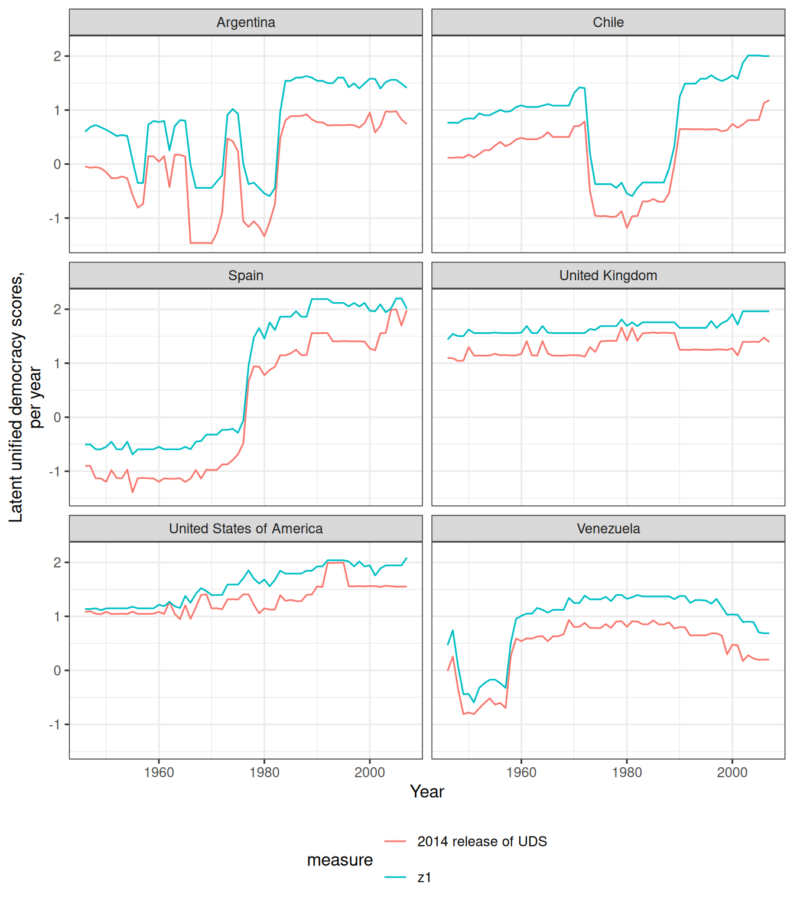
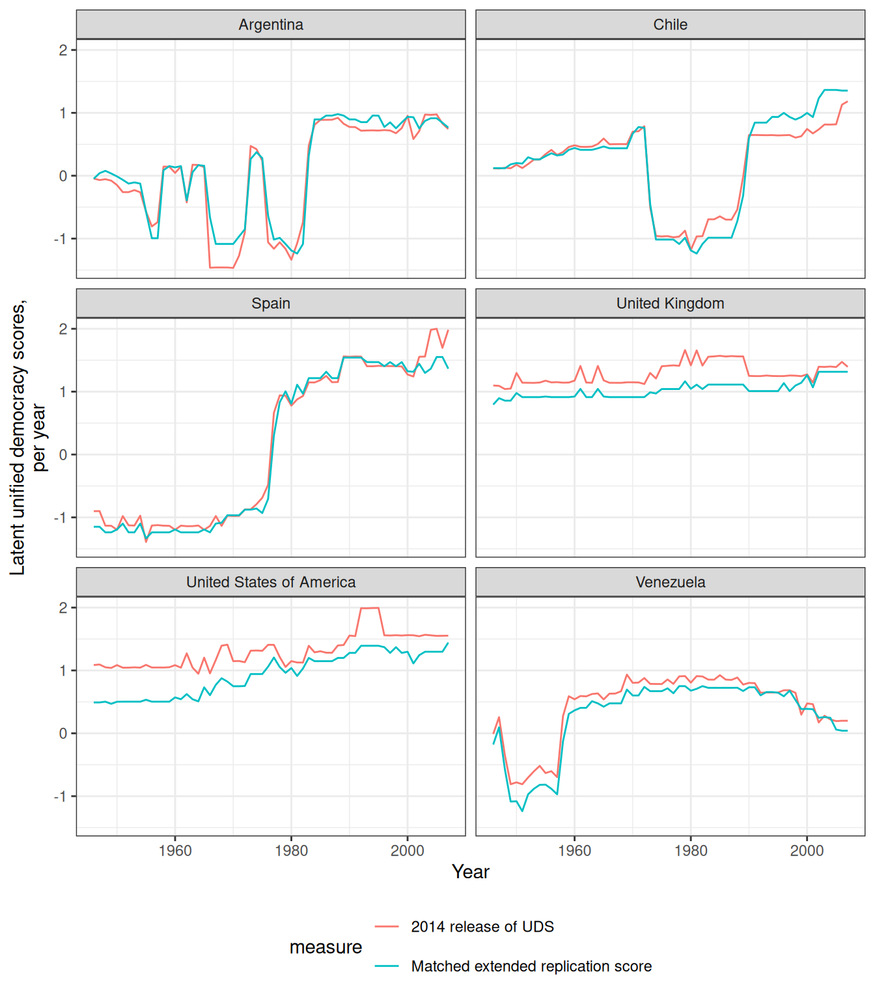
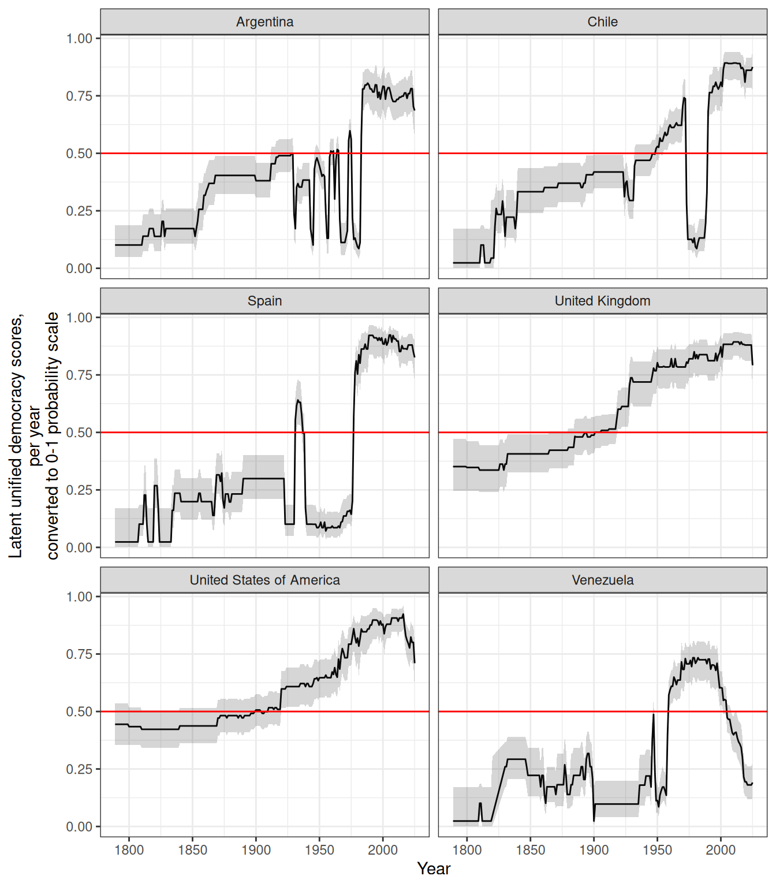
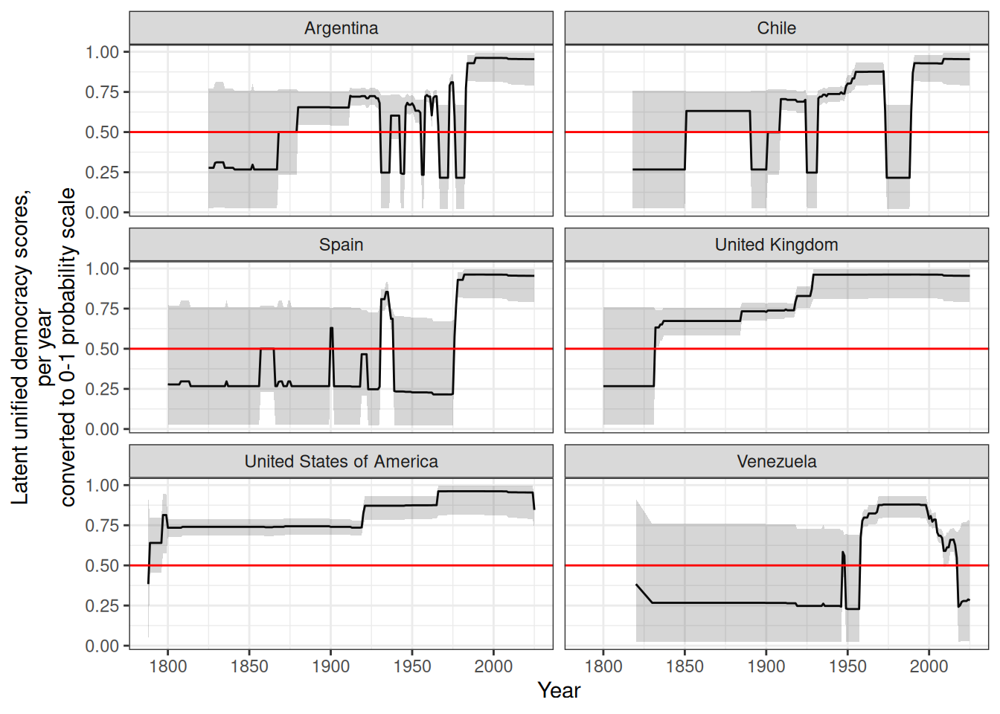
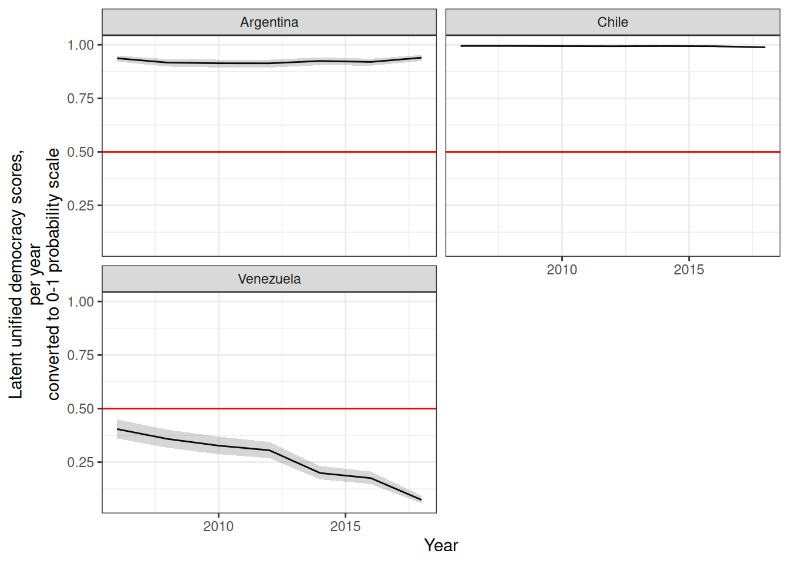
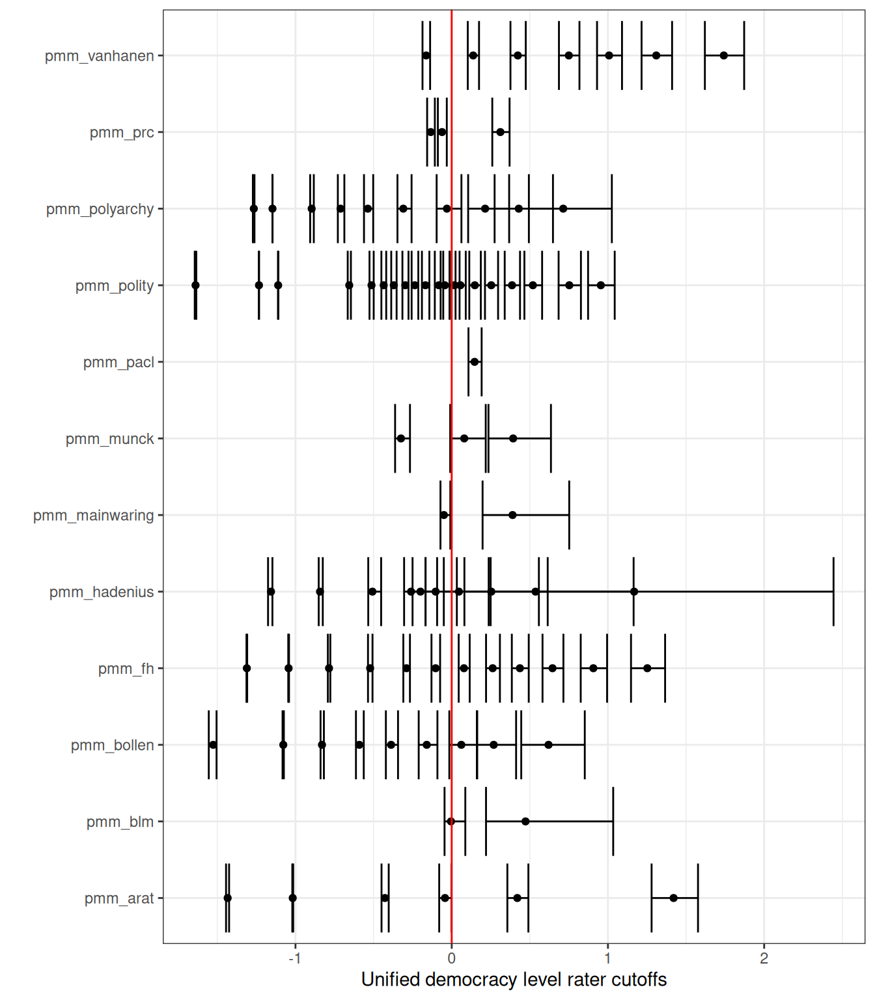
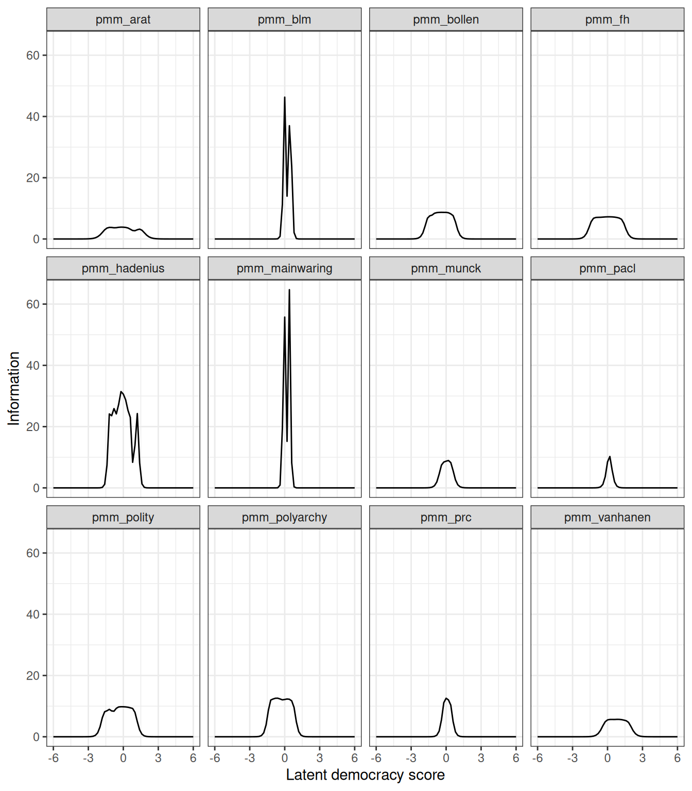

# Replicating and Extending the UD scores of Pemstein, Meserve, and Melton

We can use this package to replicate and extend the [Unified Democracy
Scores](http://www.unified-democracy-scores.org/) of Pemstein, Meserve,
and Melton ([2010](#ref-pmm2010)) (which are no longer being updated or
maintained), and in general to calculate latent variable indexes of
democracy.[^1] This article is a modified version of the vignette for my
package [QuickUDS](https://xmarquez.github.io/QuickUDS), which I am no
longer actively maintaining; I am slowly migrating the functions in that
package to this package to avoid having to update two different data
sets of democracy measures.

You will need the package
[`mirt`](https://cran.r-project.org/web/packages/mirt/index.html)
([Chalmers 2012](#ref-chalmersMirtMultidimensionalItem2012)), which can
quickly compute full-information factor analyses.

The basic procedure for replicating or extending the UD scores is very
simple.

1.  Generate a dataset of democracy scores with a call to
    [`generate_democracy_scores_dataset()`](https://xmarquez.github.io/democracyData/reference/generate_democracy_scores_dataset.md);
2.  Prepare the democracy data using the convenience function
    [`prepare_democracy_data()`](https://xmarquez.github.io/democracyData/reference/prepare_democracy_data.md);
3.  Fit a simple
    [`mirt`](https://cran.r-project.org/web/packages/mirt/index.html)
    model;
4.  Extract the calculated scores with a call to
    [`democracy_scores()`](https://xmarquez.github.io/democracyData/reference/democracy_scores.md)
    or to
    [`mirt::fscores()`](https://philchalmers.github.io/mirt/reference/fscores.html).

### Preparing your democracy measures

The first step is to prepare the democracy measures for use with
[`mirt`](https://cran.r-project.org/web/packages/mirt/index.html). I
focus first on replicating the 2011 release of the UDS, and then explain
how to extend and augment these scores.

In order to replicate the original UD scores, we need to use PMM’s
replication dataset ([Pemstein, Meserve, and Melton
2013](#ref-pmm2013uds2010)). This dataset is included this package: we
just need to generate a data frame of democracy scores from all the
datasets with names ending in `_pmm`. We can then use the function
[`prepare_democracy_data()`](https://xmarquez.github.io/democracyData/reference/prepare_democracy_data.md)
to put the data in the right format for use with
[`mirt`](https://cran.r-project.org/web/packages/mirt/index.html).

Code

``` r


library(mirt)
library(tidyverse)
library(democracyData)

identifiers <- c("extended_country_name", "GWn", "cown", "in_GW_system", "year")

democracy_data <- generate_democracy_scores_dataset(
  selection = "_pmm",
  exclude_pmm_duplicates = FALSE, 
  output_format = "wide") 
```

Before transformation by
[`prepare_democracy_data()`](https://xmarquez.github.io/democracyData/reference/prepare_democracy_data.md),
the data looks like this:

Code

``` r

skimr::skim(democracy_data |> select(matches("pmm")))
```

|  |  |
|:---|:---|
| Name | select(democracy_data, ma… |
| Number of rows | 9137 |
| Number of columns | 12 |
| \_\_\_\_\_\_\_\_\_\_\_\_\_\_\_\_\_\_\_\_\_\_\_ |  |
| Column type frequency: |  |
| numeric | 12 |
| \_\_\_\_\_\_\_\_\_\_\_\_\_\_\_\_\_\_\_\_\_\_\_\_ |  |
| Group variables | None |

Data summary {.table .caption-top}

**Variable type: numeric**

| skim_variable | n_missing | complete_rate | mean | sd | p0 | p25 | p50 | p75 | p100 | hist |
|:---|---:|---:|---:|---:|---:|---:|---:|---:|---:|:---|
| pmm_arat | 5264 | 0.42 | 73.20 | 18.91 | 29 | 58.00 | 69.00 | 92.00 | 109 | ▂▇▇▅▆ |
| pmm_blm | 8862 | 0.03 | 0.36 | 0.41 | 0 | 0.00 | 0.00 | 0.50 | 1 | ▇▁▃▁▃ |
| pmm_bollen | 8627 | 0.06 | 55.46 | 33.70 | 0 | 22.84 | 53.59 | 90.95 | 100 | ▅▅▃▂▇ |
| pmm_fh | 2699 | 0.70 | 4.15 | 2.07 | 1 | 2.50 | 4.00 | 6.00 | 7 | ▆▅▃▃▇ |
| pmm_hadenius | 9008 | 0.01 | 4.51 | 3.56 | 0 | 1.50 | 3.10 | 8.30 | 10 | ▇▅▁▂▆ |
| pmm_mainwaring | 8302 | 0.09 | 0.12 | 0.85 | -1 | -1.00 | 0.00 | 1.00 | 1 | ▆▁▅▁▇ |
| pmm_munck | 8795 | 0.04 | 0.84 | 0.26 | 0 | 0.75 | 1.00 | 1.00 | 1 | ▁▁▂▂▇ |
| pmm_pacl | 70 | 0.99 | 0.44 | 0.50 | 0 | 0.00 | 0.00 | 1.00 | 1 | ▇▁▁▁▆ |
| pmm_polity | 1087 | 0.88 | 0.13 | 7.50 | -10 | -7.00 | -1.00 | 8.00 | 10 | ▇▂▂▂▆ |
| pmm_polyarchy | 8784 | 0.04 | 6.33 | 3.51 | 0 | 3.00 | 7.00 | 10.00 | 10 | ▅▂▃▃▇ |
| pmm_prc | 3135 | 0.66 | 2.15 | 1.37 | 1 | 1.00 | 1.00 | 4.00 | 4 | ▇▁▁▂▅ |
| pmm_vanhanen | 172 | 0.98 | 11.31 | 12.67 | 0 | 0.00 | 5.90 | 20.70 | 49 | ▇▂▂▂▁ |

After transformation, it looks like this:

Code

``` r

democracy_data_transformed <- prepare_democracy_data(democracy_data)

skimr::skim(democracy_data_transformed |> select(matches("pmm")))
```

|  |  |
|:---|:---|
| Name | select(democracy_data_tra… |
| Number of rows | 9137 |
| Number of columns | 12 |
| \_\_\_\_\_\_\_\_\_\_\_\_\_\_\_\_\_\_\_\_\_\_\_ |  |
| Column type frequency: |  |
| numeric | 12 |
| \_\_\_\_\_\_\_\_\_\_\_\_\_\_\_\_\_\_\_\_\_\_\_\_ |  |
| Group variables | None |

Data summary {.table .caption-top}

**Variable type: numeric**

| skim_variable  | n_missing | complete_rate |  mean |   sd |  p0 | p25 |  p50 |  p75 | p100 | hist  |
|:---------------|----------:|--------------:|------:|-----:|----:|----:|-----:|-----:|-----:|:------|
| pmm_arat       |      5264 |          0.42 |  3.88 | 1.91 |   1 | 2.0 |  3.0 |  6.0 |    7 | ▇▆▃▃▇ |
| pmm_blm        |      8862 |          0.03 |  1.72 | 0.82 |   1 | 1.0 |  1.0 |  2.0 |    3 | ▇▁▃▁▃ |
| pmm_bollen     |      8627 |          0.06 |  6.01 | 3.23 |   1 | 3.0 |  6.0 | 10.0 |   10 | ▅▅▃▂▇ |
| pmm_fh         |      2699 |          0.70 |  7.30 | 4.13 |   1 | 4.0 |  7.0 | 11.0 |   13 | ▆▅▃▃▇ |
| pmm_hadenius   |      9008 |          0.01 |  4.51 | 3.56 |   0 | 1.5 |  3.1 |  8.3 |   10 | ▇▅▁▂▆ |
| pmm_mainwaring |      8302 |          0.09 |  2.12 | 0.85 |   1 | 1.0 |  2.0 |  3.0 |    3 | ▆▁▅▁▇ |
| pmm_munck      |      8795 |          0.04 |  3.33 | 0.96 |   1 | 3.0 |  4.0 |  4.0 |    4 | ▁▂▁▂▇ |
| pmm_pacl       |        70 |          0.99 |  1.44 | 0.50 |   1 | 1.0 |  1.0 |  2.0 |    2 | ▇▁▁▁▆ |
| pmm_polity     |      1087 |          0.88 | 11.13 | 7.50 |   1 | 4.0 | 10.0 | 19.0 |   21 | ▇▂▂▂▆ |
| pmm_polyarchy  |      8784 |          0.04 |  7.33 | 3.51 |   1 | 4.0 |  8.0 | 11.0 |   11 | ▅▂▃▃▇ |
| pmm_prc        |      3135 |          0.66 |  2.15 | 1.37 |   1 | 1.0 |  1.0 |  4.0 |    4 | ▇▁▁▂▅ |
| pmm_vanhanen   |       172 |          0.98 |  2.94 | 2.34 |   1 | 1.0 |  2.0 |  5.0 |    8 | ▇▁▂▁▂ |

The function
[`prepare_democracy_data()`](https://xmarquez.github.io/democracyData/reference/prepare_democracy_data.md)
gets rid of “empty rows” (country-years that have no measurements of
democracy for the chosen indexes; such patterns will make
[`mirt`](https://cran.r-project.org/web/packages/mirt/index.html) fail)
and transforms selected democracy indexes into ordinal variables
suitable for use with
[`mirt`](https://cran.r-project.org/web/packages/mirt/index.html),
mostly following the advice in Pemstein, Meserve, and Melton’s original
article (2010).

In particular,
[`prepare_democracy_data()`](https://xmarquez.github.io/democracyData/reference/prepare_democracy_data.md)
will try to do the following on your dataset:

- If a selected index contains the string `arat`, the function assumes
  the index is Arat’s ([Arat 1991](#ref-arat1991)) 0-109 democracy
  score, and cuts it into 7 intervals with the following cutoffs: 50,
  60, 70, 80, 90, and 100. The resulting score is ordinal from 1 to 8
  (following Pemstein, Meserve, and Melton’s advice).

- If a selected index contains the string `bollen`, the function assumes
  the index is Bollen’s ([Bollen 2001](#ref-bollen2001)) 0-100 democracy
  score, and cuts it into 10 intervals with the following cutoffs:
  10,20,30,40,50,60,70,80, and 90. The resulting score is ordinal from 1
  to 10 (following Pemstein, Meserve, and Melton’s advice).

- If a selected index contains the string `wgi`, the function assumes
  the index is the World Governance Indicator’s “Voice and
  Accountability” index ([Kaufmann and Kraay 2020](#ref-wgi2017)). Note
  that as of the 2025 data release, the WGI team rebuilt the aggregation
  model and recomputed all estimates back to 1996, so values returned by
  [`download_wgi_voice_and_accountability()`](https://xmarquez.github.io/democracyData/reference/download_wgi_voice_and_accountability.md)
  are **not comparable** to those used in pre-0.7.0 releases of this
  package; the prior series is preserved as `wgi_legacy`. The function
  cuts the index into 20 categories, producing an ordinal score from 1
  to 20.

- If a selected index contains the string `eiu`, the function assumes
  the index is the Economist Intelligence Unit’s democracy index ([The
  Economist Intelligence Unit 2026](#ref-eiu2025)), and it will cut it
  into 20 categories. The resulting score is ordinal from 1 to 20.

- If a selected index contains the string `hadenius_pmm`, the function
  assumes the index is Hadenius’s 0-10 democracy score ([Hadenius
  1992](#ref-Hadenius1992)), and it will cut it into 8 intervals with
  the following cutoffs: 1, 2,3,4, 7, 8, and 9. The resulting score is
  ordinal from 1 to 8 (following Pemstein, Meserve, and Melton’s
  advice).

- If the selected index contains the string `munck`, the function
  assumes the index is Munck’s 0-1 democracy score ([Munck
  2009](#ref-munck2009)), and it will cut it into 4 intervals with the
  following cutoffs: 0.5,0.5,0.75, and 0.99. The resulting score is
  ordinal from 1 to 4 (following Pemstein, Meserve, and Melton’s
  advice).

- If the selected index contains the string `peps`, the function assumes
  the index is one of the variants of the Participation-Enhanced Polity
  Score ([Moon et al. 2006](#ref-peps2006)), and it will round its value
  (eliminating the decimal) and then transform it into an ordinal
  measure from 1 to 21.

- If the selected index contains the string `polity`, the function
  assumes this is the Polity IV or Polity 5 score ([Marshall and Gurr
  2020](#ref-polity2020); [Marshall, Gurr, and Jaggers
  2019](#ref-polity2019)), and it will thus set any values below -10 to
  NA and then transform the variable into an ordinal measure from 1 to
  21.

- If the selected index contains the string
  `polyarchy_inclusion_dimension` or `polyarchy_contestation_dimension`,
  the function assumes this is one of the two dimensions of polyarchy
  estimated by Coppedge, Alvarez, and Maldonado
  ([2008](#ref-polyarchy_dimensions2008)), and it will cut it into 20
  categories. The resulting score is ordinal from 1 to 20.

- If the selected index contains the string `v2x`, the function assumes
  this is one of the v2x\_ continuous indexes of democracy from the
  V-Dem dataset ([Coppedge et al. 2026](#ref-vdem16codebook)), and it
  will cut it into 20 categories. The resulting score is ordinal from 1
  to 20.

- If the selected index contains the string `csvdmi` or `svdmi_2016`,
  the function assumes this is one of the continuous indexes of
  democracy from the SVMDI dataset ([Gründler and Krieger
  2016](#ref-svmdi2016), [2018](#ref-svmdi2018)), and it will cut it
  into 20 categories. The resulting score is ordinal from 1 to 20.

- If the selected index contains the string `bti`, the function assumes
  this is the Bertelsman Transformation Index ([Bertelsmann Stiftung
  2026](#ref-bti2026)), and it will cut it into 20 categories. The
  resulting score is ordinal from 1 to 20.

- If the selected index contains the string `vanhanen_democratization`
  or `vanhanen_pmm`, the function assumes this is Vanhanen’s index of
  democratization ([Vanhanen 2019](#ref-vanhanen2019)), and it will cut
  it into 8 intervals with the following cutoffs: 5,10,15,20,25,30, and
  35 (following Pemstein, Meserve, and Melton’s advice). The resulting
  score is ordinal from 1 to 8.

[`prepare_democracy_data()`](https://xmarquez.github.io/democracyData/reference/prepare_democracy_data.md)
will also work on column names that contain the following strings:

- `anckar` (assumes it’s the democracy indicator from [Anckar and
  Fredriksson 2018](#ref-anckarClassifyingPoliticalRegimes2018a))
- `anrr` (assumes it’s the democracy indicator from [Acemoglu et al.
  2019](#ref-anrr2019))
- `blm` (assumes it’s from [Bowman, Lehoucq, and Mahoney
  2005](#ref-blm2005))
- `bmr` (assumes it’s from [Boix, Miller, and Rosato
  2012](#ref-bmr2012))
- `doorenspleet` (assumes it’s from [Doorenspleet
  2000](#ref-doorenspleet2000))
- `dsvmdi` (assumes it’s the discrete machine-learning index [Gründler
  and Krieger 2018](#ref-svmdi2018))
- `e_v2x` (assumes it’s one of the “ordinal” indexes from the V-dem
  project, [Coppedge et al. 2026](#ref-vdem16codebook))
- `fh` or `freedomhouse` \[assumes it’s from Freedom House
  ([2025](#ref-fh2025)); note that the packaged Freedom House objects
  (`fh`, `fh_full`, `fh_electoral`) are frozen at the 2025 release (data
  through 2024), because Freedom House moved to email-request
  distribution in 2026\]
- `gwf` (assumes it’s from [Geddes, Wright, and Frantz
  2014](#ref-gwf2014) - the dichotomous democracy indicator only)
- `kailitz` (assumes it’s from from [Kailitz 2013](#ref-kailitz2013) -
  democracy/electoral autocracy/non-democracy indicator only)
- `lied` or `lexical_index` (assumes it’s from [Skaaning, Gerring, and
  Bartusevičius 2015](#ref-LIED2015))
- `mainwaring` (assumes it’s from [Mainwaring, Pérez-Liñán, and Brinks
  2014](#ref-mainwaring2014))
- `magaloni` (assumes it’s from [Magaloni, Chu, and Min
  2013](#ref-MagaloniChuMin2013))
- `pacl` or `cgv` (assumes it’s from [Cheibub, Gandhi, and Vreeland
  2009](#ref-pacl2010) or its later updates)
- `pitf` (assumes it’s the measure of democracy used in [Goldstone et
  al. 2010](#ref-pitf2010); [Taylor and Ulfelder 2015](#ref-pitf2015))
- `polyarchy` (assumes it’s from [Coppedge and Reinicke
  1990](#ref-polyarchy1990))
- `prc` (assumes it’s from [Gasiorowski 1996](#ref-Gasiorowski1996) or
  its later update)
- `przeworski` (assumes it’s the “regime” variable from [Przeworski
  2013](#ref-PIPE2013))
- `reign` (assumes it’s the democracy/dictatorship indicator from [Bell
  2016](#ref-reign2016))
- `svolik` (assumes it’s the democracy/dictatorship indicator from
  [Svolik 2012](#ref-svolikPoliticsAuthoritarianRule2012a))
- `ulfelder` (assumes it’s from [Ulfelder 2012](#ref-ulfelder2012))
- `utip` (assumes it’s from [Hsu 2008](#ref-utip2008))
- `wahman_teorell_hadenius` or `wth` (assumes it’s a
  democracy/non-democracy indicator from [Wahman, Teorell, and Hadenius
  2013](#ref-wahman_teorell_hadenius2013)).

In each of these cases the function
[`prepare_democracy_data()`](https://xmarquez.github.io/democracyData/reference/prepare_democracy_data.md)
transforms the values of the scores by running
`as.numeric(unclass(factor(x)))`, which transforms each index into
ordinal variables from 1 to the number of categories.

If you are using democracy indexes not included in the `democracy`
dataset, or want to use your own custom measures of democracy, or
transform them in a very particular way, you simply need to ensure that
there are no “blank” country-years in your data (i.e., country-years
without any democracy measurements; the package provides the convenience
function
[`remove_empty_rows()`](https://xmarquez.github.io/democracyData/reference/remove_empty_rows.md)
for this purpose) and that the indexes you are using are ordinal
measures from 1 to N with every category present in the data.
[`mirt`](https://cran.r-project.org/web/packages/mirt/index.html) is
pretty flexible and forgiving: it will accept ordinal variables in any
range and will attempt to transform your indexes so that every category
is within a distance of 1 of its neighboring categories. But it’s useful
to have a good sense of what the algorithm is doing to your data before
you begin!

### Fitting a democracy model

After you’ve prepared the data, you can then fit a model as follows:

Code

``` r


replication_2011_model <- mirt(
  democracy_data_transformed |> 
    select(
      matches("pmm")
      ), 
      model = 1,
      itemtype = "graded", SE = TRUE,
      verbose = FALSE
      )
                               
```

This just tells
[`mirt`](https://cran.r-project.org/web/packages/mirt/index.html) to fit
a one-factor, full information graded response model like that in
Pemstein, Meserve, and Melton ([2010](#ref-pmm2010)), and to calculate
the standard errors for the coefficients. (See
[`?mirt`](https://philchalmers.github.io/mirt/reference/mirt.html) for
details of the many options you can use to tweak your model, and see [my
paper](https://papers.ssrn.com/sol3/papers.cfm?abstract_id=2753830) for
a fuller description of why this model is useful here).

Fitting this model is reasonably fast:

Code

``` r

replication_2011_model@time
#> TOTAL:   Data  Estep  Mstep     SE   Post 
#>  5.466  0.303  0.600  3.646  0.889  0.001
```

We can easily check that this model converges and that it accounts for
most of the variance in the democracy indexes:

Code

``` r

replication_2011_model
#> 
#> Call:
#> mirt(data = select(democracy_data_transformed, matches("pmm")), 
#>     model = 1, itemtype = "graded", SE = TRUE, verbose = FALSE)
#> 
#> Full-information item factor analysis with 1 factor(s).
#> Converged within 1e-04 tolerance after 146 EM iterations.
#> mirt version: 1.46.1 
#> M-step optimizer: BFGS 
#> EM acceleration: Ramsay 
#> Number of rectangular quadrature: 61
#> Latent density type: Gaussian 
#> 
#> Information matrix estimated with method: Oakes
#> Second-order test: model is a possible local maximum
#> Condition number of information matrix =  89112.81
#> 
#> Log-likelihood = -55716.18
#> Estimated parameters: 97 
#> AIC = 111626.4
#> BIC = 112317; SABIC = 112008.8
summary(replication_2011_model)
#>                   F1    h2
#> pmm_arat       0.901 0.812
#> pmm_blm        0.992 0.985
#> pmm_bollen     0.951 0.904
#> pmm_fh         0.941 0.885
#> pmm_hadenius   0.986 0.972
#> pmm_mainwaring 0.994 0.989
#> pmm_munck      0.955 0.912
#> pmm_pacl       0.967 0.936
#> pmm_polity     0.954 0.911
#> pmm_polyarchy  0.965 0.932
#> pmm_prc        0.969 0.938
#> pmm_vanhanen   0.928 0.861
#> 
#>                 SE.F1
#> pmm_arat       0.0045
#> pmm_blm        0.0030
#> pmm_bollen     0.0066
#> pmm_fh         0.0024
#> pmm_hadenius   0.0050
#> pmm_mainwaring 0.0017
#> pmm_munck      0.0090
#> pmm_pacl       0.0022
#> pmm_polity     0.0018
#> pmm_polyarchy  0.0058
#> pmm_prc        0.0019
#> pmm_vanhanen   0.0024
#> 
#> SS loadings:  11.035 
#> Proportion Var:  0.92 
#> 
#> Factor correlations: 
#> 
#>    F1
#> F1  1
```

And we can then extract the latent democracy scores, either via
`mirt::fscore()`, or via this package’s convenient wrapper
`democracy_scores` (which returns a tidy dataset with the latent scores
and automatically calculates 95% confidence intervals):

Code

``` r

replication_2011_scores <-  fscores(replication_2011_model, 
                                    full.scores = TRUE, 
                                    full.scores.SE = TRUE)
# Not a data frame, no country-years:
str(replication_2011_scores)
#>  'matrix' num [1:9137, 1:2] -1.89 -1.89 -1.57 -1.57 -1.45 ...
#>  - attr(*, "dimnames")=List of 2
#>   ..$ : NULL
#>   ..$ : chr [1:2] "F1" "SE_F1"

replication_2011_scores <- democracy_scores(model = replication_2011_model)

replication_2011_scores <- bind_cols(democracy_data, replication_2011_scores)

# A data frame with confidence intervals and country-years:

replication_2011_scores
#> # A tibble: 9,137 × 30
#>    extended_country_name   GWn  cown in_GW_system  year pmm_arat pmm_blm
#>    <chr>                 <dbl> <dbl> <lgl>        <dbl>    <dbl>   <dbl>
#>  1 Afghanistan             700   700 TRUE          1946       NA      NA
#>  2 Afghanistan             700   700 TRUE          1947       NA      NA
#>  3 Afghanistan             700   700 TRUE          1948       54      NA
#>  4 Afghanistan             700   700 TRUE          1949       55      NA
#>  5 Afghanistan             700   700 TRUE          1950       54      NA
#>  6 Afghanistan             700   700 TRUE          1951       55      NA
#>  7 Afghanistan             700   700 TRUE          1952       56      NA
#>  8 Afghanistan             700   700 TRUE          1953       55      NA
#>  9 Afghanistan             700   700 TRUE          1954       56      NA
#> 10 Afghanistan             700   700 TRUE          1955       54      NA
#> # ℹ 9,127 more rows
#> # ℹ 23 more variables: pmm_bollen <dbl>, pmm_fh <dbl>, pmm_hadenius <dbl>,
#> #   pmm_mainwaring <dbl>, pmm_munck <dbl>, pmm_pacl <dbl>, pmm_polity <dbl>,
#> #   pmm_polyarchy <dbl>, pmm_prc <dbl>, pmm_vanhanen <dbl>, z1 <matrix>,
#> #   se_z1 <matrix>, z1_pct975 <matrix>, z1_pct025 <matrix>, z1_adj <matrix>,
#> #   z1_pct975_adj <matrix>, z1_pct025_adj <matrix>, z1_as_prob <matrix>,
#> #   z1_pct975_as_prob <matrix>, z1_pct025_as_prob <matrix>, …
```

We can check that these scores are, in fact, almost perfectly correlated
with Pemstein, Meserve, and Melton’s 2011 UDS release:

Code

``` r


uds <- generate_democracy_scores_dataset(
  selection = "uds", 
  output_format = "wide"
  )

replication_2011_scores <- replication_2011_scores |> 
  left_join(uds)

cor(replication_2011_scores |> 
  select(matches("uds_2011"), z1), use = "pairwise")
#>                 uds_2011_mean uds_2011_median        z1
#> uds_2011_mean       1.0000000       0.9999485 0.9996735
#> uds_2011_median     0.9999485       1.0000000 0.9995924
#> z1                  0.9996735       0.9995924 1.0000000
```

(For more details on the relationship between the original UD scores and
the replicated scores produced using this method, see my [working
paper](http://ssrn.com/abstract=2753830)).

### Extending the model

Now suppose you want to create a new latent score derived but want to
include other measures, or updated measures, or want to restrict your
sources to dichotomous indicators of democracy or a particular set of
measures that seem especially reliable.

For example, suppose we want to use:

- The dichotomous indicator of democracy, adjusted for female suffrage,
  in version 3.0 of the Boix, Miller and Rosato dataset of political
  regimes ([Boix, Miller, and Rosato 2012](#ref-bmr2012))
- The full extent of the Political Regime Change dataset ([Gasiorowski
  1996](#ref-Gasiorowski1996); [Reich 2002](#ref-prc_gasiorowski2002)),
  Vanhanen’s index of democratization ([Vanhanen
  2019](#ref-vanhanen2019)), Bowman, Lehoucq, and Mahoney’s data on
  Central America ([Bowman, Lehoucq, and Mahoney 2005](#ref-blm2005))
  and Mainwaring, Brinks and Perez-Linan’s data on Latin America
  ([Mainwaring, Pérez-Liñán, and Brinks 2014](#ref-mainwaring2014)), all
  of which go back to the beginning of the 20th century or before but
  are not used to their fullest extent in the official UD releases.
- One of the new V-Dem indexes of democracy, ordinal or continuous
  ([Coppedge et al. 2026](#ref-vdem16codebook))
- Renske Doorenspleet’s dichotomous indicator of democracy including
  suffrage info ([Doorenspleet 2000](#ref-doorenspleet2000))
- The World Governance Indicator’s latest Voice and Accountability index
  (note: the WGI was re-estimated under a new methodology in 2025, so
  current values are not comparable to those used in pre-0.7.0 analyses;
  the prior series is preserved as `wgi_legacy` for reproducibility)
- The archived 2025 release of Freedom House’s data (data through 2024,
  frozen because Freedom House no longer distributes machine-readable
  FIW data as a public download), and Polity 5 data through its most
  recent available update
- The indicators of democracy in various autocratic regime datasets
  ([Geddes, Wright, and Frantz 2014](#ref-gwf2014); [Kailitz
  2013](#ref-kailitz2013); [Svolik
  2012](#ref-svolikPoliticsAuthoritarianRule2012a); [Wahman, Teorell,
  and Hadenius 2013](#ref-wahman_teorell_hadenius2013))
- The 7-level Lexical Index of Democracy and Autocracy ([Skaaning,
  Gerring, and Bartusevičius 2015](#ref-LIED2015))
- Jay Ulfelder’s dichotomous indicator of democracy ([Ulfelder
  2012](#ref-ulfelder2012))

This package makes the process extremely simple:

Code

``` r


all_dem <- generate_democracy_scores_dataset(
  output_format = "wide",
  verbose = FALSE
  )


other_dem <- all_dem |>
  select(any_of(identifiers), arat, blm, bmr_democracy_femalesuffrage,
         pmm_bollen, doorenspleet, wgi_democracy, fh_total_reversed, 
         gwf_democracy_extended_strict, pmm_hadenius, kailitz_tri, svolik_democracy, 
         lexical_index, ulfelder_democracy_extended, prc, mainwaring, 
         vanhanen_democratization, v2x_polyarchy)

other_dem <- prepare_democracy_data(other_dem)

extended_model <- mirt(other_dem |> select(-any_of(identifiers)), 
                       model = 1, itemtype = "graded", SE = TRUE, verbose = FALSE)

summary(extended_model)
#>                                  F1    h2
#> arat                          0.962 0.925
#> blm                           0.991 0.982
#> bmr_democracy_femalesuffrage  0.989 0.978
#> pmm_bollen                    0.967 0.934
#> doorenspleet                  0.979 0.959
#> wgi_democracy                 0.974 0.948
#> fh_total_reversed             0.960 0.922
#> gwf_democracy_extended_strict 0.970 0.941
#> pmm_hadenius                  0.983 0.966
#> kailitz_tri                   0.965 0.932
#> svolik_democracy              0.976 0.952
#> lexical_index                 0.969 0.938
#> ulfelder_democracy_extended   0.980 0.960
#> prc                           0.986 0.972
#> mainwaring                    0.986 0.972
#> vanhanen_democratization      0.944 0.892
#> v2x_polyarchy                 0.980 0.961
#> 
#>                                 SE.F1
#> arat                          0.00172
#> blm                           0.00211
#> bmr_democracy_femalesuffrage  0.00072
#> pmm_bollen                    0.00392
#> doorenspleet                  0.00134
#> wgi_democracy                 0.00102
#> fh_total_reversed             0.00109
#> gwf_democracy_extended_strict 0.00162
#> pmm_hadenius                  0.00431
#> kailitz_tri                   0.00130
#> svolik_democracy              0.00145
#> lexical_index                 0.00073
#> ulfelder_democracy_extended   0.00117
#> prc                           0.00071
#> mainwaring                    0.00135
#> vanhanen_democratization      0.00129
#> v2x_polyarchy                 0.00047
#> 
#> SS loadings:  16.134 
#> Proportion Var:  0.949 
#> 
#> Factor correlations: 
#> 
#>    F1
#> F1  1

extended_scores <- democracy_scores(model = extended_model)

extended_scores <- bind_cols(
  other_dem |>
    select(any_of(identifiers)),
  extended_scores
  )

extended_scores <- extended_scores |>
  left_join(
    uds |> 
      select(any_of(identifiers), 
      matches("_mean")))
```

[`mirt`](https://cran.r-project.org/web/packages/mirt/index.html) will
stop by default after 500 EM cycles, but some models will take longer to
converge. If your model has not converged after 500 iterations of the
algorithm, you can try increasing the number of cycles with the
`technical` option. Use
[`?mirt`](https://philchalmers.github.io/mirt/reference/mirt.html) for
more details.

One important point to note about latent variable democracy scores is
that they are normalized with mean zero and standard deviation one, so a
score of 1 just means that the country-year is 1 standard deviation more
democratic than the average country-year in the sample. But this means
that adding extra country-years to our model will typically result in
scores that have a higher mean (though usually smaller standard errors)
than the original UD model, given that the world has become
substantially more democratic over the last two centuries:

Code

``` r

countries <- c("United States of America",
               "United Kingdom","Argentina",
               "Chile","Venezuela","Spain")

data <- extended_scores |> 
  filter(extended_country_name %in% countries) |>
  tidyr::gather(measure, zscore, uds_2014_mean, z1) |>
  filter(!is.na(zscore), year >=1946, year < 2008) |>
  mutate(measure = case_when(
    measure == "uds_2010_mean" ~ "2010 release of UDS",
    measure == "uds_2011_mean" ~ "2011 release of UDS",
    measure == "uds_2014_mean" ~ "2014 release of UDS",
    measure == "z1_matched" ~ "Extended replication score",
    TRUE ~ measure
    )
)

ggplot(data = data, 
       aes(x = year, y = zscore, color = measure)) + 
  geom_path() + 
  theme_bw() + 
  labs(x = "Year", y = "Latent unified democracy scores,\nper year")  + 
  theme(legend.position="bottom") + 
  guides(color = guide_legend(ncol = 1),fill = guide_legend(nrow = 1)) + 
  facet_wrap(~extended_country_name, ncol = 2)  
```



Figure 1: Extended replication scores vs. the 2014 UDS release, for
selected countries (1946-2008).

If necessary, one can therefore “match” the extended scores to the
official UD release by substracting the mean of the extended scores for
the period of the UD release one wants to match from the extended scores
(that is, making the mean of the extended scores equal to zero for the
period of adjustment):

Code

``` r

matched_data <- extended_scores |>
  filter(!is.na(uds_2014_mean)) |>
  mutate(z1_matched = z1 - mean(z1, na.rm = TRUE), 
         z1_pct975_matched = z1_pct975 - mean(z1, na.rm = TRUE), 
         z1_pct025_matched = z1_pct025 - mean(z1, na.rm = TRUE))

matched_data <- matched_data |> 
  filter(extended_country_name %in% countries) |>
  tidyr::gather(measure, zscore, uds_2014_mean, z1_matched) |>
  filter(!is.na(zscore), year >=1946, year < 2008) |>
  mutate(measure = case_when(
    measure == "uds_2010_mean" ~ "2010 release of UDS",
    measure == "uds_2011_mean" ~ "2011 release of UDS",
    measure == "uds_2014_mean" ~ "2014 release of UDS",
    measure == "z1_matched" ~ "Matched extended replication score",
    TRUE ~ measure
    ))

ggplot(data = matched_data, 
       aes(x = year, y = zscore, color = measure)) + 
  geom_path() + 
  theme_bw() + 
  labs(x = "Year", y = "Latent unified democracy scores,\nper year")  + 
  theme(legend.position="bottom") + 
  guides(color = guide_legend(ncol=1),fill = guide_legend(nrow=1)) + 
  facet_wrap(~extended_country_name,ncol=2)  
```



Figure 2: Extended replication scores, mean-adjusted to match the 2014
UDS release period, for selected countries.

In the graph above, we can see that the 2014 release of the UDS seems to
overestimate the degree of democracy in the USA in the early decades of
1950 relative to the “extended” scores.

These scores have a more natural interpretation when transformed to a
0-1 index using the cumulative distribution function as the “probability
that a country-year is democratic” (so the 0 is now a natural minimum,
and 1 a natural maximum). These indexes are automatically produced by
the function `democracy_scores`; they are in the column `z1_as_prob` of
the output, and are produced by applying the `pnorm` function to `z1`,
as follows:

Code

``` r

extended_scores <- extended_scores |> 
  mutate(index = pnorm(z1), 
         index_pct025 = pnorm(z1_pct025), 
         index_pct975 = pnorm(z1_pct975))

# These are equal to z1_as_prob, which is automatically calculated:

extended_scores |> filter(index != z1_as_prob)
#> # A tibble: 0 × 24
#> # ℹ 24 variables: extended_country_name <chr>, GWn <dbl>, cown <dbl>,
#> #   in_GW_system <lgl>, year <dbl>, z1 <matrix>, se_z1 <matrix>,
#> #   z1_pct975 <matrix>, z1_pct025 <matrix>, z1_adj <matrix>,
#> #   z1_pct975_adj <matrix>, z1_pct025_adj <matrix>, z1_as_prob <matrix>,
#> #   z1_pct975_as_prob <matrix>, z1_pct025_as_prob <matrix>,
#> #   z1_adj_as_prob <matrix>, z1_pct975_adj_as_prob <matrix>,
#> #   z1_pct025_adj_as_prob <matrix>, uds_2010_mean <dbl>, uds_2011_mean <dbl>, …
```

It is also possible to to set the cutpoint for this index at, for
example, the average cutpoint in the latent variable of the dichotomous
indexes of democracy (so that 0.5 correponds more naturally to the point
at which a regime could be either democratic or non-democratic according
to the dichotomous measures of democracy included in your model). These
scores are also automatically calculated (they are in the column
`z1_adj`) but they can also be manually added as follows:

Code

``` r

cutpoints_extended <- cutpoints(extended_model)

cutpoints_extended
#> # A tibble: 101 × 6
#>    variable                     estimate pct025 pct975      se num_obs
#>    <chr>                           <dbl>  <dbl>  <dbl>   <dbl>   <int>
#>  1 arat                           -0.518 -0.522 -0.513 0.00246    3873
#>  2 arat                           -0.190 -0.203 -0.177 0.00693    3873
#>  3 arat                            0.239  0.206  0.275 0.0186     3873
#>  4 arat                            0.525  0.471  0.584 0.0302     3873
#>  5 arat                            0.908  0.822  1.00  0.0479     3873
#>  6 arat                            1.69   1.54   1.86  0.0837     3873
#>  7 blm                             0.479  0.300  0.762 0.144       505
#>  8 blm                             1.06   0.674  1.67  0.312       505
#>  9 bmr_democracy_femalesuffrage    0.841  0.741  0.955 0.0581    19126
#> 10 pmm_bollen                     -0.649 -0.658 -0.637 0.00604     510
#> # ℹ 91 more rows

dichotomous_cutpoints <- cutpoints_extended |> 
  group_by(variable) |>
  filter(n() == 1) 

dichotomous_cutpoints
#> # A tibble: 5 × 6
#> # Groups:   variable [5]
#>   variable                      estimate pct025 pct975     se num_obs
#>   <chr>                            <dbl>  <dbl>  <dbl>  <dbl>   <int>
#> 1 bmr_democracy_femalesuffrage     0.841  0.741  0.955 0.0581   19126
#> 2 doorenspleet                     0.925  0.815  1.05  0.0638   13009
#> 3 gwf_democracy_extended_strict    0.663  0.590  0.744 0.0417    9243
#> 4 svolik_democracy                 0.720  0.635  0.816 0.0491    8554
#> 5 ulfelder_democracy_extended      0.711  0.630  0.802 0.0464   11545

avg_dichotomous <- mean(dichotomous_cutpoints$estimate)

avg_dichotomous
#> [1] 0.7720065

extended_scores <- extended_scores |> mutate(adj_z1 = z1 - avg_dichotomous, 
                                        adj_pct025 = z1_pct025 - avg_dichotomous, 
                                        adj_pct975 =z1_pct975 - avg_dichotomous,
                                        index = pnorm(adj_z1),
                                        index_pct025 = pnorm(adj_pct025),
                                        index_pct975 = pnorm(adj_pct975))

ggplot(data = extended_scores |> filter(extended_country_name %in% countries), 
       aes(x= year, y = index, 
           ymin = index_pct025, ymax = index_pct975)) + 
  geom_line() + 
  geom_ribbon(alpha=0.2) + 
  theme_bw() + 
  labs(x = "Year", y = "Latent unified democracy scores,\nper year\nconverted to 0-1 probability scale")  + 
  theme(legend.position="bottom") + 
  guides(color = guide_legend(ncol=1),fill = guide_legend(nrow=1)) + 
  geom_hline(yintercept=0.5,color="red") +
  facet_wrap(~extended_country_name,ncol=2)  
```



Figure 3: Extended scores transformed to a 0-1 probability scale, with
the cutpoint set at the average cutpoint of the dichotomous rater
indicators.

A pre-computed and documented version of the extended UDS scores, with
data from all the indexes mentioned above, plus the
participation-enhanced Polity Scores of Moon et al.
([2006](#ref-peps2006)), a trichotomous democracy indicator calculated
from Magaloni, Min, and Chu’s “Autocracies of the World” datset
([Magaloni, Chu, and Min 2013](#ref-MagaloniChuMin2013)), a dichotomous
democracy indicator calculated from Hsu ([2008](#ref-utip2008)), the
REIGN dataset of Bell ([2016](#ref-reign2016)), which extends Geddes,
Wright, and Frantz ([2014](#ref-gwf2014)), a dichotomous democracy
indicator from Acemoglu et al. ([2019](#ref-anrr2019)), the Bertelsmann
Transformation index ([Bertelsmann Stiftung 2026](#ref-bti2026)), the
Varieties of Political Regimes dataset ([Kailitz
2026](#ref-vaporeg32dataset)) (the 0.7.0 release refreshed VaPoReg to
the March 2026 upstream schema; the legacy pre-0.7.0 VaPoReg variables
are preserved separately as `vaporeg_2024`), and an indicator of
democracy used by the Political Instability Task Force ([Goldstone et
al. 2010](#ref-pitf2010); [Taylor and Ulfelder 2015](#ref-pitf2015)), is
included with the package; it can be loaded by simply typing
`extended_uds`. The `extended_uds` object shipped with 0.7.0 was rebuilt
using the revised WGI and current VaPoReg inputs alongside the other
refreshed datasets. Use
[`?extended_uds`](https://xmarquez.github.io/democracyData/reference/extended_uds.md)
to examine the documentation for all its variables, and see my working
paper ([Marquez 2016](http://ssrn.com/abstract=2753830)) for more detail
on the data and its uses.

The function
[`generate_extended_uds()`](https://xmarquez.github.io/democracyData/reference/generate_extended_uds.md)
recreates these scores in one line of code, at the cost of some
flexibility.

### Other Extensions

We can also use this method to create indexes from specific types of
scores, such as dichotomous measures of democracy. Here we compute a
2-parameter logistic model from all dichotomous indexes of democracy
(excluding near-duplicates):

Code

``` r

dichotomous_dem <- all_dem |>
  select(any_of(identifiers), where(~n_distinct(.) <= 3))  |>
  select(-pacl,
         -bmr_democracy_omitteddata, -bmr_democracy,
         -wth_democ1,
         -gwf_democracy_extended, -utip_dichotomous)

dichotomous_dem <- prepare_democracy_data(dichotomous_dem)

dichotomous_model <- mirt(dichotomous_dem |> select(-any_of(identifiers)),
                          model = 1, itemtype = "2PL", SE = TRUE, verbose = FALSE)

summary(dichotomous_model)
#>                                  F1    h2
#> anckar_democracy              0.996 0.992
#> anrr_democracy                0.985 0.971
#> bmr_democracy_femalesuffrage  0.996 0.992
#> bnr_extended                  0.973 0.948
#> doorenspleet                  0.978 0.956
#> fh_electoral                  0.982 0.964
#> gwf_democracy_extended_strict 0.978 0.956
#> kailitz_binary                0.981 0.963
#> magaloni_democracy_extended   0.983 0.966
#> pacl_update                   0.971 0.943
#> PIPE_democracy                0.813 0.660
#> pitf_binary                   0.975 0.951
#> reign_democracy               0.971 0.942
#> dsvmdi                        0.958 0.919
#> svolik_democracy              0.979 0.959
#> ulfelder_democracy_extended   0.979 0.958
#> utip_dichotomous_strict       0.930 0.864
#> vaporeg_binary_strict         0.982 0.964
#> vaporeg_binary_non_strict     0.981 0.962
#> wth_democrobust               0.976 0.953
#> 
#>                                 SE.F1
#> anckar_democracy              0.00050
#> anrr_democracy                0.00118
#> bmr_democracy_femalesuffrage  0.00056
#> bnr_extended                  0.00164
#> doorenspleet                  0.00154
#> fh_electoral                  0.00143
#> gwf_democracy_extended_strict 0.00147
#> kailitz_binary                0.00128
#> magaloni_democracy_extended   0.00119
#> pacl_update                   0.00155
#> PIPE_democracy                0.00538
#> pitf_binary                   0.00130
#> reign_democracy               0.00156
#> dsvmdi                        0.00196
#> svolik_democracy              0.00144
#> ulfelder_democracy_extended   0.00130
#> utip_dichotomous_strict       0.00399
#> vaporeg_binary_strict         0.00156
#> vaporeg_binary_non_strict     0.00098
#> wth_democrobust               0.00176
#> 
#> SS loadings:  18.782 
#> Proportion Var:  0.939 
#> 
#> Factor correlations: 
#> 
#>    F1
#> F1  1

dichotomous_scores <- democracy_scores(dichotomous_model)

dichotomous_scores <- bind_cols(dichotomous_dem |> select(any_of(identifiers)),
                                dichotomous_scores)


ggplot(data = dichotomous_scores |> filter(extended_country_name %in% countries),
       aes(x= year, y = z1_as_prob,
           ymin = z1_pct025_as_prob, ymax = z1_pct975_as_prob)) +
  geom_line() +
  geom_ribbon(alpha=0.2) +
  theme_bw() +
  labs(x = "Year", y = "Latent unified democracy scores,\nper year\nconverted to 0-1 probability scale")  +
  theme(legend.position="bottom") +
  guides(color = guide_legend(ncol=1),fill = guide_legend(nrow=1)) +
  geom_hline(yintercept=0.5,color="red") +
  facet_wrap(~extended_country_name,ncol=2)
```



Figure 4: Latent democracy scores fit only from dichotomous raters
(2-parameter logistic model), on the 0-1 probability scale.

As Gründler and Krieger ([2021/05/17/](#ref-svmdi2021)) note, latent
variable indexes suffer from arbitrary changes in level related to
variables entering into or out of the source data. One way to get around
this is to use a panel, with every measure present for every
country-year in the panel. For example, suppose we’re interested only in
measures with long coverage. Here we select a set of indexes with
coverage down to the 19th century and then select the set of rows for
which all measures exist, producing a panel with 159 countries and
scores from 1919 to 2003.

Code

``` r

full_panel <- all_dem |>
  select(any_of(identifiers), reign_democracy, polity2,
         bmr_democracy_femalesuffrage, v2x_polyarchy,
         ulfelder_democracy_extended, bnr_extended, 
         magaloni_democracy_extended, csvmdi, pitf,
         anckar_democracy, PEPS1v, vanhanen_democratization) |>
  rowwise() |>
  mutate(num_nas = sum(is.na(c_across(-any_of(identifiers))))) |>
  filter(num_nas == 0) |>
  ungroup() |>
  select(-num_nas)

full_panel <- prepare_democracy_data(full_panel)

panel_model <- mirt(full_panel |> select(-any_of(identifiers)),
                    model = 1, itemtype = "graded", SE = TRUE, 
                    verbose = FALSE, technical = list(NCYCLES = 1000))

panel_model@time
#> TOTAL:   Data  Estep  Mstep     SE   Post 
#>  8.251  0.053  1.131  5.987  1.047  0.000

summary(panel_model)
#>                                 F1    h2
#> reign_democracy              0.979 0.958
#> polity2                      0.990 0.980
#> bmr_democracy_femalesuffrage 0.984 0.969
#> v2x_polyarchy                0.924 0.854
#> ulfelder_democracy_extended  0.978 0.956
#> bnr_extended                 0.975 0.951
#> magaloni_democracy_extended  0.989 0.979
#> csvmdi                       0.958 0.917
#> pitf                         0.981 0.963
#> anckar_democracy             0.988 0.977
#> PEPS1v                       0.991 0.982
#> vanhanen_democratization     0.949 0.900
#> 
#>                                SE.F1
#> reign_democracy              0.00157
#> polity2                      0.00040
#> bmr_democracy_femalesuffrage 0.00132
#> v2x_polyarchy                0.00203
#> ulfelder_democracy_extended  0.00159
#> bnr_extended                 0.00178
#> magaloni_democracy_extended  0.00110
#> csvmdi                       0.00135
#> pitf                         0.00083
#> anckar_democracy             0.00107
#> PEPS1v                       0.00036
#> vanhanen_democratization     0.00170
#> 
#> SS loadings:  11.386 
#> Proportion Var:  0.949 
#> 
#> Factor correlations: 
#> 
#>    F1
#> F1  1

panel_scores <- democracy_scores(panel_model)

panel_scores <- bind_cols(full_panel |> select(any_of(identifiers)),
                                panel_scores)

skimr::skim(panel_scores)
```

|                                                  |              |
|:-------------------------------------------------|:-------------|
| Name                                             | panel_scores |
| Number of rows                                   | 7058         |
| Number of columns                                | 18           |
| \_\_\_\_\_\_\_\_\_\_\_\_\_\_\_\_\_\_\_\_\_\_\_   |              |
| Column type frequency:                           |              |
| character                                        | 14           |
| logical                                          | 1            |
| numeric                                          | 3            |
| \_\_\_\_\_\_\_\_\_\_\_\_\_\_\_\_\_\_\_\_\_\_\_\_ |              |
| Group variables                                  | None         |

Data summary {.table .caption-top}

**Variable type: character**

| skim_variable         | n_missing | complete_rate | min | max | empty | n_unique | whitespace |
|:----------------------|----------:|--------------:|----:|----:|------:|---------:|-----------:|
| extended_country_name |         0 |             1 |   4 |  39 |     0 |      158 |          0 |
| z1                    |         0 |             1 |  14 |  21 |     0 |     1625 |          0 |
| se_z1                 |         0 |             1 |  14 |  18 |     0 |     1625 |          0 |
| z1_pct975             |         0 |             1 |  13 |  20 |     0 |     1625 |          0 |
| z1_pct025             |         0 |             1 |  14 |  21 |     0 |     1625 |          0 |
| z1_adj                |         0 |             1 |  15 |  21 |     0 |     1625 |          0 |
| z1_pct975_adj         |         0 |             1 |  14 |  20 |     0 |     1625 |          0 |
| z1_pct025_adj         |         0 |             1 |  15 |  21 |     0 |     1625 |          0 |
| z1_as_prob            |         0 |             1 |  14 |  18 |     0 |     1625 |          0 |
| z1_pct975_as_prob     |         0 |             1 |  14 |  18 |     0 |     1625 |          0 |
| z1_pct025_as_prob     |         0 |             1 |  13 |  19 |     0 |     1625 |          0 |
| z1_adj_as_prob        |         0 |             1 |  15 |  19 |     0 |     1625 |          0 |
| z1_pct975_adj_as_prob |         0 |             1 |  13 |  18 |     0 |     1625 |          0 |
| z1_pct025_adj_as_prob |         0 |             1 |  15 |  20 |     0 |     1625 |          0 |

**Variable type: logical**

| skim_variable | n_missing | complete_rate | mean | count     |
|:--------------|----------:|--------------:|-----:|:----------|
| in_GW_system  |         0 |             1 |    1 | TRU: 7058 |

**Variable type: numeric**

| skim_variable | n_missing | complete_rate | mean | sd | p0 | p25 | p50 | p75 | p100 | hist |
|:---|---:|---:|---:|---:|---:|---:|---:|---:|---:|:---|
| GWn | 0 | 1 | 455.34 | 246.18 | 20 | 230 | 451 | 663 | 950 | ▇▇▇▇▅ |
| cown | 0 | 1 | 455.33 | 246.19 | 20 | 230 | 451 | 663 | 950 | ▇▇▇▇▅ |
| year | 0 | 1 | 1976.28 | 18.27 | 1919 | 1964 | 1978 | 1992 | 2003 | ▁▂▅▇▇ |

Figure 5: Latent democracy scores from a panel of long-coverage
measures, constrained to country-years with no missing values.

Code

``` r


ggplot(data = panel_scores |> filter(extended_country_name %in% countries), 
       aes(x= year, y = z1_as_prob, 
           ymin = z1_pct025_as_prob, ymax = z1_pct975_as_prob)) + 
  geom_line() + 
  geom_ribbon(alpha=0.2) + 
  theme_bw() + 
  labs(x = "Year", y = "Latent unified democracy scores,\nper year\nconverted to 0-1 probability scale")  + 
  theme(legend.position="bottom") + 
  guides(color = guide_legend(ncol=1),fill = guide_legend(nrow=1)) + 
  geom_hline(yintercept=0.5,color="red") +
  facet_wrap(~extended_country_name,ncol=2)
```


Figure 6: Latent democracy scores from a panel of long-coverage
measures, constrained to country-years with no missing values.

Or suppose we’re interested in a particular coverage period, including
only measures that have data to 2018:

Code

``` r

full_panel <- all_dem |>
  pivot_longer(-any_of(identifiers), values_drop_na = TRUE) |>
  filter(name %in% name[year == 2018]) |>
  filter(year <= 2018) |>
  pivot_wider(id_cols = any_of(identifiers), names_from = "name", values_from = "value") |>
  unnest(fh_total_reversed:eiu) |>
  select(-pitf_binary, -dsvmdi, -polityIV, -polity2IV, 
         -polity,  -vanhanen_competition, 
         -vanhanen_participation) |>
  rowwise() |>
  mutate(num_nas = sum(is.na(c_across(-any_of(identifiers))))) |>
  filter(num_nas == 0) |>
  ungroup() |>
  select(-num_nas)

full_panel <- prepare_democracy_data(full_panel)

panel_model <- mirt(full_panel |> select(-any_of(identifiers)),
                    model = 1, itemtype = "graded", SE = TRUE, 
                    verbose = FALSE, technical = list(NCYCLES = 1000))

panel_model@time
#> TOTAL:   Data  Estep  Mstep     SE   Post 
#> 17.099  0.037  0.760 12.112  4.123  0.000

summary(panel_model)
#>                                 F1    h2
#> fh_total_reversed            0.925 0.856
#> lexical_index                0.936 0.876
#> lexical_index_plus           0.932 0.869
#> v2x_polyarchy                0.998 0.995
#> v2x_libdem                   0.971 0.943
#> v2x_partipdem                0.964 0.930
#> v2x_api                      0.997 0.995
#> v2x_mpi                      0.997 0.994
#> anckar_democracy             0.932 0.868
#> bmr_democracy                0.908 0.825
#> bmr_democracy_femalesuffrage 0.908 0.825
#> bmr_democracy_omitteddata    0.908 0.825
#> pitf                         0.859 0.737
#> polity2                      0.867 0.751
#> vaporeg_binary_strict        0.874 0.765
#> vaporeg_binary_non_strict    0.937 0.878
#> vaporeg_trichotomous         0.923 0.852
#> v2x_delibdem                 0.951 0.904
#> v2x_egaldem                  0.919 0.844
#> csvmdi                       0.886 0.785
#> vanhanen_democratization     0.620 0.385
#> reign_democracy              0.841 0.708
#> pacl_update                  0.815 0.665
#> fh_electoral                 0.937 0.879
#> wgi_democracy                0.911 0.830
#> bti                          0.897 0.805
#> eiu                          0.846 0.716
#> 
#>                                SE.F1
#> fh_total_reversed            0.00486
#> lexical_index                0.00693
#> lexical_index_plus           0.00593
#> v2x_polyarchy                0.00053
#> v2x_libdem                   0.00222
#> v2x_partipdem                0.00242
#> v2x_api                      0.00040
#> v2x_mpi                      0.00043
#> anckar_democracy             0.01013
#> bmr_democracy                0.01233
#> bmr_democracy_femalesuffrage 0.01233
#> bmr_democracy_omitteddata    0.01233
#> pitf                         0.01065
#> polity2                      0.00836
#> vaporeg_binary_strict        0.02094
#> vaporeg_binary_non_strict    0.01082
#> vaporeg_trichotomous         0.00896
#> v2x_delibdem                 0.00331
#> v2x_egaldem                  0.00509
#> csvmdi                       0.00795
#> vanhanen_democratization     0.01849
#> reign_democracy              0.01720
#> pacl_update                  0.01888
#> fh_electoral                 0.01017
#> wgi_democracy                0.00552
#> bti                          0.00640
#> eiu                          0.00898
#> 
#> SS loadings:  22.305 
#> Proportion Var:  0.826 
#> 
#> Factor correlations: 
#> 
#>    F1
#> F1  1

panel_scores <- democracy_scores(panel_model)

panel_scores <- bind_cols(full_panel |> select(any_of(identifiers)),
                                panel_scores)

skimr::skim(panel_scores)
```

|                                                  |              |
|:-------------------------------------------------|:-------------|
| Name                                             | panel_scores |
| Number of rows                                   | 832          |
| Number of columns                                | 18           |
| \_\_\_\_\_\_\_\_\_\_\_\_\_\_\_\_\_\_\_\_\_\_\_   |              |
| Column type frequency:                           |              |
| character                                        | 14           |
| logical                                          | 1            |
| numeric                                          | 3            |
| \_\_\_\_\_\_\_\_\_\_\_\_\_\_\_\_\_\_\_\_\_\_\_\_ |              |
| Group variables                                  | None         |

Data summary {.table .caption-top}

**Variable type: character**

| skim_variable         | n_missing | complete_rate | min | max | empty | n_unique | whitespace |
|:----------------------|----------:|--------------:|----:|----:|------:|---------:|-----------:|
| extended_country_name |         0 |             1 |   4 |  39 |     0 |      129 |          0 |
| z1                    |         0 |             1 |  14 |  21 |     0 |      792 |          0 |
| se_z1                 |         0 |             1 |  15 |  18 |     0 |      792 |          0 |
| z1_pct975             |         0 |             1 |  14 |  20 |     0 |      792 |          0 |
| z1_pct025             |         0 |             1 |  13 |  20 |     0 |      792 |          0 |
| z1_adj                |         0 |             1 |  14 |  20 |     0 |      792 |          0 |
| z1_pct975_adj         |         0 |             1 |  14 |  20 |     0 |      792 |          0 |
| z1_pct025_adj         |         0 |             1 |  13 |  19 |     0 |      792 |          0 |
| z1_as_prob            |         0 |             1 |  15 |  19 |     0 |      792 |          0 |
| z1_pct975_as_prob     |         0 |             1 |  14 |  18 |     0 |      792 |          0 |
| z1_pct025_as_prob     |         0 |             1 |  15 |  19 |     0 |      792 |          0 |
| z1_adj_as_prob        |         0 |             1 |  14 |  19 |     0 |      792 |          0 |
| z1_pct975_adj_as_prob |         0 |             1 |  14 |  18 |     0 |      792 |          0 |
| z1_pct025_adj_as_prob |         0 |             1 |  13 |  19 |     0 |      792 |          0 |

**Variable type: logical**

| skim_variable | n_missing | complete_rate | mean | count    |
|:--------------|----------:|--------------:|-----:|:---------|
| in_GW_system  |         0 |             1 |    1 | TRU: 832 |

**Variable type: numeric**

| skim_variable | n_missing | complete_rate | mean | sd | p0 | p25 | p50 | p75 | p100 | hist |
|:---|---:|---:|---:|---:|---:|---:|---:|---:|---:|:---|
| GWn | 0 | 1 | 483.69 | 226.96 | 40 | 355 | 500 | 690 | 910 | ▆▆▇▇▅ |
| cown | 0 | 1 | 483.69 | 226.96 | 40 | 355 | 500 | 690 | 910 | ▆▆▇▇▅ |
| year | 0 | 1 | 2012.06 | 4.02 | 2006 | 2008 | 2012 | 2016 | 2018 | ▇▃▃▃▇ |

Figure 7: Latent democracy scores from a panel restricted to measures
with data through 2018. Holding the set of input raters fixed across the
entire window prevents the arbitrary level shifts that Gründler and
Krieger ([2021/05/17/](#ref-svmdi2021)) flag, at the cost of dropping
country-years that fall outside any rater’s coverage.

Code

``` r


ggplot(data = panel_scores |> filter(extended_country_name %in% countries), 
       aes(x= year, y = z1_as_prob, 
           ymin = z1_pct025_as_prob, ymax = z1_pct975_as_prob)) + 
  geom_line() + 
  geom_ribbon(alpha=0.2) + 
  theme_bw() + 
  labs(x = "Year", y = "Latent unified democracy scores,\nper year\nconverted to 0-1 probability scale")  + 
  theme(legend.position="bottom") + 
  guides(color = guide_legend(ncol=1),fill = guide_legend(nrow=1)) + 
  geom_hline(yintercept=0.5,color="red") +
  facet_wrap(~extended_country_name,ncol=2)
```



Figure 8: Latent democracy scores from a panel restricted to measures
with data through 2018. Holding the set of input raters fixed across the
entire window prevents the arbitrary level shifts that Gründler and
Krieger ([2021/05/17/](#ref-svmdi2021)) flag, at the cost of dropping
country-years that fall outside any rater’s coverage.

### Extracting useful information from a model

The [`mirt`](https://cran.r-project.org/web/packages/mirt/index.html)
package offers a great number of powerful tools to examine and diagnose
the fitted model, including functions to extract model cutpoints and
item information curves. But this package also contains two convenience
functions that wrap
[`mirt`](https://cran.r-project.org/web/packages/mirt/index.html) tools
to quickly extract democracy rater discrimination parameters, rater
cutoffs, and rater information curves from a model produced by this
procedure in a tidy data frame format suitable for graphing. Here, for
example, we can replicate the figures in PMM’s original paper:

Code

``` r

replication_2011_cutpoints <- cutpoints(replication_2011_model, type ="score")
replication_2011_cutpoints
#> # A tibble: 85 × 6
#>    variable   estimate  pct025   pct975      se num_obs
#>    <chr>         <dbl>   <dbl>    <dbl>   <dbl>   <int>
#>  1 pmm_arat   -1.43    -1.42   -1.44    0.00526    3873
#>  2 pmm_arat   -1.02    -1.02   -1.01    0.00149    3873
#>  3 pmm_arat   -0.427   -0.449  -0.403   0.0123     3873
#>  4 pmm_arat   -0.0428  -0.0801 -0.00145 0.0211     3873
#>  5 pmm_arat    0.420    0.356   0.491   0.0361     3873
#>  6 pmm_arat    1.42     1.28    1.58    0.0797     3873
#>  7 pmm_blm    -0.00455 -0.0459  0.0871  0.0468      275
#>  8 pmm_blm     0.473    0.220   1.03    0.286       275
#>  9 pmm_bollen -1.53    -1.51   -1.55    0.0145      510
#> 10 pmm_bollen -1.08    -1.07   -1.08    0.00244     510
#> # ℹ 75 more rows

# We plot the "normalized" cutpoints ("estimate," in the same scale as the latent scores), 
# not the untransformed ones ("par")

ggplot(data = replication_2011_cutpoints, 
       aes(x = variable, y = estimate, 
           ymin = pct025, ymax = pct975))  + 
  theme_bw() + 
  labs(x="",y="Unified democracy level rater cutoffs") + 
  geom_point() + 
  geom_errorbar() + 
  geom_hline(yintercept =0, color="red") + 
  coord_flip()

# We can also plot discrimination parameters, which are in a different scale:
replication_2011_discrimination <- cutpoints(replication_2011_model, 
                                             type ="discrimination")

replication_2011_discrimination
#> # A tibble: 12 × 5
#>    variable       estimate pct025 pct975 num_obs
#>    <chr>             <dbl>  <dbl>  <dbl>   <int>
#>  1 pmm_arat           3.54   3.35   3.72    3873
#>  2 pmm_blm           13.6    8.45  18.8      275
#>  3 pmm_bollen         5.22   4.48   5.96     510
#>  4 pmm_fh             4.72   4.51   4.92    6438
#>  5 pmm_hadenius       9.97   6.45  13.5      129
#>  6 pmm_mainwaring    16.1   11.2   21.1      835
#>  7 pmm_munck          5.47   4.33   6.62     342
#>  8 pmm_pacl           6.50   6.05   6.95    9067
#>  9 pmm_polity         5.44   5.21   5.67    8050
#> 10 pmm_polyarchy      6.30   5.21   7.38     353
#> 11 pmm_prc            6.64   6.22   7.06    6002
#> 12 pmm_vanhanen       4.23   4.07   4.39    8965

ggplot(data = replication_2011_discrimination, 
       aes(x=reorder(variable,estimate),
           y = estimate, ymin = pct025, 
           ymax = pct975))  + 
  theme_bw() + 
  labs(x="",y="Discrimination parameter for each rater
       \n(higher value means fewer idiosyncratic\nerrors relative to latent score)") + 
  geom_point() + 
  geom_errorbar() + 
  coord_flip()

# And we can plot item information curves for each rater:
replication_2011_info <- raterinfo(replication_2011_model)
replication_2011_info
#> # A tibble: 732 × 3
#>    rater    theta       info
#>    <chr>    <dbl>      <dbl>
#>  1 pmm_arat  -6   0.00000122
#>  2 pmm_arat  -5.8 0.00000247
#>  3 pmm_arat  -5.6 0.00000501
#>  4 pmm_arat  -5.4 0.0000102 
#>  5 pmm_arat  -5.2 0.0000206 
#>  6 pmm_arat  -5   0.0000418 
#>  7 pmm_arat  -4.8 0.0000848 
#>  8 pmm_arat  -4.6 0.000172  
#>  9 pmm_arat  -4.4 0.000349  
#> 10 pmm_arat  -4.2 0.000707  
#> # ℹ 722 more rows

ggplot(data = replication_2011_info, aes(x=theta,y=info)) + 
  geom_path() + 
  facet_wrap(~rater) + 
  theme_bw() + 
  labs(x="Latent democracy score",y = "Information") + 
  theme(legend.position="bottom")
```



Figure 9: Rater cutoffs, discrimination parameters, and item information
curves for each democracy measure used in the 2011 UDS replication
model.


Figure 10: Rater cutoffs, discrimination parameters, and item
information curves for each democracy measure used in the 2011 UDS
replication model.



Figure 11: Rater cutoffs, discrimination parameters, and item
information curves for each democracy measure used in the 2011 UDS
replication model.

Finally, the package offers a simple function to estimate the
probability that a given country is more democratic than another in a
given year, accounting for the uncertainty in the UD-style measures. For
example, suppose we want to know the probability that the USA was more
democratic than France in the year 2000 for both the replicated 2011
scores and our extended model:

Code

``` r

prob_more(replication_2011_scores, "United States of America","France", 2000)
#> [1] 0.8782654
prob_more(extended_scores, "United States of America","France", 2000)
#> [1] 0.5778274
```

Or perhaps we wish to know the probability that the United States was
more democratic in the year 2000 than in the year 1953:

Code

``` r

prob_more(replication_2011_scores, 
          "United States of America",
          "United States of America", 
          c(2000,1953))
#> [1] 0.9179056
prob_more(extended_scores, 
          "United States of America",
          "United States of America", 
          c(2000,1953))
#> [1] 0.9999968
```

### When to use which score

The four latent-variable indexes in this article have different uses:

- **Replication score** (`replication_2011_model` above): you would only
  use this if you need to reproduce a published analysis that relied on
  the 2010 or 2011 UDS release. For new work, the original UDS is now
  out of date. You can at any rate use the archived `uds_2010`,
  `uds_2011`, or `uds_2014` objects in this package.
- **`extended_uds`** (the precomputed object shipped with the package):
  the right default for most users. It uses the widest set of
  contemporary raters, including the refreshed VaPoReg and the rebuilt
  WGI, and covers the longest country-year span. Use this when you want
  a single democracy score for a panel of countries and years and don’t
  have a specific reason to prefer something else.
- **Dichotomous-only score**: use when you want a latent score that
  depends only on the strict “is this regime a democracy?” judgments –
  e.g., when an analysis pairs a continuous measure with a
  regime-classification literature (Boix-Miller-Rosato,
  Cheibub-Gandhi-Vreeland, Geddes-Wright-Frantz, etc.). It avoids the
  implicit weighting that more graded indexes (Polity, V-Dem) impose.
- **Fixed panel** (the long-coverage and 2018-coverage panels above):
  use when level comparability over time matters more than coverage –
  for instance, when documenting a trend in democracy over the 20th
  century. As Gründler and Krieger ([2021/05/17/](#ref-svmdi2021)) note,
  latent scores built from changing rater sets can show artefactual
  level shifts at the points where new raters enter; holding the rater
  panel fixed eliminates those shifts at the cost of dropping
  country-years that no longer have full coverage.

If you are unsure, start with `extended_uds` and switch to a fixed panel
only if you can see the rater-entry artefacts contaminating your time
series.

## References

Acemoglu, Daron, Suresh Naidu, Pascual Restrepo, and James A. Robinson.
2019. “Democracy Does Cause Growth.” *Journal of Political Economy*
127(1): 47–100. doi:[10.1086/700936](https://doi.org/10.1086/700936).

Anckar, Carsten, and Cecilia Fredriksson. 2018. “Classifying Political
Regimes 1800–2016: A Typology and a New Dataset.” *European Political
Science* 18(1): 84–96.
doi:[10.1057/s41304-018-0149-8](https://doi.org/10.1057/s41304-018-0149-8).

Arat, Zehra F. 1991. *Democracy and Human Rights in Developing
Countries*. Boulder: Lynne Rienner Publishers.

Bell, Curtis. 2016. “The Rulers, Elections, and Irregular Governance
Dataset (REIGN).” <https://oefdatascience.github.io/REIGN.github.io/>.

Bertelsmann Stiftung. 2026. *Transformation Index BTI 2026: Governance
in International Comparison*. Gütersloh: Bertelsmann Stiftung. Report.
<https://www.bertelsmann-stiftung.de/en/publications/publication/did/transformation-index-bti-2026>.

Boix, Carles, Michael Miller, and Sebastian Rosato. 2012. “A Complete
Data Set of Political Regimes, 1800–2007.” *Comparative Political
Studies* 46(12): 1523–54.
doi:[10.1177/0010414012463905](https://doi.org/10.1177/0010414012463905).

Bollen, Kenneth A. 2001. “Cross-National Indicators of Liberal
Democracy, 1950-1990.”
doi:[10.3886/ICPSR02532.v2](https://doi.org/10.3886/ICPSR02532.v2).

Bowman, Kirk, Fabrice Lehoucq, and James Mahoney. 2005. “Measuring
Political Democracy: Case Expertise, Data Adequacy, and Central
America.” *Comparative Political Studies* 38(8): 939–70.
doi:[10.1177/0010414005277083](https://doi.org/10.1177/0010414005277083).

Chalmers, R. Philip. 2012. “Mirt: A Multidimensional Item Response
Theory Package for the R Environment.” *Journal of Statistical Software*
48(6): 1–29.
doi:[10.18637/jss.v048.i06](https://doi.org/10.18637/jss.v048.i06).

Cheibub, José Antonio, Jennifer Gandhi, and James Raymond Vreeland.
2009. “Democracy and Dictatorship Revisited.” *Public Choice* 143(1–2):
67–101.
doi:[10.1007/s11127-009-9491-2](https://doi.org/10.1007/s11127-009-9491-2).

Coppedge, Michael, Angel Alvarez, and Claudia Maldonado. 2008. “Two
Persistent Dimensions of Democracy: Contestation and Inclusiveness.”
*The journal of politics* 70(03): 632–47.
doi:[10.1017/S0022381608080663](https://doi.org/10.1017/S0022381608080663).

Coppedge, Michael, John Gerring, Carl Henrik Knutsen, Staffan I.
Lindberg, Jan Teorell, David Altman, Fabio Angiolillo, et al. 2026.
*V-Dem Codebook V16*. Varieties of Democracy (V-Dem) Project. Report.
<https://www.v-dem.net/documents/70/codebook_v16.pdf>.

Coppedge, Michael, and Wolfgang H. Reinicke. 1990. “Measuring
Polyarchy.” *Studies in Comparative International Development* 25(1):
51–72.

Doorenspleet, Renske. 2000. “Reassessing the Three Waves of
Democratization.” *World Politics* 52(03): 384–406.
doi:[10.1017/S0043887100016580](https://doi.org/10.1017/S0043887100016580).

Freedom House. 2025. *Freedom in the World 2025: The Uphill Battle to
Safeguard Rights*. Freedom House.

Gasiorowski, Mark. 1996. “An Overview of the Political Regime Change
Dataset.” *Comparative Political Studies* 29(4): 469–83.
doi:[10.1177/0010414096029004004](https://doi.org/10.1177/0010414096029004004).

Geddes, Barbara, Joseph Wright, and Erica Frantz. 2014. “Autocratic
Breakdown and Regime Transitions: A New Data Set.” *Perspectives on
Politics* 12(1): 313–31.
doi:[10.1017/S1537592714000851](https://doi.org/10.1017/S1537592714000851).

Goldstone, Jack, Robert Bates, David Epstein, Ted Gurr, Michael Lustik,
Monty Marshall, Jay Ulfelder, and Mark Woodward. 2010. “A Global Model
for Forecasting Political Instability.” *American Journal of Political
Science* 54(1): 190–208.
doi:[10.1111/j.1540-5907.2009.00426.x](https://doi.org/10.1111/j.1540-5907.2009.00426.x).

Gründler, Klaus, and Tommy Krieger. 2021/05/17/. “Using Machine Learning
for Measuring Democracy: A Practitioners Guide and a New Updated Dataset
for 186 Countries from 1919 to 2019.” *European Journal of Political
Economy*: 102047.
doi:[10.1016/j.ejpoleco.2021.102047](https://doi.org/10.1016/j.ejpoleco.2021.102047).

Gründler, Klaus, and Tommy Krieger. 2016. “Democracy and Growth:
Evidence from a Machine Learning Indicator.” *European Journal of
Political Economy* 45: 85–107.
doi:[10.1016/j.ejpoleco.2016.05.005](https://doi.org/10.1016/j.ejpoleco.2016.05.005).

Gründler, Klaus, and Tommy Krieger. 2018. *Machine Learning Indices,
Political Institutions, and Economic Development*. CESifo Group Munich.
Report. <https://dx.doi.org/10.2139/ssrn.3171982>.

Hadenius, Axel. 1992. *Democracy and Development*. New York: Cambridge
University Press.

Hsu, Sara. 2008. “The Effect of Political Regimes on Inequality,
1963-2002.” *UTIP Working Paper* (53).

Kailitz, Steffen. 2013. “Classifying Political Regimes Revisited:
Legitimation and Durability.” *Democratization* 20(1): 39–60.

Kailitz, Steffen. 2026. “Varieties of Political Regimes (Va-PoReg).
Dataset. Version 3.2.”

Kaufmann, Daniel, and Aart Kraay. 2020. “Worldwide Governance
Indicators.” <http://www.govindicators.org>.

Magaloni, Beatriz, Jonathan Chu, and Eric Min. 2013. “Autocracies of the
World, 1950-2012 (Version 1.0).”
<https://dx.doi.org/10.2139/ssrn.4346003>.

Mainwaring, Scott, Aníbal Pérez-Liñán, and Daniel Brinks. 2014.
“Political Regimes in Latin America, 1900-2007 (with Daniel Brinks).” In
*Democracies and Dictatorships in Latin America: Emergence, Survival,
and Fall*, New York: Cambridge University Press.
<https://web.archive.org/web/20120119050029/http://kellogg.nd.edu/scottmainwaring/Political_Regimes.pdf>.

Márquez, Xavier. 2016. “A Quick Method for Extending the Unified
Democracy Scores.” *Available at SSRN 2753830*.
doi:[10.2139/ssrn.2753830](https://doi.org/10.2139/ssrn.2753830).

Marshall, Monty G., and Ted Robert Gurr. 2020. *Polity 5: Political
Regime Characteristics and Transitions, 1800-2018. Dataset Users’
Manual.* Center for Systemic Peace. manual.

Marshall, Monty G., Ted Robert Gurr, and Keith Jaggers. 2019. *Polity IV
Project: Political Regime Characteristics and Transitions, 1800-2018.
Dataset Users’ Manual.* Center for Systemic Peace. manual.

Moon, Bruce E., Jennifer Harvey Birdsall, Sylvia Ciesluk, Lauren M.
Garlett, Joshua J. Hermias, Elizabeth Mendenhall, Patrick D. Schmid, and
Wai Hong Wong. 2006. “Voting Counts: Participation in the Measurement of
Democracy.” *Studies in Comparative International Development* 41(2):
3–32. doi:[10.1007/BF02686309](https://doi.org/10.1007/BF02686309).

Munck, Gerardo. 2009. *Measuring Democracy: A Bridge Between Scholarship
and Politics*. Baltimore: The Johns Hopkins University Press.

Pemstein, Daniel, Stephen A. Meserve, and James Melton. 2013.
“Replication Data for: Democratic Compromise: A Latent Variable Analysis
of Ten Measures of Regime Type.”
doi:[10.7910/DVN/WWYOHU](https://doi.org/10.7910/DVN/WWYOHU).

Pemstein, Daniel, Stephen Meserve, and James Melton. 2010. “Democratic
Compromise: A Latent Variable Analysis of Ten Measures of Regime Type.”
*Political Analysis* 18(4): 426–49.
doi:[10.1093/pan/mpq020](https://doi.org/10.1093/pan/mpq020).

Przeworski, Adam. 2013. “Political Institutions and Political Events
(PIPE) Data Set.”
<https://sites.google.com/a/nyu.edu/adam-przeworski/home/data>.

Reich, G. 2002. “Categorizing Political Regimes: New Data for Old
Problems.” *Democratization* 9(4): 1–24.
doi:[10.1080/714000289](https://doi.org/10.1080/714000289).

Skaaning, Svend-Erik, John Gerring, and Henrikas Bartusevičius. 2015. “A
Lexical Index of Electoral Democracy.” *Comparative Political Studies*
48(12): 1491–1525.
doi:[10.1177/0010414015581050](https://doi.org/10.1177/0010414015581050).

Svolik, Milan. 2012. *The Politics of Authoritarian Rule*. Cambridge;
New York: Cambridge University Press.

Taylor, Sean J., and Jay Ulfelder. 2015. “A Measurement Error Model of
Dichotomous Democracy Status.” *Available at SSRN*.
doi:[10.2139/ssrn.2726962](https://doi.org/10.2139/ssrn.2726962).

The Economist Intelligence Unit. 2026. *Democracy Index 2025: Democracy
Stabilises After Eight Years of Decline*. London: Economist Intelligence
Unit. Report. <https://www.eiu.com/n/campaigns/democracy-index-2025/>.

Ulfelder, Jay. 2012. “Democracy/Autocracy Data Set.”
doi:[10.7910/DVN/M11WFC](https://doi.org/10.7910/DVN/M11WFC).

Vanhanen, Tatu. 2019. “Measures of Democracy 1810-2018 (Dataset).
Version 8.0 (2019-06-17).” <https://urn.fi/urn:nbn:fi:fsd:T-FSD1289>.

Wahman, Michael, Jan Teorell, and Axel Hadenius. 2013. “Authoritarian
Regime Types Revisited: Updated Data in Comparative Perspective.”
*Contemporary Politics* 19(1): 19–34.
doi:[10.1080/13569775.2013.773200](https://doi.org/10.1080/13569775.2013.773200).

[^1]: For more detail on the models used to generate these indexes, and
    their characteristics, see my working paper ([Márquez
    2016](#ref-extended_uds_marquez2016)), available at
    <https://papers.ssrn.com/sol3/papers.cfm?abstract_id=2753830>.
