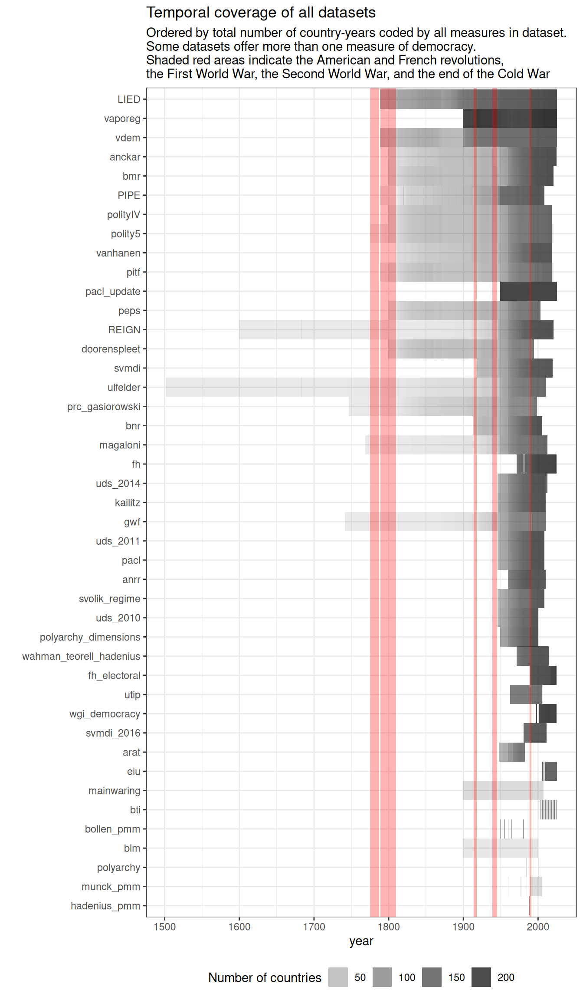
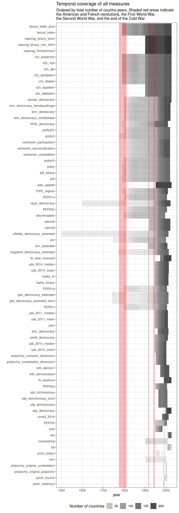
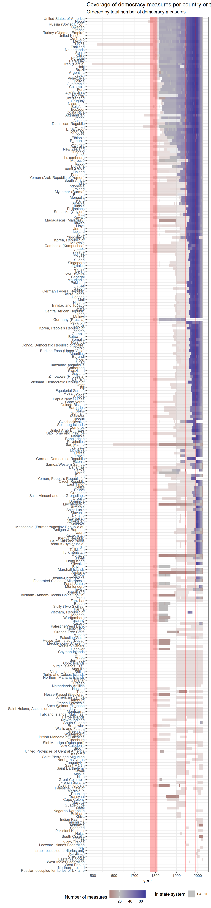
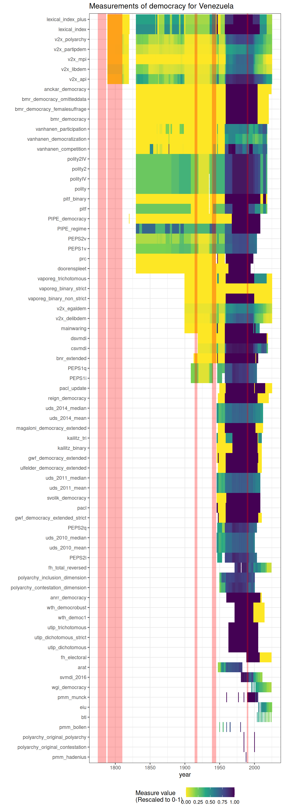
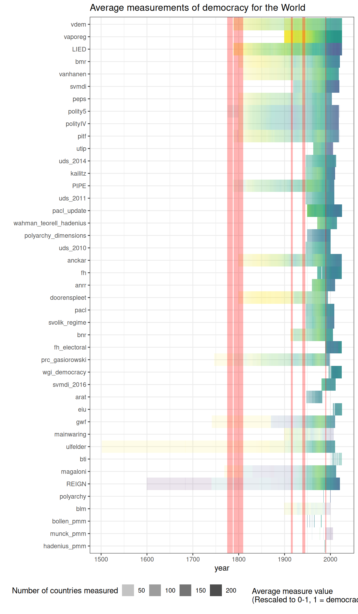
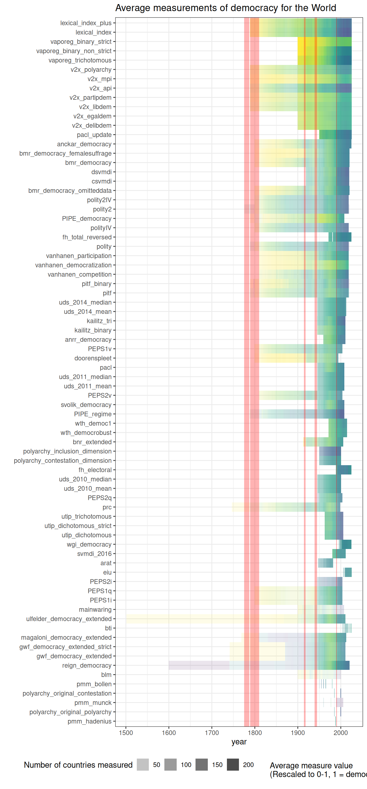

# Understanding the geographic and temporal coverage of existing democracy indexes

The geographical and temporal coverage of different democracy indexes
varies greatly.

[VDem](https://xmarquez.github.io/reference/vdem_simple.md) and
[LIED](https://xmarquez.github.io/reference/LIED.md) code the largest
total number of country-years, while specialist indexes like
[BLM](https://xmarquez.github.io/reference/blm.md) (which covers only 5
countries in Latin America) code the smallest number. Given the increase
in the number of states in the state system, it’s no surprise that
coverage increases greatly after WWII, with many datasets covering a
large number of countries.

Figure 1: Temporal coverage of each dataset, ordered by total number of
country-years. Shaded red bands mark the American and French
revolutions, the First and Second World Wars, and the end of the Cold
War.

Figure 2: Temporal coverage of every individual democracy measure,
ordered by total number of country-years.

As we can see, the majority of datasets measure democracy between the
end of the Second World War and the first two decades after the end of
the Cold War. The most heavily measured country is the United States;
the earliest measurement is for Iran (1502, in the Ulfelder extended
dataset; this is the regime start date). The vast majority of
measurements are after 1945 (bluer = more measurements of democracy for
a given country-year), but most datasets created in the 2000s were not
updated, so the number of measurements decreases post 2010 (only a few
datasets are updated to 2020).

Figure 3: Coverage of democracy measures per country or territory,
ordered by total number of measurements. Alpha shading marks whether the
unit is in the Gleditsch-Ward state system in that year.

There can be a fair amount of disagreement in these measures, especially
at regime transition points (see article on correlations between
measures for more discussion). Consider the USA, Venezuela, and Russia
(darker colors = more democratic):

Figure 4: Measurements of democracy for the United States of America
across all indexes, rescaled to 0-1.

Figure 5: Measurements of democracy for Venezuela across all indexes,
rescaled to 0-1.

Figure 6: Measurements of democracy for Russia / the Soviet Union across
all indexes, rescaled to 0-1.

We can also take a look at the average level of democracy for each
measure, across the world. As we can see, the world has become more
democratic (darker colors = more democratic), though the particular
moment at which this happened varies from measure to measure.

Figure 7: Average level of democracy for the world by year, by dataset
(rescaled to 0-1, darker = more democratic). Alpha shading reflects the
number of countries measured in each year.

Figure 8: Average level of democracy for the world by year, by
individual measure (rescaled to 0-1, darker = more democratic).

Finally, we visualize the average level of democracy per country
(averaging across all measures that code a country-year; darker colors =
more democratic).

Figure 9: Average level of democracy per country, averaged across all
measures that code a given country-year (rescaled to 0-1, darker = more
democratic).
