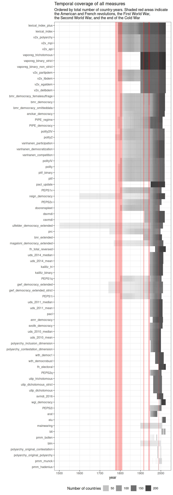
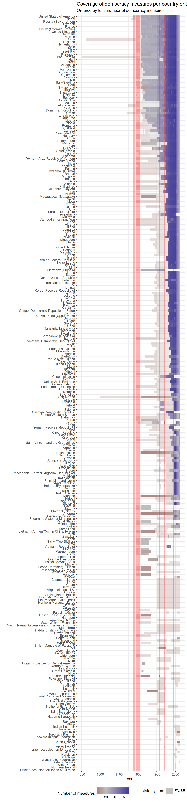
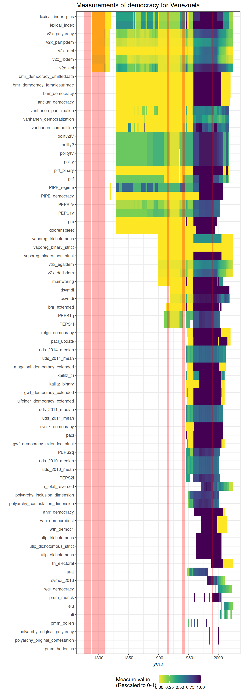
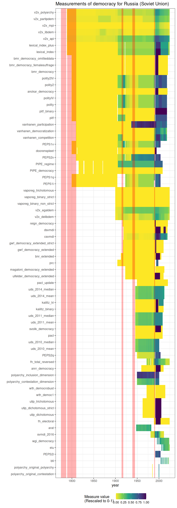
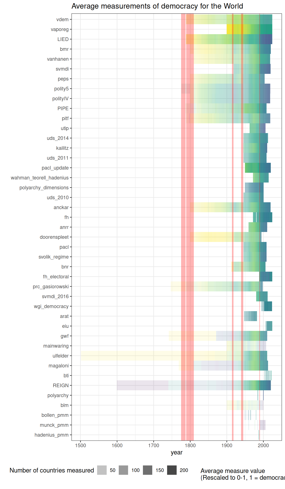
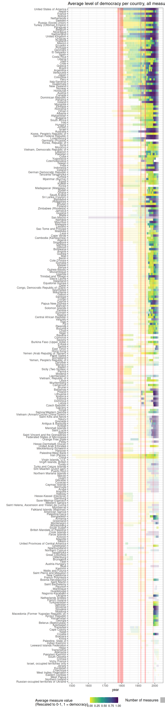

# Understanding the geographic and temporal coverage of existing democracy indexes

The geographical and temporal coverage of different democracy indexes
varies greatly.

[VDem](https://xmarquez.github.io/reference/vdem_simple.md) and
[LIED](https://xmarquez.github.io/reference/LIED.md) code the largest
total number of country-years, while specialist indexes like
[BLM](https://xmarquez.github.io/reference/blm.md) (which covers only 5
countries in Latin America) code the smallest number. Given the increase
in the number of states in the state system, it’s no surprise that
coverage increases greatly after WWII, with many datasets covering a
large number of countries.

As we can see, the majority of datasets measure democracy between the
end of the Second World War and the first two decades after the end of
the Cold War. The most heavily measured country is the United States;
the earliest measurement is for Iran (1502, in the Ulfelder extended
dataset; this is the regime start date). The vast majority of
measurements are after 1945 (bluer = more measurements of democracy for
a given country-year), but most datasets created in the 2000s were not
updated, so the number of measurements decreases post 2010 (only a few
datasets are updated to 2020).

There can be a fair amount of disagreement in these measures, especially
at regime transition points (see article on correlations between
measures for more discussion). Consider the USA, Venezuela, and Russia
(darker colors = more democratic):

We can also take a look at the average level of democracy for each
measure, across the world. As we can see, the world has become more
democratic (darker colors = more democratic), though the particular
moment at which this happened varies from measure to measure.

Finally, we visualize the average level of democracy per country
(averaging across all measures that code a country-year; darker colors =
more democratic).

