::: {.cell}

:::

::: {.cell}

:::

Most measures of democracy are highly correlated. But these correlations can nevertheless vary quite a bit across measures, years, and countries.

## Dichotomous Measures of Democracy

Consider first dichotomous measures of democracy, which classify countries into two categories: democracies and non-democracies. These are very highly correlated (median pairwise correlation coefficient = 0.84).

::: {.cell}
::: {.cell-output-display}
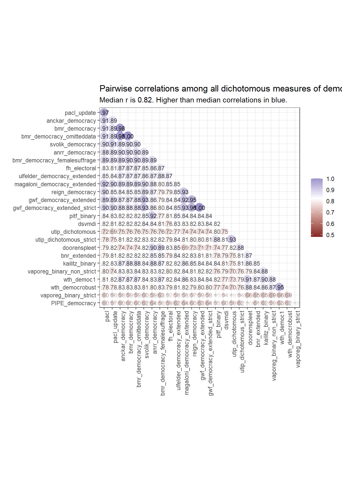{width=672}
:::
:::

::: {.cell}
::: {.cell-output-display}
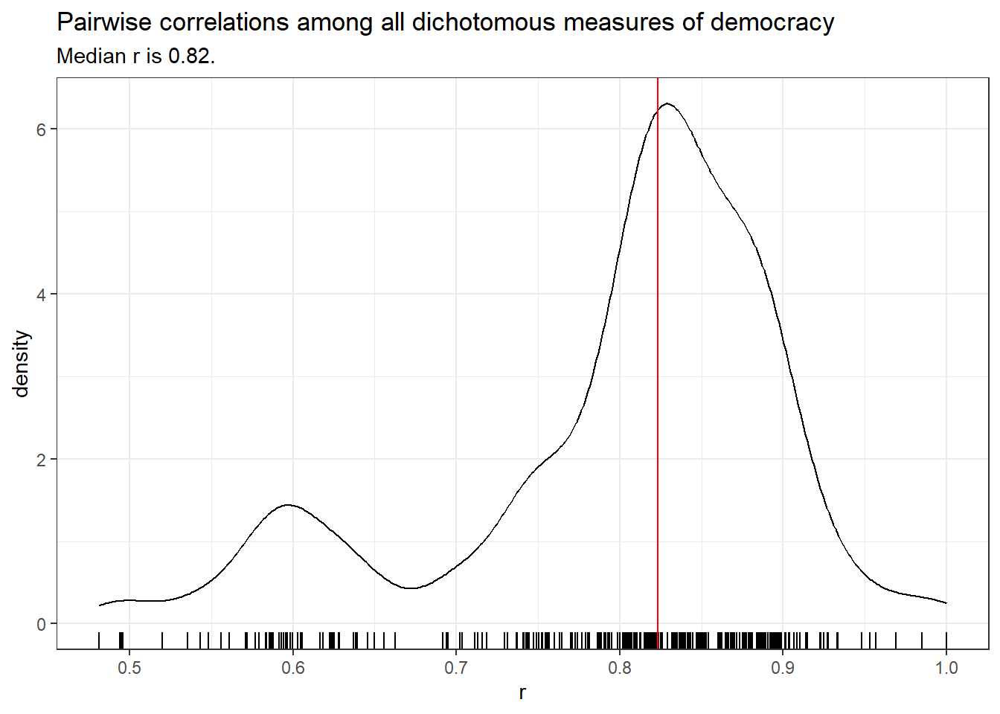{width=672}
:::
:::

Nevertheless, a few of these measures are poorly correlated with the rest, in particular, the [PIPE](../../reference/PIPE.html) [@PIPE2013] and [bnr](../../reference/bnr.html) [@bnr2001] measures. The [PIPE](../../reference/PIPE.html) measure of democracy is likely not properly constructed; there are no clear instructions for replicating it in the original documentation, and I can't be sure I succeeded in replicating it. 

The [bnr](../../reference/bnr.html) measure is different from most other dichotomous measures of democracy because it was constructed with survival analysis in mind, and hence only includes democracies; when extended to non-democracies (in [bnr_extended](../../reference/bnr.html)) it is well-correlated with the rest. [utip](../../reference/utip.html) [@utip2008] and [doorenspleet](../../reference/doorenspleet.html) [@doorenspleet2000] also have below average correlations with the other measures; these are somewhat idiosyncratic measures that are not widely used, and doorenspleet in particular is based on an earlier version of  [Polity](../../reference/polityIV.html) (Polity III) and also adds an "inclusion" criterion, whereas most of the other dichotomous measures are based on [pacl](../../reference/pacl.html) [@pacl2010].

## Trichotomous Measures of Democracy

There are a number of measures of democracy that distinguish between democracy, non-democracy, and some hybrid or intermediate category. These trichotomous measures are also highly correlated.

::: {.cell}
::: {.cell-output-display}
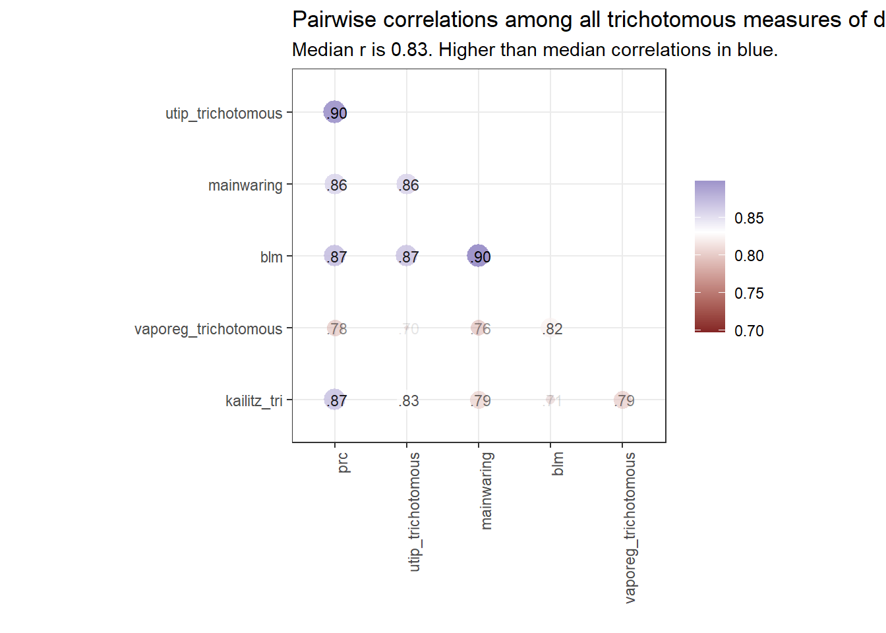{width=672}
:::
:::

All of these are specialist measures that are no longer maintained, but remain of historical interest. The lowest correlation levels are with the [Kailitz](../../reference/kailitz.html) trichotomous index calculated by taking "electoral autocracy" as the middle category (updated in the [VaPoReg](../../reference/vaporeg.html) measure).

## Ordinal/Graded Measures of Democracy

There are also measures that distinguish among different "grades" of democracy, though the intervals between grades may not have a consistent meaning. For example, [Freedom House](../../reference/download_fh.html) [@fh2025] distinguishes 14 different "grades" between the most unfree and the most free category, but it is not clear that the difference between one grade and another means the same across all grades. In any case, these measures are highly correlated among themselves.

::: {.cell}
::: {.cell-output-display}
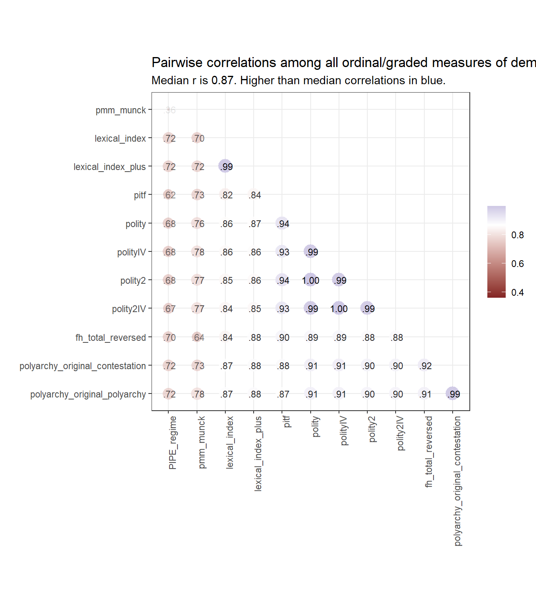{width=672}
:::
:::

## Continous Measures of Democracy

Finally, there are a number of continuous measures of democracy (usually in the 0-1 range), which like other measures, are very highly correlated.

::: {.cell}
::: {.cell-output-display}
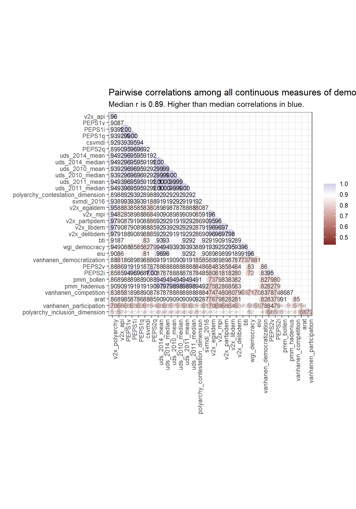{width=672}
:::
:::

## All Correlations

The median correlation coefficient between any two measures (of any type) is 0.83.

::: {.cell}

:::

::: {.cell}
::: {.cell-output-display}
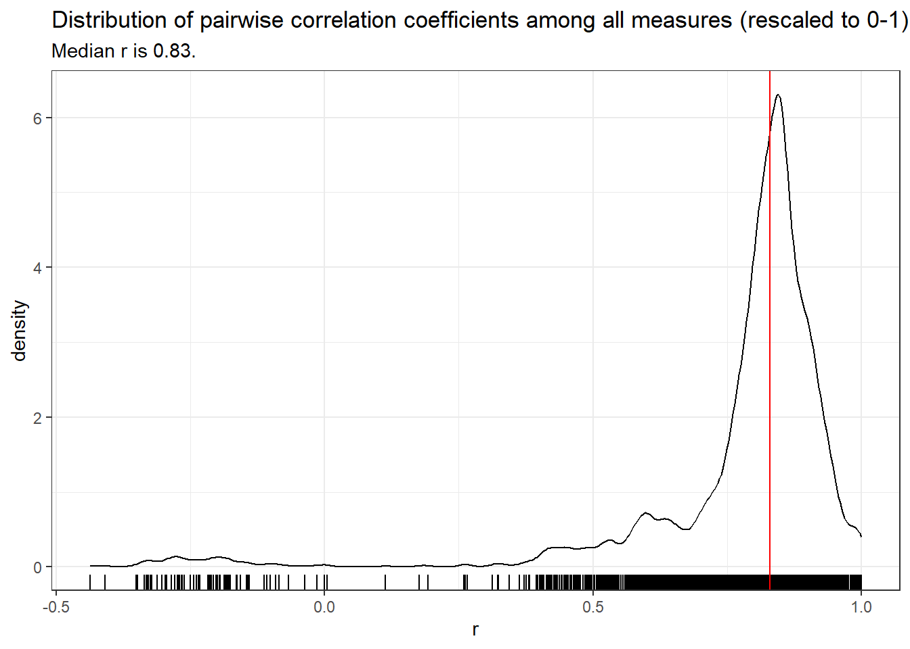{width=672}
:::
:::

A simple hierarchical cluster analysis can help us to better visualize the relationships among these measures. 

At the top of the figure below, we find the main outlier, the measure of democracy from [PIPE](../../reference/PIPE.html) [@PIPE2013]. The next cluster includes a set of continous measures, mostly from V-Dem [@vdem15codebook], but also the [vanhanen](../../reference/vanhanen.html) measure [@vanhanen2019] that includes information about participation. These are "thicker" measures of democracy. The bottom two clusters, by contrast, contain measures derived from [pacl](../../reference/pacl.html) [@pacl2010], including [bmr](../../reference/bmr.html) [@bmr2012], [gwf](../../reference/gwf_all.html) [@gwf2014] and a recent update of [pacl](../../reference/pacl.html), [pacl_update](../../reference/pacl_update.html) [@pacl_update_2020], as well as measures derived from [polity](../../reference/polityIV.html) [@polity2019], including [peps](../../reference/peps.html) [@peps2006], latent variable indexes like [uds](../../reference/uds_2014.html), which are heavily influenced by the inclusion of [polity](../../reference/polityIV.html) scores [@pmm2013uds2010], and [pitf](../../reference/pitf.html) scores [@pitf2015], which are built from [polity](../../reference/polityIV.html).

::: {.cell}
::: {.cell-output-display}
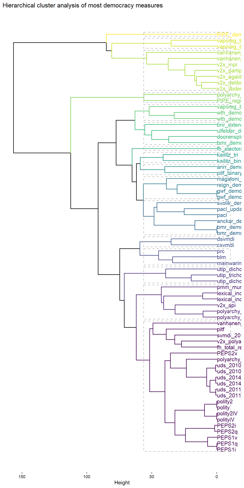{width=672}
:::
:::

## Variation in per-country and per-year correlations

As noted in the [article on the temporal and geographic coverage of democracy measures](Understanding_the_geographic_and_temporal_coverage_of_existing_democracy_indexes.html), such measures, though highly correlated in general, can disagree substantially in particular cases. Consider the USA. Despite general agreement in these datasets that the USA is basically democratic, different measurements do not agree on when the country first became democratic, or how democratic it actually was at any given point in time.

::: {.cell}
::: {.cell-output-display}
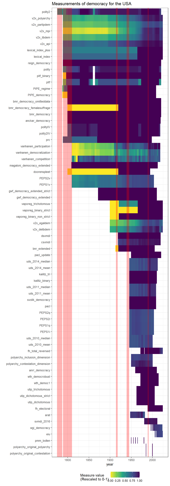{width=672}
:::
:::

A latent variable analysis of most of these measures (using the [extended_uds] measure - see the vignette on replicating and extended the UD scores in this package) makes the evolution of democracy in the USA look like this:

::: {.cell}
::: {.cell-output-display}
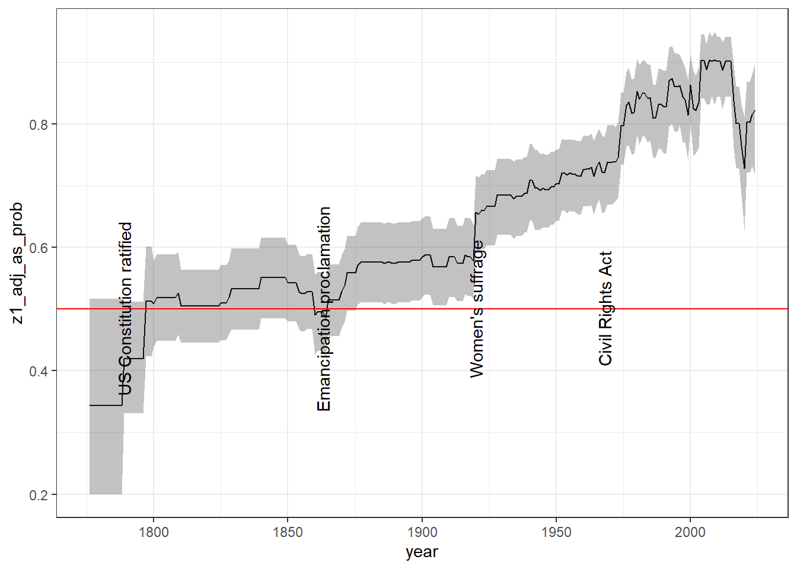{width=672}
:::
:::

The average correlation between democracy measures varies substantially year by year, due in part to the particular states that are measured on any given year, the availability of historical information, and the prevalence of hybrid or ambiguous regime forms. It is thus high in the late 18th and early 19th century, as most countries were clearly non-democratic and relatively easy to classify (and there were fewer independent states); it becomes lower in the 19th century, with more countries in difficult-to-classify hybrid forms, and more difficulties for researchers in finding appropriate historical information; and it increases in the mid-twentieth century, where most of the classificatory effort has been focused. It is worth noting that correlations also dip after the Cold War, as more countries take on difficult to classify hybrid forms.

::: {.cell}
::: {.cell-output-display}
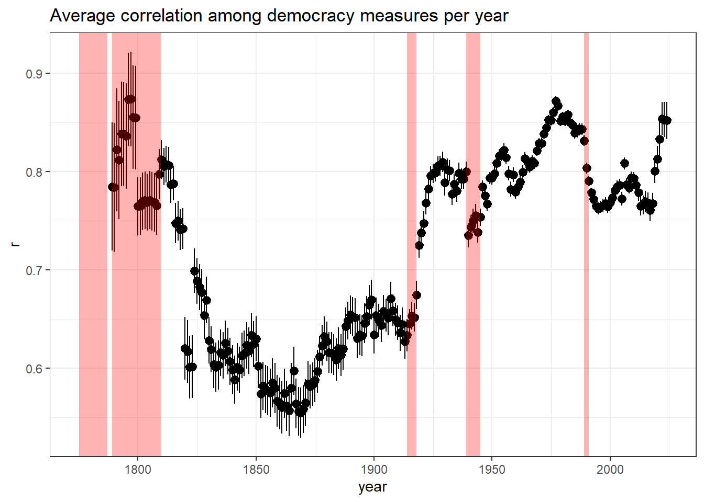{width=672}
:::
:::

Correlations among measures can also vary substantially within a given country. 

::: {.cell}
::: {.cell-output-display}
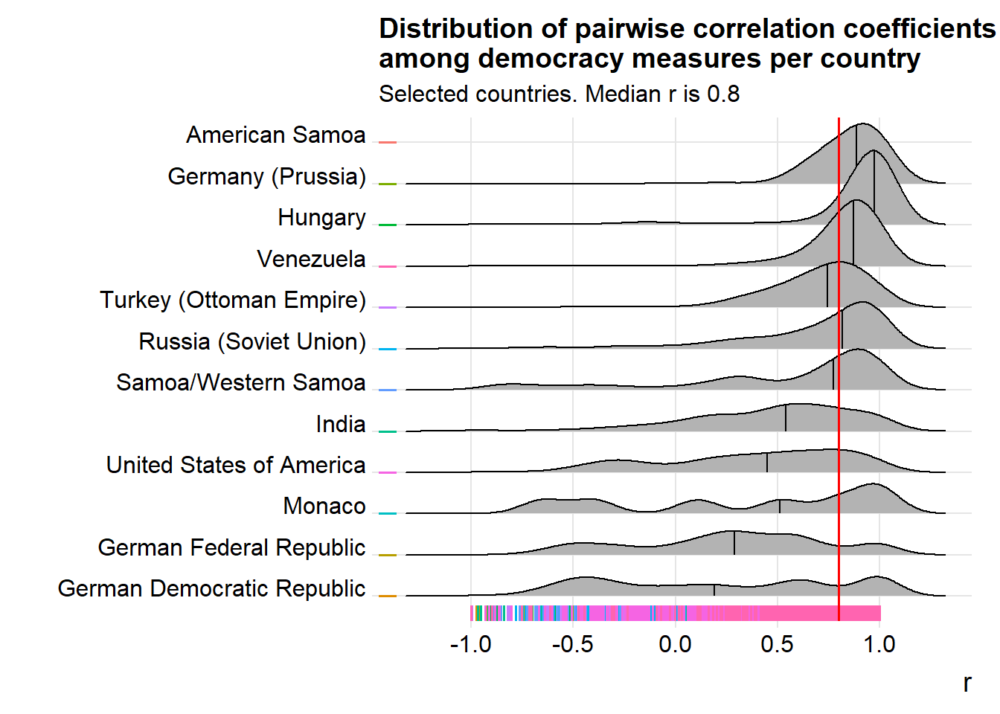{width=672}
:::
:::

Here we see that for a country like the USA, the pairwise correlation coefficient between any two measures of democracy ranges from nearly 1 to nearly -1, with a median below 0.5. Small semi-monarchical countries like Monaco are especially susceptible to scholarly disagreements on their level of democracy, though some countries have very decent levels of agreement (e.g., Hungary, Venezuela).

::: {.cell}

:::

We can find the "hardest" countries to classify by looking at the standard deviation of the rescaled measures per year. Here are the top 12 most difficult to classify countries by this measure:

::: {.cell}
::: {.cell-output-display}
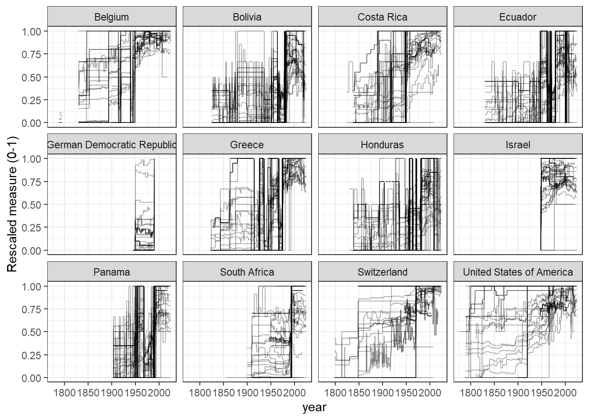{width=672}
:::
:::

There is clearly a great deal of uncertainty in these measures for many country-years, though the overall patterns are usually clear. Two ways of aggregating these measures to deal with uncertainty are explored in other articles in this website: [Latent Variable Indexes](Replicating_and_extending_the_UD_scores.html) -- see vignette("Replicating_and_extending_the_UD_scores") -- and Machine-Learning predictions (article still to come).

## References

